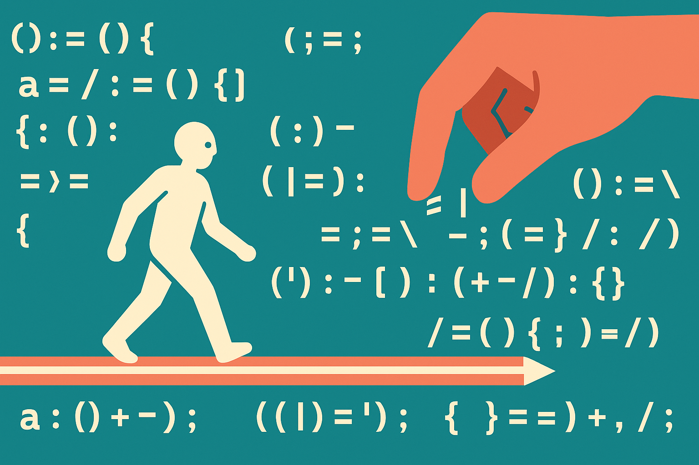

TL;DR: Three arXiv papers this summer each expose a gap between benchmark numbers and real deployment: retrieval systems that split sparse and dense into two models, fairness audits that never justify their comparison targets, and coding agents that assume they work alone. Fixing each one is now a concrete engineering decision, not a research daydream.

I read a lot of retrieval and agent papers that promise a new state of the art and deliver a decimal point. The three below are more useful than that. Each one names a thing practitioners already half-know is broken and then makes it precise enough to act on. Take them together and you get a snapshot of where applied AI actually is in mid-2026: the models are strong, and the seams between them and the real world are where the work now lives.

I am going to walk all three, because the throughline matters more than any single result. The connective tissue is this: benchmarks reward isolated competence, and production punishes it.

## What does UEmbed actually unify, and why does it matter?

Start with retrieval, because it is the plumbing under RAG, search, and half the agent stack. The primary source here is "UEmbed: Unified Sparse and Dense Multimodal Embeddings" on arXiv cs.AI. The authors ship a decoder-only embedding model that produces both a sparse lexical vector and a dense vector in a single causal forward pass.

To see why that is interesting you have to know the old split. Dense embeddings map text or images into a continuous vector where similarity is cosine distance. They capture semantics well and lose exact terms. Sparse retrieval, the Learned Sparse Retrieval (LSR) line, predicts weights over vocabulary terms so you keep lexical precision and inverted-index speed. In practice teams run both and fuse the scores, which means two models, two indexes, two things to maintain.

UEmbed collapses that. The mechanism is clean: append N learnable special tokens to the input, partition the vocabulary into N disjoint subsets, and let each token's causal hidden state predict sparse weights over its assigned subset. Concatenate the N subsets and you have the full sparse vector, produced by the same pass that gives you the dense one. This is the same architectural instinct behind the shift to decoder-only multimodal systems I wrote about in [MODUS brings any-to-any multimodal modeling to decoder-only systems](/blog/2026-07-29-modus-brings-any-to-any-multimodal-modeling-to-decoder-only-systems/): stop bolting on modality-specific and objective-specific modules, make one causal model do the job.

The numbers, from the paper: UEmbed-9B reaches 71.8 dense and 71.0 sparse on MMEB-v2, which the authors report as beating multimodal embedding models trained on publicly available data such as RzenEmbed. On BEIR it stays competitive with strong dense and sparse baselines. They release 2B, 4B, and 9B scales trained on public data. Note the qualifier they attach themselves: the comparison is against models trained on public data, not against everything. That is honest framing and worth keeping when you cite the win.

What I like most is that the sparse extension carries into multimodal. LSR historically lived in encoder-style bidirectional architectures and leaned on auxiliary cross-modal modules to handle images. UEmbed drops both crutches. If you have ever tried to make lexical retrieval work over image inputs, you know how much glue that usually takes. This is adjacent to the routing idea in [ReToken Makes Visual Retrieval a One-Token Routing Problem](/blog/2026-07-31-retoken-makes-visual-retrieval-a-one-token-routing-problem/): compress a retrieval decision into a small, learned structure inside the model rather than a separate pipeline stage.

## Should you replace your two-model retrieval stack with one?

Not yet, and here is the honest read. UEmbed's pitch is operational, not just accuracy. One model, one forward pass, both representations. If you are running a dense encoder plus a separate SPLADE-style sparse model plus a fusion step, the appeal is obvious: fewer moving parts, one thing to fine-tune, one thing to serve.

But the paper's own results temper the excitement. On BEIR it is "competitive with," not "beating," strong single-purpose baselines. That is the pattern you should expect from any unification: you trade a little peak performance in each mode for a large simplification across the whole system. Whether that trade is worth it depends entirely on your constraints. If your retrieval quality is already the bottleneck on user outcomes, a specialized model may still win. If your ops burden and latency budget are the bottleneck, one 4B model producing both vectors is a real gift.

There is also a scale question the paper leaves for you. UEmbed-9B posts the headline numbers. Most production retrieval runs nowhere near 9B for embeddings because you index millions of documents and every parameter costs at query time and index time. The 2B and 4B releases are the ones most teams will actually test, and the paper's abstract does not break out their MMEB-v2 scores, so treat the smaller-model quality as something you verify yourself before committing.

My practical advice: pull the 2B or 4B checkpoint, run it against your own eval set in both modes, and compare total system cost, not just NDCG. The unification is the product. Judge it as an ops decision.

## What is the "missing-target" problem in fairness audits?

Switch domains entirely. The second primary source is "Who Should Be Generated? Justifying Demographic Targets in Open-Ended Generation" on arXiv cs.AI. It is not a model paper. It is a measurement paper, and it points at something almost everyone doing generative fairness audits gets wrong.

Here is the setup. When you prompt a model for "a CEO in the United States," the prompt does not specify demographics. The model decides. Generative fairness audits then look at the output-side distribution: across many samples, who did the model generate? Fine. But to say that distribution is fair or biased, you compare it against a target. And the paper's core observation is that the target is almost always supplied, never justified. You compare against some distribution, but why that one?

The authors formalize this as the missing-target problem for demographic-value-unspecified generation, and they decompose target construction into four commitments: the evaluative object, prior admissibility, allocation, and operationalization. In plainer terms: what are you measuring over, which prior distributions are even legitimate to compare against, how do you allocate across categories, and how do you turn that into a concrete number.

The consequences are not small. Instantiating this in AP-Bench, they report distribution divergence from geography-derived targets ranging from 0.508 to 0.606 on a 0-to-1 scale. Then the sharp result: swap each geography-derived target for an equal-category comparator, hold the generations and the measurement fixed, and the model-specific mean absolute cell-level JSD_2 changes range from 0.279 to 0.355. Read that again. Same model, same outputs, same measurement machinery. Only the target changed, and the audit's verdict moves by a third of the entire scale.

## Why does this change how you read any bias benchmark?

Because it means a fairness score is only as defensible as the target behind it, and most published scores do not defend theirs. The paper's line is exact: target construction "is not a preliminary to fairness evaluation but a component of it." The choice of comparison distribution is not setup you do before the real work. It is the real work, and it is doing a lot of the heavy lifting in whatever conclusion you draw.

The authors are careful about what they are and are not claiming. They admit the geographic prior under a geographic-membership interpretation for a declared public-world use. They note the occupational prior, under an incumbency interpretation, needs an independently defended objective such as workforce-composition fidelity. And they explicitly say they are not offering a universal target, only a framework that makes the required justification explicit. That restraint is the point. Anyone selling you a single correct fairness target is overclaiming, and this paper gives you the vocabulary to say why.

For a practitioner this cuts two ways. If you ship a model and someone audits it, the first question you should ask is not "what was our score" but "against what target, and how was that target justified." A bad score against an undefended target is not evidence of anything. Conversely, if you run audits internally, you now owe yourself an explicit, written commitment on all four dimensions before you report a number, or your own dashboards will mislead you. This is the interpretability lesson from a different corner of the field, the one in [C2R targets the hidden mess inside sparse autoencoder features](/blog/2026-06-30-c2r-targets-the-hidden-mess-inside-sparse-autoencoder-features/): the measurement instrument has hidden structure, and if you do not examine it, you are measuring the instrument, not the model.

## What does SWE-Touch reveal about coding agents in shared workspaces?

Third source, third domain, same disease. "SWE-Touch: Benchmarking Coding Agents When Users Touch the Code" on arXiv cs.AI attacks an assumption baked into every repository-level agent benchmark: that the agent works alone.

Real development is not solo. You kick off an agent on a task, and while it runs you inspect the code, you tweak a function, a teammate pushes a change. The workspace is shared and it moves under the agent's feet. Existing benchmarks either evaluate agents in isolation or restrict user participation to chat messages. SWE-Touch stress-tests the actual case with what the authors call validated Counter-Edits: plausible edits to task-relevant code that conflict with completing the task.

The construction is deliberate. They mine task-critical regions from multiple repair trajectories, use a separate User Patch Generator to build the edits, and inject them with contextual user messages exactly when the agent reaches the relevant code. So it is not random noise. It is a believable human change landing at the moment it matters most.

The result they report: Counter-Edit lowers average resolve rate by 7.7 percentage points on SWE-bench Verified across nine coding models, and the degradation persists on longer-horizon tasks from SWE-Bench Pro and DeepSWE. The trajectory analysis is the useful part. Failures trace to limited awareness of the evolving workspace. Agents retain conflicting code, or they replace it without re-inspecting the repository, or they skip validating the revised behavior with targeted tests. In other words the agents assume the world stood still while they thought.

That number, 7.7 points, is not catastrophic. It is worse than that, in a way, because it is quiet. It says strong autonomous performance does not carry over to collaboration, and the gap is large enough to matter but small enough to miss if you only benchmark solo.

## How should builders design agents for a moving workspace?

The authors name three capabilities directly, and I would treat them as a design checklist: detect workspace changes, reconcile conflicting edits with the task, and verify the affected behavior. None of these is exotic. They are hygiene an autonomous agent skips because nothing in its training or its benchmark ever forced it to.

Concretely, that means an agent should re-read files it has already touched before finalizing, not trust its cached mental model of the repo. It should diff the current state against what it expected and treat a mismatch as a signal, not an annoyance. And it should run targeted tests on exactly the behavior it and the user both edited, rather than assuming a passing build means agreement. The failure mode the paper describes, replacing conflicting code without re-inspecting, is the agent version of a merge that overwrites a colleague's work silently. We would fire a human for that. We should not accept it from an agent because it scored well alone.

This connects to a broader pattern showing up across applied AI right now: systems that are excellent when their inputs are complete and clean, and brittle the moment reality is partial or shifting. It is the same shape as [Multimodal AI needs a plan for missing inputs](/blog/2026-07-28-multimodal-ai-needs-a-plan-for-missing-inputs/), where a model that assumes every modality is present falls over when one is absent. Missing modality, moving workspace, undefended target: three faces of the same gap between the tidy benchmark and the untidy deployment. The lesson that architecture choices should be tested against messy conditions rather than assumed away is exactly what I argued in [Entity matching needs architecture tests, not bigger-model reflexes](/blog/2026-07-28-entity-matching-needs-architecture-tests-not-bigger-model-reflexes/).

## Where does this leave the field, and what should you watch?

Here is my forward judgment, the part no single one of these papers gives you.

The center of gravity in applied AI has moved from raw capability to interface with reality. All three papers are capability-agnostic. UEmbed does not claim a smarter embedding, it claims a simpler system boundary. The fairness paper does not propose a fairer model, it fixes how you judge one. SWE-Touch does not build a better coder, it exposes how the good ones behave when a human intervenes. Three teams, three subfields, all pointing at the seams rather than the core. That is a signal about where the marginal returns are now.

For retrieval, watch whether the unified sparse-dense approach spreads beyond this one model. If decoder-only embedding models keep producing both representations for free, the two-index architecture becomes legacy within a year or two. The place to watch is the smaller scales: unification only wins broadly if the 2B and 4B models hold quality, and that data is not fully public yet. Keep an eye also on how this composes with domain-specific routing, the kind of scale-aware retrieval in [ELSA3D routes language to the right 3D scale](/blog/2026-07-08-elsa3d-routes-language-to-the-right-3d-scale/), and with architectures that keep facts external, like [Co-LMLM Puts Facts in a Database, Not the Weights](/blog/2026-07-09-co-lmlm-puts-facts-in-a-database-not-the-weights/). Better embeddings only matter if the retrieval-plus-storage design around them is sound.

For fairness auditing, the missing-target framework should become table stakes for anyone publishing a bias number. It will not, quickly, because it makes audits harder and less quotable. But regulators and serious internal teams will adopt the four-commitment discipline, and audits that skip it will start to read as marketing. Watch for tooling that forces explicit target justification into the audit pipeline.

For coding agents, SWE-Touch is the start of a benchmark category, not the end. Solo resolve rate on SWE-bench Verified has been the headline metric for two years. Expect collaborative and adversarial-workspace variants to become the harder, more honest number, the way instruction-following benchmarks eventually displaced raw perplexity. Watch which labs report shared-workspace numbers voluntarily. The ones that do are telling you they trust their agents around humans.

The practitioner's take: pick the seam that costs you the most today and instrument it before you touch the model. If you run RAG, pull a UEmbed checkpoint and compare total system cost against your two-model stack, not just retrieval quality on a leaderboard. If you ship anything that gets audited, write down your four target commitments before you report a fairness number, because a score against an undefended target moved a third of the way across the scale in the AP-Bench result and yours can too. If you deploy coding agents, add a Counter-Edit style test to your own eval: change a task-relevant file mid-run and see whether the agent notices. The catch most readers miss is that none of these fixes requires a bigger or better model. They require you to stop testing your systems in conditions kinder than the ones they will actually meet. That is cheaper than a new model and it is where the real failures live.
