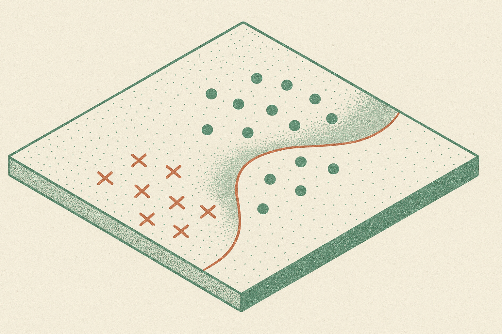

TL;DR: “An Optimal Agnostic PAC Algorithm” tightens the theory of learning under noise, showing the best possible error rate is achievable up to constants, but the practical lesson is still about matching data, hypothesis class, and evaluation budget.

## What problem did “An Optimal Agnostic PAC Algorithm” settle?

The primary source here is the arXiv cs.AI and cs.LG listing titled “An Optimal Agnostic PAC Algorithm.” It studies a classic supervised learning setup: binary classification, a hypothesis class \(H\), finite VC dimension \(d\), and an unknown data distribution.

The key variable is \(L^*\), the lowest possible risk inside the hypothesis class. That matters because agnostic PAC learning does not assume the labels are clean, or that the correct classifier is even available in \(H\). It asks a more realistic question: given noisy data and a limited model class, how close can a learner get to the best classifier in that class?

The arXiv listing claims a learner with this high-probability guarantee:

\(L(\widehat h) \le L^* + 7 \cdot 10^8( \sqrt\{L^*(d+\log(1/\delta))/n\} + (d+\log(1/\delta))/n )\)

That is a mouthful, but the shape is the important part. The excess error depends on sample size \(n\), VC dimension \(d\), confidence \(\delta\), and the irreducible in-class error \(L^*\). When \(L^*\) is small, the square-root term shrinks accordingly. When the class is noisy or mismatched, the bound says you pay for that too.

The arXiv listing says this settles the sample complexity of agnostic PAC learning up to universal constants at every fixed \(L^*\), matching lower bounds from Devroye, Györfi, and Lugosi’s 1996 book, *A Probabilistic Theory of Pattern Recognition*.

## Why should builders care about a PAC constant this large?

The constant is enormous: \(7 \cdot 10^8\). Nobody should read that and think, “great, now I can calculate my production dataset size directly.”

This is theory doing theory. The win is not that the bound is numerically friendly. The win is that the dependence on the key quantities is claimed to be statistically optimal, up to constants. That tells us the old lower bounds were not just pessimistic artifacts. They describe a real barrier.

For builders, this is a reminder that data quantity is not magic. If your hypothesis class cannot express the thing you need, \(L^*\) stays high. If your labels are inconsistent, \(L^*\) stays high. If your target task keeps shifting, the guarantee is about a distribution you may not actually have.

This maps pretty cleanly onto today’s applied AI work. A classifier fine-tuned on messy support tickets, safety labels, medical notes, fraud events, or sales intents is often in an agnostic setting. There may be no perfect labeling rule. Human annotators disagree. The model family may be too narrow, or too broad in ways that hurt validation. The question is not “can the model learn?” It is “how much of the remaining error is learnable from more samples, and how much is baked into the setup?”

## What changes in applied evaluation?

Not your deployment checklist tomorrow. This result does not replace held-out tests, calibration checks, slices, drift monitoring, or adversarial review.

But it does sharpen the mental model. The bound separates three knobs that teams often blur together: more data, simpler or more complex hypothesis classes, and the unavoidable error of the best available classifier. In practice, teams usually obsess over the first knob because it is visible. Get more labeled examples. Buy more data. Generate synthetic data. Fine.

But if label policy is unstable, more examples can just encode confusion at scale. If the model class is wrong for the task, more samples help less than expected. If the evaluation set hides rare but important cases, your measured \(L^*\) is fantasy.

I would use this result as a prompt to ask better questions before another labeling sprint: what is the best achievable performance given our current label rules, features, and model family? Where do experts disagree? Which errors are due to sample scarcity, and which are due to problem definition?

For a practitioner, the useful move is simple: run a small error audit before scaling data collection. Take the failures from your current model, separate ambiguous labels from clear misses, then estimate whether your next 10,000 examples attack the learnable part or just add more noise. The catch most readers miss: optimal learning theory still assumes the data distribution is the thing you care about. In production, that is often the weakest assumption in the room.
