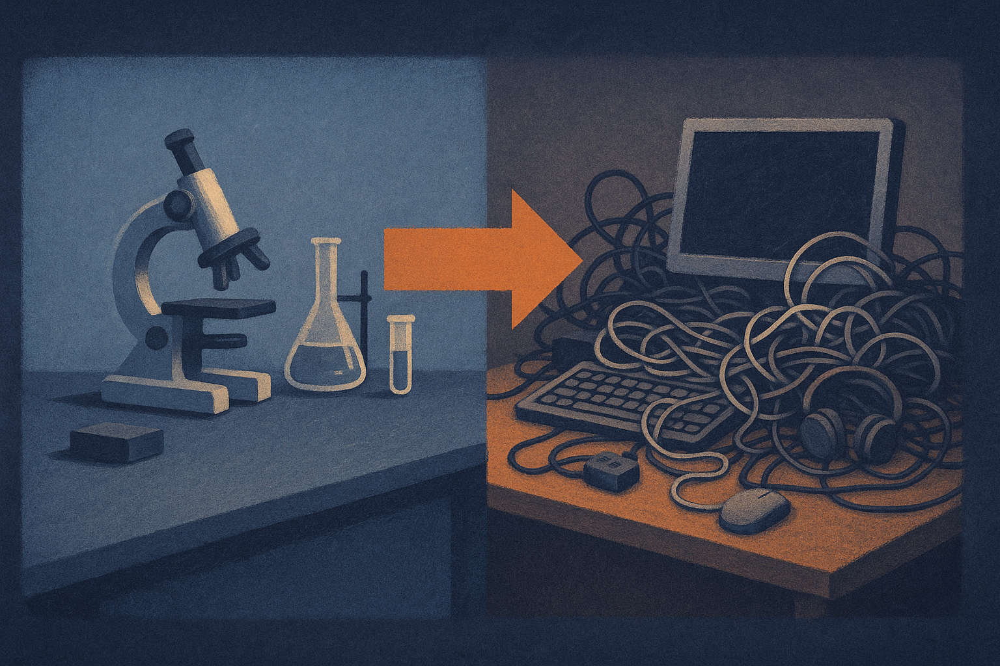

TL;DR: Making a model resist misleading context is easy and useless if it also learns to ignore good context, so the real target is selective trust, and the paper "Learning When to Trust via Selective Context Preference Optimization" gives you a benchmark and a training recipe to measure and improve it.

If you build anything on retrieval, you have shipped this bug without knowing it. Your model answers a question correctly on its own. Then you hand it a retrieved passage that happens to be wrong, and the answer flips. The paper "Learning When to Trust via Selective Context Preference Optimization," posted across arXiv's cs.AI, cs.CL, and cs.LG, names this failure precisely and, more importantly, refuses the easy fix.

## What is the actual failure mode in RAG here?

The setup: language models increasingly condition answers on external signals. Retrieved documents, tool outputs, user-supplied notes, whatever you stuff into the context window. The problem is that a single misleading signal can turn a correct answer wrong.

The obvious response is to train the model to resist bad context. Harden it. Teach it to distrust what it reads. The paper's central argument is that this cure hides a worse disease. A model that ignores all context looks great on adversarial tests and is worthless in production, because the whole point of RAG is that the context is usually worth trusting. You retrieve documents precisely because the model does not know the answer on its own. A model that shrugs off its retrieved evidence is not robust. It is deaf.

So the authors reframe the whole thing. Not resistance. Selective trust. Trust the context when it helps, ignore it when it misleads, and the hard part is telling those two situations apart with no oracle telling you which is which.

## How do you even measure selective trust?

You cannot improve what you cannot measure, and single-condition tests miss this entirely. If you only test on misleading context, a model that ignores everything scores perfectly. If you only test on clean context, you never catch the flip.

The paper introduces MIST, a human-annotated benchmark that renders each reasoning item under four matched conditions: clean (no added context), misleading (context that points to a wrong answer), correct-context (context that supports the right answer), and irrelevant-context (noise). Same underlying question, four dressings. That matched design is the clever part. It lets you isolate the effect of the context itself rather than the difficulty of the question.

On top of that sits SC2W, a paired metric. It counts how often a misleading signal flips a clean-correct answer to wrong. Read that carefully. It only looks at items the model already got right without context. Those are the cases where the context did real damage, where the model knew the answer and then talked itself out of it. That is a much sharper instrument than raw accuracy on a contaminated test set.

The finding from the benchmark study is blunt: this susceptibility is universal. Every model they tested flips correct answers when fed misleading context. This is not a quirk of one weak open model. It is a property of how these systems currently weigh external text against their own knowledge.

## What does SCOPE actually train, and how is it different?

SCOPE is the training method. The mechanism is Direct Preference Optimization, the same DPO you already know from alignment work, but the trick is in how the preference pairs are built.

Naive approaches optimize over misleading items alone. Show the model bad context, teach it to reject the wrong answer, done. That is exactly the trap: you get a model that learns "context bad, ignore context," and your correct-context accuracy craters.

SCOPE instead mines the specific failures that matter, the clean-correct/misleading-wrong cases, the same population SC2W measures. Then it builds matched preference pairs and balances them equally across all four conditions. Clean, misleading, correct-context, irrelevant-context, weighted the same. The balancing is the whole point. The model is not being taught to distrust context. It is being taught to sort context, because it sees examples where the right move is to hold its ground and examples where the right move is to update.

The reported results match the goal. SCOPE substantially reduces SC2W on popular open-sourced models while preserving accuracy when the added context is clean, correct, or irrelevant. That preservation clause is the part that separates this from a cheap robustness hack. Anyone can lower SC2W by making the model ignore everything. Doing it without paying for it on the good-context cases is the real claim.

## Where should you be skeptical?

A few things the abstract does not settle, and I will not pretend it does.

It does not give numbers. "Substantially reduces" and "preserving accuracy" are the words we get. No SC2W deltas, no per-model figures, no head-to-head against the naive resistance baseline. That matters because "preserving accuracy" could mean a tiny drop that a product team would still feel. Check the full paper's tables before you plan around it.

MIST is human-annotated, which is a strength for quality and a limit for scale and coverage. Four clean conditions per item is a controlled lab, not your messy retrieval pipeline where a passage is half-right, or right but outdated, or right about the wrong entity. Real misleading context rarely arrives as a tidy adversarial swap.

And DPO trains toward the distribution of failures you mined. If your production misleadingness looks different from MIST's, the gains may not transfer cleanly. This is a method for a shape of problem, not a universal patch.

None of that sinks the contribution. The reframing alone earns its keep: selective trust is the right target, and SC2W is a metric I would actually add to an eval suite tomorrow.

You do not need to run SCOPE to use this today. Steal the evaluation design first. Take a slice of questions your model gets right closed-book, then re-ask them with a plausibly wrong retrieved passage injected, and count the flips. That number is your SC2W, and I would bet it is higher than you expect. If it is, you have two levers before you reach for DPO: tighten retrieval so misleading passages show up less often, and prompt the model to weigh context against its own knowledge rather than defer to it. The catch most people miss is the other direction. If you harden your prompt or fine-tune against bad context, re-run the clean-context and correct-context cases too, because the failure you will not see in your dashboard is the model quietly ignoring the good documents you paid to retrieve. Resistance is cheap. Selective trust is the thing worth measuring.
