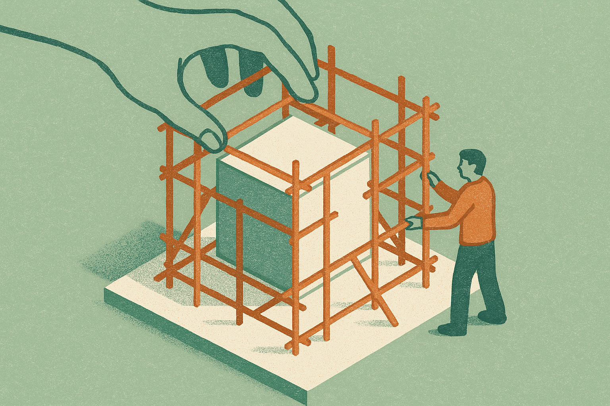

TL;DR: HarnessOpt-Bench shows that a model's ability to improve the scaffolding around an agent (prompts, tools, control flow, memory, orchestration) is a distinct, measurable skill that separates frontier models more than the tooling they run inside, which means picking your optimizer matters more than picking your framework.

For two years the story about agents has been about weights. New model, better agent. HarnessOpt-Bench, posted to arXiv across cs.AI, cs.CL, and cs.LG, points at the other half of the system: the harness. The prompts, the tool definitions, the control flow, the memory, the orchestration code. All the stuff wrapped around the model that you write and rewrite by hand. The benchmark asks a sharp question. Can a frontier model do that rewriting itself, under a real budget, and actually make the target agent better?

That is a more interesting question than it sounds, and the results are more useful than most benchmark papers.

## What is harness optimization and why does it matter?

Every agent you ship is two things. The model, which you mostly do not control, and the harness, which you fully control. The harness is where all your work goes. You write the system prompt, define the tools, decide when the agent loops versus stops, decide what goes in memory, wire up the orchestration. When someone says "I spent a week getting the agent to stop calling the wrong tool," they spent a week on the harness.

HarnessOpt-Bench defines harness optimization as the iterative, evaluation-guided improvement of that harness by an AI system. An optimizer, which is itself an LLM paired with a coding harness, gets three things: a target agent's seed harness, graded feedback from evaluations, and a fixed target-evaluation budget. It edits the harness, runs evals, edits again, and eventually nominates a final candidate. That candidate gets scored by its normalized gain over the seed on a held-out test partition the optimizer never sees during search.

The held-out part matters. It is the difference between "the model tuned itself to the test" and "the model made a real improvement." A trusted execution environment enforces that boundary, meters the target agent's resource use, and keeps every candidate version for audit. In plain terms: the setup makes cheating hard and makes the results reproducible, which is more discipline than most agent evals bother with.

## What did the benchmark actually find?

Three findings, and each one is a small correction to a common assumption.

First, optimizer models separate more than the coding harnesses they act through. The team evaluated 5 frontier LLMs as optimizers, both under a shared coding harness and under their own native harnesses, across 4 downstream tasks over 111 scored runs. The gap between models was larger than the gap created by the tooling those models ran inside. Read that twice. The skill lives in the model, not in the scaffolding you give the optimizer. If you are choosing what to use to improve your agents, the choice of model matters more than the framework you wrap around it.

Second, native harnesses are not consistently superior. There is a widespread belief that a model works best inside the harness its lab built for it. The tool definitions, the reasoning format, the loop structure tuned to that specific model. HarnessOpt-Bench says that is not reliably true for this task. Sometimes the shared coding harness did as well or better. That undercuts a lot of the "you must use our official agent framework" marketing.

Third, gains vary substantially across tasks and seed regimes. The same optimizer that produced a big improvement on one task and one starting harness produced a small one elsewhere. This is the honest finding, the one that keeps the paper from being hype. Harness optimization is not a switch you flip for a uniform boost. It depends heavily on the task and on how good your starting harness already was. A weak seed leaves room to improve. A strong seed does not.

## Should you let a model rewrite your agent's harness?

Cautiously, and with a real eval suite in place, yes. But the paper is describing a research setup with a trusted execution environment and a held-out test partition, not a plug-and-play tool. The catch is the evaluation itself. HarnessOpt-Bench works because it operates under "expensive and stochastic evaluation" with a fixed budget and a graded feedback signal. The optimizer only gets better because it can measure whether it got better.

Most teams cannot do that yet. They do not have a held-out test set for their agent. They do not have graded evals. They have vibes and a Slack channel where someone says the demo felt worse today. If you hand a model your harness and say "improve it" without a real scoring function, you are not doing harness optimization. You are doing prompt roulette. The whole result rests on the eval boundary being real and the feedback being honest.

So the sequence matters. Build the evals first. Then the optimization loop has something to climb.

## What does this mean for how we build agents?

It reframes the work. If the harness is a large, measurable share of agent performance, and if a frontier model can improve it under the right conditions, then a chunk of agent engineering starts to look like a search problem rather than a craft problem. You are not hand-tuning a prompt forever. You are defining the objective, the budget, and the eval boundary, then letting a strong optimizer search the harness space.

That does not mean the craft disappears. Someone still writes the seed harness, defines the tools, and decides what "good" means. The paper is explicit that harness optimization has "large space for improvement," which is researcher-speak for the models are not great at this yet. But it is measurable now, and measurable capabilities tend to improve fast once there is a benchmark to climb.

The quiet implication for tool vendors: if native harnesses are not consistently better, the moat around "our framework, our agent runtime" is thinner than the pitch suggests. The value moves toward whoever has the best optimizer model and the cleanest eval infrastructure.

Here is how I would actually use this. Do not wait for a HarnessOpt-Bench product. Build the eval harness for your own agent now: a held-out task set, a graded scoring function, a resource budget per run. Then run a cheap version of the loop yourself. Take your strongest available model, hand it the current harness plus the eval scores, and let it propose edits across a few iterations, scoring each candidate on held-out tasks it never saw during the edits. The finding that models separate more than tooling means the pick that matters is which model you point at the problem, not which agent framework you adopt. The catch most readers will miss: the whole thing collapses without a real held-out eval, because a model optimizing against a leaky or vibes-based signal will confidently make your agent worse while the numbers say it got better.
