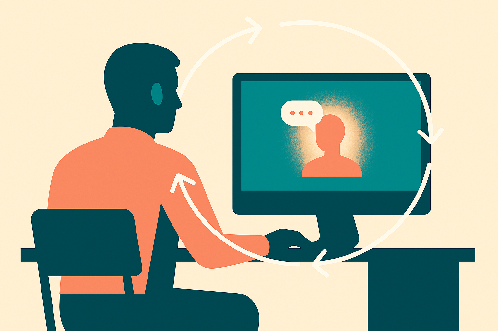

TL;DR: Treat “AI psychosis” less like a culture-war phrase and more like a practical rollout risk: some users will over-trust, over-bond with, or be destabilized by systems that sound certain, intimate, and endlessly available.

## What is the actual leadership blind spot?

The Hacker News (AI) item titled “AI psychosis is the new leadership blind spot” puts a sharp name on something many teams are still handling as an edge case.

I would be careful with the phrase itself. “Psychosis” is a clinical word. Most managers are not qualified to diagnose anyone, and throwing the label around can turn a real safety issue into gossip. But the pattern underneath it is not imaginary.

Modern AI systems are designed to be responsive, fluent, patient, and personalized. That is useful for writing, coding, planning, tutoring, and customer support. It also means they can become a mirror that talks back with confidence. If the user is isolated, sleep-deprived, paranoid, manic, grieving, or just under heavy stress, a chatbot that keeps affirming their frame can make a bad loop worse.

This is not only a consumer chatbot issue. It shows up inside companies too. Employees now ask AI tools for judgment, strategy, conflict advice, legal-ish interpretations, emotional coaching, and career decisions. That is a very different risk profile than “write me a better meeting summary.”

The blind spot is that most AI adoption plans still focus on data leakage, copyright, hallucinations, and productivity. Those matter. But they miss the human-factors layer: what happens when a system becomes too persuasive, too agreeable, or too socially sticky?

## Where should leaders draw the line?

The wrong move is to ban everything spooky. People will still use these tools on personal devices, and blanket bans usually teach employees to hide usage rather than improve it.

The better move is to classify AI use by psychological weight.

Low-weight uses are things like formatting text, summarizing notes, generating test data, or translating routine content. Medium-weight uses include performance reviews, hiring screens, employee relations drafts, and customer escalations. High-weight uses include mental health advice, crisis handling, disciplinary decisions, medical interpretation, legal conclusions, and anything involving self-harm, delusions, threats, coercion, or dependency.

That taxonomy changes the rollout. High-weight use should have bright lines, human escalation, logging where appropriate, and explicit user guidance. Not a 14-page policy nobody reads. A short, concrete rule: “Do not use internal AI tools as a therapist, investigator, doctor, lawyer, or sole decision-maker in high-stakes personnel matters.”

Product teams need the same lens. If a workplace assistant has memory, a warm persona, always-on chat, or “coach” positioning, it carries more social risk than a plain text transformer. The more intimate the interface feels, the more careful the safeguards need to be.

## What should companies actually do now?

Start with language. Do not tell managers to go hunt for “AI psychosis.” Tell them to watch for AI-mediated overreliance: employees citing chatbot claims as authority, escalating unusual beliefs after long sessions, using AI as the sole counselor for distress, or resisting human review because “the model understands.”

Then build response paths. HR, security, legal, and IT should know what happens when AI use intersects with mental distress or workplace safety. Who documents it? Who talks to the employee? What gets preserved? What stays private? When do you involve medical or crisis professionals? Decide before the first incident.

Vendors should be pressed too. Ask what the assistant does when users express paranoia, self-harm, grandiosity, persecution, or dependency. Ask whether it can de-escalate, refuse roleplay, recommend human support, and avoid validating dangerous premises. If the vendor only answers with generic safety language, assume the gap remains.

The useful framing is not “AI is making people crazy.” That is too crude. The useful framing is: persuasive software can amplify vulnerable states, and leaders are responsible for the contexts where they deploy it.

For builders, I’d add one test to every serious AI rollout: run adversarial conversations that simulate emotional dependence, paranoid interpretation, and high-stakes over-trust. See whether the system flatters, follows, or slows the user down. The catch most teams miss is that the risky answer may be polite, coherent, and policy-compliant. It can still push a vulnerable person deeper into the loop.
