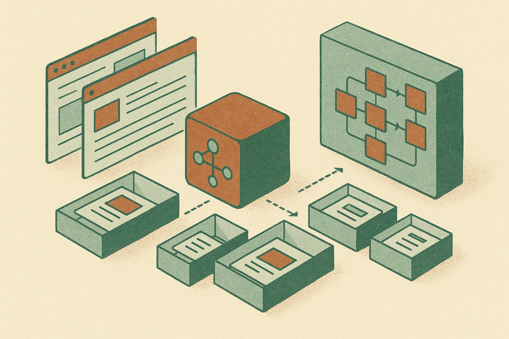

TL;DR: Kitesurf’s useful idea is not “AI browsing the web,” it is treating the browser as an agent runtime, with isolation, state, and control surfaces designed in from the start.

## What does “agent-first browser” actually mean?

The primary source here is **“Kitesurf: Agent-first browser that runs in V8 isolates,”** surfaced on Hacker News. That title is thin, so I’m not going to pretend we know benchmarks, security guarantees, pricing, or production maturity. We do not.

But the phrasing is worth paying attention to.

Most “browser agents” today are bolted onto browsers built for humans. They click through pixels, scrape DOMs, wait for brittle selectors, and recover badly when a modal, cookie banner, or auth wall appears. The browser is treated as a remote-controlled user interface.

An agent-first browser implies a different starting point: the main customer is not a person with a mouse. It is software that needs repeatable access to pages, state, credentials, tools, logs, and side effects. That changes the product surface. You care less about tabs and bookmarks, more about session boundaries, replayability, permissions, snapshots, tool calls, and whether a failed checkout flow can be inspected without guessing what happened.

That is the right direction. It also moves the conversation away from demos where an agent orders lunch and toward the boring work that makes agents useful in operations: form filling, procurement, QA, customer support back-office tasks, competitor monitoring, insurance workflows, compliance checks, and internal admin tools that never got an API.

## Why V8 isolates matter, and what they do not solve

V8 isolates are separate JavaScript execution environments with their own heaps. They are a familiar pattern in systems that need to run many bits of code with stronger separation than “just run it all in one process.” For an agent browser, that sounds attractive. Each task, tenant, page, or tool execution can have a cleaner boundary.

That matters because browser agents are risky by default. They touch logged-in sessions. They read private data. They may click buttons with real-world consequences. If an agent is going to operate across accounts or workflows, isolation is table stakes, not a bonus feature.

Still, V8 isolates are not magic security dust. They do not answer the policy question: what is this agent allowed to do? They do not decide whether a page is malicious, whether a prompt injection in a support ticket should be ignored, or whether the agent should submit a payment form. They also do not make web apps less weird. Anyone who has built against headless Chrome, Playwright, or Puppeteer knows the pain: timing bugs, flaky selectors, shadow DOMs, bot detection, cross-origin constraints, captchas, and unexpected UI changes.

So the Kitesurf framing is interesting, but the hard proof will be operational. Can it show clean traces? Can it replay failures? Can developers set permissions at the level of domains, actions, and data classes? Can it preserve useful state without leaking secrets? Can it hand control back to a human before the expensive click?

That is where this category will be won.

## The agent browser is becoming infrastructure

I think browser agents will split into two camps.

One camp will stay demo-first: “Watch an AI use a website.” Fun, occasionally useful, usually fragile.

The other camp will become infrastructure: isolated browser sessions, workflow orchestration, credential vaulting, human approval gates, audit logs, eval suites, and fallback paths when the model gets confused. Kitesurf’s title places it in that second camp, at least conceptually.

That also suggests the real buyer. Not consumers who want a smarter browser. Not just AI hobbyists. The practical buyer is a team with too many web workflows and not enough APIs. Operations teams. Growth teams. Finance teams. Support teams. QA teams. Internal tooling teams. People who already have SOPs that say “log into portal X, download Y, paste into Z.”

The catch: if the workflow is important enough to automate, it is important enough to constrain. A general-purpose agent that can click anything is less useful than a narrower agent that can do five approved actions with logging and rollback.

Practitioner’s Take: If I were testing Kitesurf or any agent-first browser, I would not start with an open-ended “browse and solve this” task. I would pick one ugly internal workflow with a clear success condition, run it 100 times, and track failures by cause: auth, UI drift, model judgment, timing, permissions, or missing data. The catch most teams miss is that the browser runtime is only half the product. The other half is the control plane around it.
