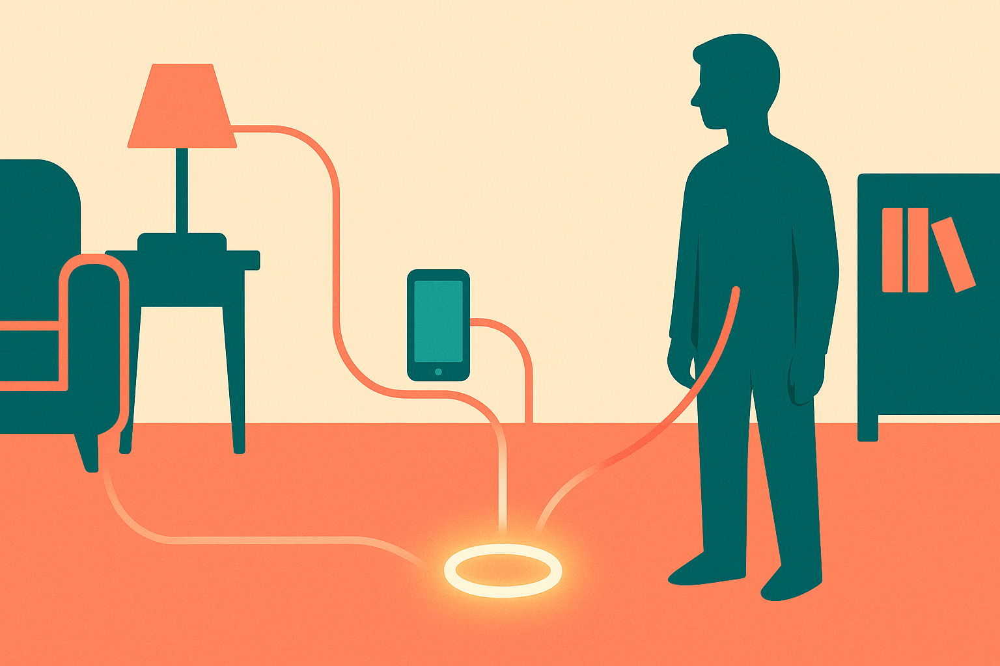

TL;DR: If Decrypt’s report is right, OpenAI’s first device should be judged less as a gadget and more as a test of whether people will give an AI system persistent room-level context.

## What did Decrypt actually report?

Decrypt’s report, titled “OpenAI's First Device Is a $300-Plus Doughnut-Shaped Speaker: Report,” says OpenAI’s first device with Jony Ive’s LoveFrom studio is a screenless gadget slated for 2027. The reported form factor is a $300-plus doughnut-shaped speaker that uses cameras, lights, and moving parts.

That is a small set of facts. It is also enough to frame the real bet.

A screenless AI device is not competing on app grids, display quality, or camera megapixels in the usual phone sense. It is competing on presence. Can it hear enough, see enough, remember enough, and act at the right time without becoming annoying or creepy?

That is a much harder product problem than “put ChatGPT in a speaker.” Voice assistants already trained users to expect timers, music, weather, and occasional disappointment. A stronger model does not automatically fix the social problem of having a machine listen from the counter. Cameras raise the bar again. Lights and moving parts may help the object feel legible, but they also make the device more visibly alive.

The reported price matters too. At $300-plus, this is not a cheap accessory for every room. It has to create a new daily habit or replace several existing ones. Otherwise it becomes another nice object that gets demoed to friends, then ignored.

## What does a screenless AI device have to prove?

The obvious pitch is ambient assistance. Ask questions without opening a laptop. Get reminders without staring at a phone. Let the system understand what is happening in the room. Maybe it can help cook, manage calls, capture notes, coach routines, or coordinate a family calendar.

The less obvious challenge is that all of those use cases depend on context, and context depends on permission.

A device with cameras can do more than a microphone-only speaker. It can see the messy desk, the stove, the whiteboard, the package by the door. But each extra sense creates a new trust bill. Who can see the data? What is stored? What is processed locally? What gets sent to OpenAI? What happens when guests are in the room? Can a user inspect and delete memory without needing a law degree?

If the answer is fuzzy, the product becomes hard to place. Bedrooms are sensitive. Offices have confidential work. Kitchens and living rooms have children, visitors, and background conversations. The device has to make privacy controls feel physical and obvious, not buried three menus deep in an app.

This is where the screenless choice cuts both ways. No screen can make the product calmer. It can also make state invisible. Users need to know when it is listening, watching, thinking, recording, or acting. Lights and motion may be part of that answer, assuming Decrypt’s reported details hold up. The product needs body language.

## Is this a phone replacement or something narrower?

I doubt the first winning version is a phone replacement. Phones are too good at too many jobs. They are private, portable, visual, and already full of payments, messaging, identity, photos, maps, and work apps.

The better target is narrower: a shared AI endpoint for spaces where hands-free context matters. Kitchen. Workshop. Studio. Meeting room. Elder care. Maybe classroom, if the privacy and administration story is unusually strong.

For builders, the lesson is not “make hardware.” It is that the interface is moving from chat boxes toward situated workflows. A screenless device only works if the assistant has a job, the permissions to do it, and a clean fallback when it is wrong. Prototype that before worrying about industrial design. Pick one room, one recurring task, one set of sensors, and one visible permission model. The catch most people miss: ambient AI does not fail because the model is too dumb. It fails because the user cannot tell what the system knows, when it is acting, and how to stop it.
