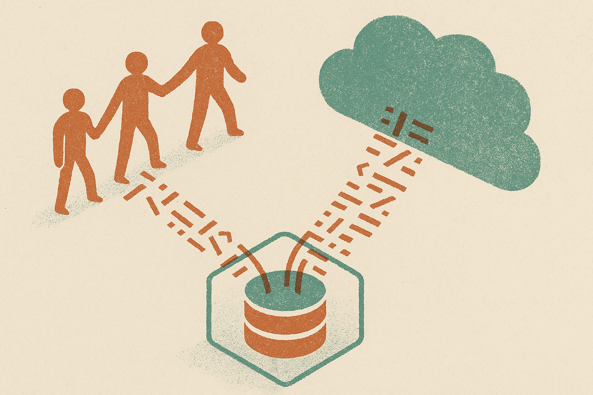

TL;DR: Oracle’s reported ban on AI-generated code in OpenJDK is a governance move, not an anti-AI purity test, and builders should treat it as a reminder that code provenance now matters as much as code quality.

## What is Oracle actually trying to prevent?

The primary source here is the Hacker News item titled “Oracle bans AI-generated code from OpenJDK.” The headline is thin, but the signal is clear enough: Oracle does not want AI-generated code entering OpenJDK.

That sounds like a culture-war sentence if you squint. I do not read it that way.

OpenJDK is not a weekend repo. It is the open-source reference implementation of the Java platform, with long-lived compatibility expectations, heavy downstream dependence, and legal surface area that most projects never see. If code lands there, it can live for years. It may be read by competitors, vendors, cloud providers, banks, governments, and toolchain maintainers.

AI-generated code complicates a basic question: where did this come from?

That is not just copyright anxiety. It is also reviewability. If a contributor cannot explain why a patch works, what training material shaped it, or whether it resembles code from a project with incompatible licensing, maintainers inherit a mess. The code may compile. The test may pass. The provenance may still be unclear.

This is the part many teams miss. AI did not remove accountability from software. It just made it easier to produce artifacts faster than our review systems can absorb them.

## Does this mean teams should ban AI-generated code too?

Not automatically.

Oracle’s incentives around OpenJDK are not the same as a five-person SaaS company shipping an internal dashboard. A project with global platform status has a much lower tolerance for ambiguity. A startup can choose a different risk profile, especially for code that never leaves its walls.

But every serious engineering org should copy the underlying question: can we prove authorship, intent, and responsibility?

There is a useful distinction here. “AI-assisted” is not the same as “AI-generated and pasted in.” A developer using a model to explain an API, sketch a test case, translate a regex, or propose refactors can still own the result. They can review it, modify it, and justify it.

The risk climbs when the human becomes a courier. Prompt goes in, code comes out, patch gets submitted. Nobody knows the design tradeoff. Nobody knows whether edge cases were considered. Nobody knows whether the model produced something memorized, something synthetic, or something subtly wrong.

That is not an AI problem alone. Humans have always copied Stack Overflow snippets badly. AI just makes the copying feel original.

## Where does AI still fit in a serious codebase?

I think the practical answer is to separate thinking help from contribution artifacts.

Use AI to read unfamiliar code, draft migration plans, generate throwaway prototypes, write first-pass tests, compare approaches, explain compiler errors, and suggest names. Those are high-value workflows with manageable risk. The human still decides what enters the repo.

For external contributions, set stricter rules. Require contributors to certify that they understand the patch and have the right to submit it. Ask for rationale, not just diff output. Make AI usage disclosure normal where it matters. Do not turn it into a witch hunt, but do not pretend provenance is irrelevant.

For internal teams, policy should be boring and specific. Which tools are approved? Can source code be sent to hosted models? Are generated snippets allowed? What counts as “generated”? Who is accountable when AI-written code breaks production? If those answers live only in vibes, they will fail under pressure.

The catch is that bans are easier to announce than workflows are to operate. A blanket “no AI code” rule may protect OpenJDK, because its risk profile is unusual. Most builders need something more nuanced: allow AI in the loop, but keep humans on the hook. Try this tomorrow: add a short AI-use note to your contribution guidelines, require reviewers to ask for rationale on suspiciously context-free patches, and treat unexplainable code as unmergeable no matter who, or what, wrote it.
