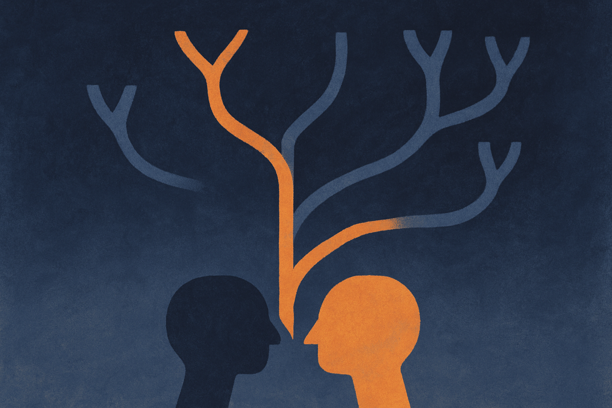
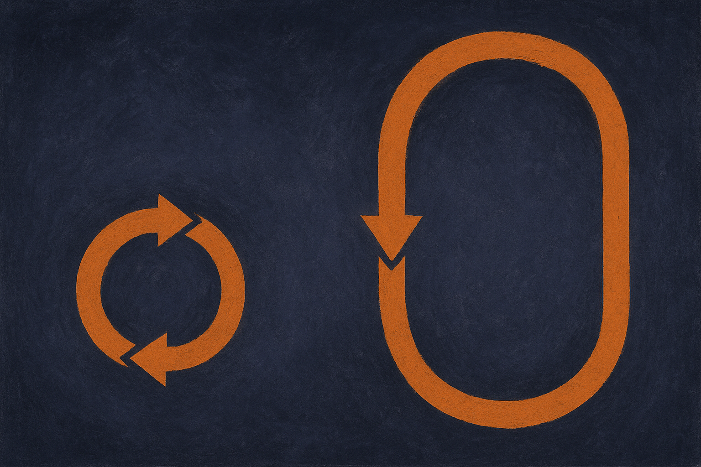

TL;DR: The value of an AI tutor is not in how well it answers, it is in whether it knows when to withhold the answer, and Hugging Face's TutorMoments makes that measurable instead of vibes.

Most tutoring demos you have seen optimize for the wrong thing. Ask a question, get a clean explanation, feel smart. That is a good chatbot. It is a bad tutor. A real tutor watches a student struggle and decides, in the moment, whether to hint, to ask a counter-question, or to shut up and let the student fight through it. That decision is the whole job. Hugging Face's TutorMoments (from the Hugging Face Blog) puts a name and a frame on exactly this problem: does an AI tutor know when to help and when to hold back?

I like this framing because it inverts the metric everyone defaults to. Helpfulness is easy to reward and easy to fake. Restraint is the hard part, and it is the part that separates a system that produces learning from one that produces the feeling of learning.

## Why does "helpful" make a bad tutor?

The instinct baked into most chat models is to resolve the question in front of them. RLHF trained them to be maximally helpful, which in a tutoring context means: give the answer, give it fast, give it fully. That is the opposite of good pedagogy.

There is a well-worn idea in education research called the productive struggle. Students learn more when they wrestle with a problem near the edge of their ability, not when the friction gets removed for them. Vygotsky's zone of proximal development is the same idea from a different angle: the useful help is the smallest nudge that lets the learner do the next step themselves. A tutor that hands over the full solution collapses that zone. The student gets the answer and learns nothing durable.

So the design tension is real. Every "helpful" reflex the base model has works against the tutoring goal. You are not fighting a capability gap, you are fighting a personality that was rewarded into the model on purpose. That is why bolting a system prompt onto GPT-class models ("act like a Socratic tutor") tends to decay fast. The model plays along for a turn or two, then reverts to answer-dumping the moment the student pushes.

## What is TutorMoments actually measuring?

The interesting move in the TutorMoments work is treating the tutor's behavior as a sequence of decision points, not a single response. At each turn there is a moment: help now, or hold back. The quality of the tutor is the quality of those in-the-moment calls across a whole conversation.

That reframing matters for evaluation. If you score a tutor on answer accuracy, a system that solves every problem instantly scores perfectly and teaches nothing. If you score on whether the model made the right call at each moment, you start rewarding the thing you actually want: appropriate restraint, well-timed hints, questions that surface the student's own reasoning.

This is genuinely hard to grade, and I want to be honest about the thin spots. Judging whether a hint was "right" is subjective and context-dependent. What is a good nudge for a student who is 80% of the way there is a cruel non-answer for a student who is completely lost. Any benchmark here is making pedagogical assumptions, and those assumptions are the real product. The number on the leaderboard is only as good as the teaching theory encoded in the rubric.

I would push anyone using this to look hard at the rubric before trusting the score. Who decided what "holding back" should look like? Was it grounded in classroom observation or in someone's idea of Socratic vibes? The framing is the strongest part of the contribution. The scoring is where you should keep your skepticism switched on.

## Can you actually build a tutor that holds back?

Yes, but not by prompting alone, and this is where operators should pay attention.

The pattern that works is to separate the tutoring policy from the content knowledge. The model can know the answer. The system decides whether to reveal it. You can implement that as an explicit state layer: track what the student has attempted, how many hints they have already gotten, where they seem stuck, and let those variables gate what the model is allowed to say next. The model becomes the generator of the hint, not the decider of whether to hint.

Concretely, a few things I would try. First, a hint ladder: force the system to start at the smallest possible nudge and only escalate if the student stays stuck across turns. Second, a "no full solution until N attempts" hard rule enforced in code, not in the prompt, because prompt-only rules leak. Third, log every decision point as a labeled moment so you can review whether the model held back when it should have. That last one is basically building your own TutorMoments-style eval on your real traffic, which is where the value compounds.

The catch is that restraint has a cost. A tutor that holds back too often is infuriating, and users will bounce. There is a satisfaction gap: students say they want to be challenged, and then they rate the tutor that just gave them the answer higher because it felt easier. If you optimize for engagement or thumbs-up, you will train your tutor right back into answer-dumping. You have to be willing to accept lower short-term satisfaction for better learning outcomes, and you need a way to measure the learning, not just the smiles.

If you are building anything in education, start by writing down what your tutor should refuse to do and enforce it outside the model. Treat every turn as a decision to help or hold, and log those decisions so you can grade them later. Borrow the TutorMoments frame even if you never touch the benchmark: the metric that matters is not answer quality, it is decision quality across the whole session. And expect your best-teaching version to feel worse in the first week of user ratings than your worst-teaching one. That gap is the signal that you built a tutor and not a very polite answer machine. The teams that win here will be the ones who measure learning over time and hold the line when the short-term satisfaction numbers try to pull them back.
