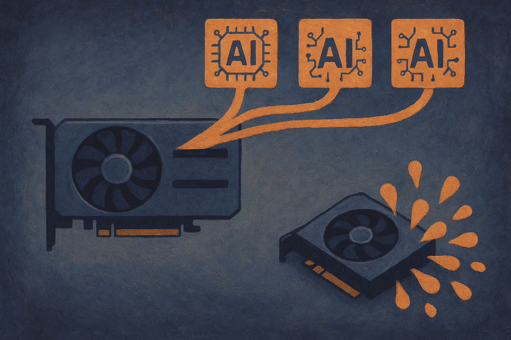

TL;DR: Treat the rumored 96GB RTX 5090 as a signal about where local AI demand is going, not as a real product until there are verified specs, photos, benchmarks, and supply from credible channels.

## What was actually spotted?

The primary source here is the r/LocalLLaMA post “RTX 5090 96GB spotted on Alibaba?” submitted by /u/panchovix. That framing matters. This is not an NVIDIA announcement. It is not a board partner launch. It is not a benchmark run from a known reviewer. Based on the provided sourcing, it is a marketplace sighting that reached a community obsessed with local inference hardware.

That does not make it useless. r/LocalLLaMA is often early to notice weird hardware listings because its users are hunting for one thing: more usable VRAM per dollar. They notice recycled datacenter cards, modded boards, workstation leftovers, import-only SKUs, and listings that may or may not survive contact with reality.

But an Alibaba listing is not a spec sheet. It could be mislabeled. It could be a placeholder. It could be a custom board, a scam, an engineering sample, or a real niche product that never gets clean global distribution. The question mark in the Reddit title is doing real work.

The right posture is not “fake” or “future confirmed.” It is “interesting if verified.”

## Why would 96GB on a consumer-ish card matter?

For local AI, 96GB is a different class of constraint.

Most consumer GPU conversations still orbit gaming performance, power draw, and price. Local model builders care about a separate axis: how much model, context, KV cache, and batch can sit in VRAM without spilling into system memory. Once you leave everything on-card, the user experience changes. Lower latency. Fewer weird stalls. Less babysitting of quantization settings. More room to run a model, a reranker, embeddings, and maybe a vision component without constantly swapping.

That is why the rumored number hits a nerve. A 96GB card would sit in the psychological gap between high-end consumer GPUs and expensive workstation or datacenter parts. It suggests a world where a single tower can do more serious local inference without a multi-GPU mess.

Still, memory alone is not the whole machine. A 96GB board can be slow, hot, loud, power-hungry, driver-annoying, or physically awkward. It can also be priced so close to workstation gear that the buyer pool collapses. For builders, the useful metric is not the sticker VRAM number. It is usable tokens per second at the model quality you need, under your power, thermal, and reliability limits.

## What would make this real enough to care about?

I would want four things before treating this as more than a rumor: consistent photos of the actual board, a credible GPU-Z or equivalent readout, inference benchmarks from known local AI workloads, and evidence that multiple buyers received matching units. A marketplace page is discovery. Delivery plus reproducible testing is evidence.

The trust chain matters more as these parts get weirder. If a card ships with modified firmware, odd memory configuration, unsupported drivers, or no warranty path, the “cheap VRAM” story can get expensive fast. This is especially true for operators building around one machine. If your local model box is part of a workflow, downtime is not a theoretical cost.

The broader point is clear even if this exact listing goes nowhere. Demand for big local memory is real. The open model ecosystem keeps pushing users toward larger checkpoints, longer contexts, multimodal inputs, and agent loops that keep more state around. The bottleneck is often not “can I run a model at all?” It is “can I run the model I actually want, with enough context, at a speed that does not make the workflow feel broken?”

That is the market signal underneath the rumor.

For a builder, I would not plan a stack around this card yet. I would use the rumor as a prompt to audit your actual VRAM pain. Log the models you run, context sizes, quantization levels, tokens per second, and when you hit memory limits. Then price three paths: better quantization and routing, a current high-memory used GPU, or waiting for verified next-generation high-memory cards. The catch most readers miss: more VRAM only pays off if your workflow can keep it busy.
