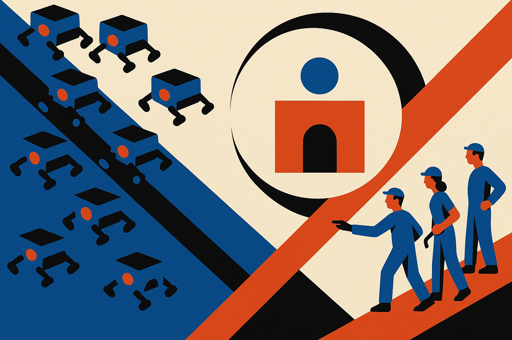

TL;DR: AI scraping is no longer an abstract web policy fight, it is an infrastructure cost that small public projects now have to defend against.

## What actually broke here?

My primary source for this note is the Hacker News item titled “Gentoo bugzilla closed due AI bot scraper overload.”

That is a thin public record, so I am not going to pretend we have packet captures, traffic rates, bot fingerprints, or a full postmortem. We do not. The useful claim is narrower: Gentoo’s Bugzilla was reportedly closed because AI bot scraping overloaded it.

That is enough to pay attention.

Gentoo Bugzilla is not a media site trying to optimize ad yield. It is project infrastructure. Bugs, patches, regressions, maintainers, users trying to figure out whether their problem is known. The boring plumbing of open source.

When that kind of service gets hammered by automated fetchers, the cost lands on people who did not sign up to run a data pipeline for someone else’s model or AI search product. Bandwidth is one cost. Database load is another. Human attention is the big one. Someone has to notice, block, rate limit, communicate, reopen, and then deal with false positives.

The AI part matters because normal crawler etiquette was already a fragile social contract. Search crawlers had incentives to behave because publishers and sites could grant or remove access, and indexing was usually tied to sending traffic back. Model training and answer engines changed that bargain. A bot can extract value without a click, without attribution a user will see, and without any ongoing relationship with the site it hits.

That does not make every scraper malicious. It does make the default economics ugly.

## Why should builders care if they are not scraping Gentoo?

Because this is what AI externalities look like in practice.

A team ships an agent, crawler, research tool, eval harness, dataset builder, or “web context” feature. The demo works. The product feels smarter. The cost shows up somewhere else: on a Bugzilla instance, a forum, a docs site, a package registry, a small nonprofit archive, or a maintainer’s VPS.

Large platforms can absorb abuse with dedicated anti-bot teams and expensive edge infrastructure. Smaller projects cannot. They will close endpoints, add login walls, block whole cloud ranges, poison content, or make public resources less public.

That hurts AI builders too. The open web becomes harder to reach, less reliable, and more adversarial. Agents get more CAPTCHAs. Retrieval quality drops. Fresh technical knowledge moves into private Discords, issue trackers, and paid systems. The model may still answer confidently, but the ground truth gets harder to inspect.

This is the part AI hype usually skips. “The model can read the web” sounds magical until the web starts defending itself.

## What should change?

The low-friction answer is not “never crawl.” Crawling is useful. Search is useful. Archiving is useful. AI systems need current information, and public technical knowledge should not disappear into closed silos.

But builders need to treat public infrastructure like a shared dependency, not free ore.

That starts with basic crawler hygiene: identify yourself, publish contact details, respect robots.txt where it applies, use conditional requests, cache aggressively, set sane concurrency, back off on errors, and avoid hammering search, bug, and diff endpoints that are expensive to generate. If your product needs a lot of data from a project, ask. If you are generating revenue from that data, budget for access, mirrors, sponsorship, or hosted exports.

There is also a product design point. Not every AI feature needs live crawling. Many workflows can use curated snapshots, official APIs, package mirrors, docs exports, or user-provided context. “Just send an agent to browse everything” is often lazy architecture wearing a fancy hat.

Practitioners should audit their systems this week for one simple thing: where does our AI product impose load on infrastructure we do not own? Check crawler logs, eval scripts, background jobs, agent browser loops, and vendor tools. Add identity and throttling before someone else has to block you. The catch most readers miss is that polite scraping is not just ethics. It is supply chain risk. If open source services close doors because AI bots are too expensive, your product gets dumber too.
