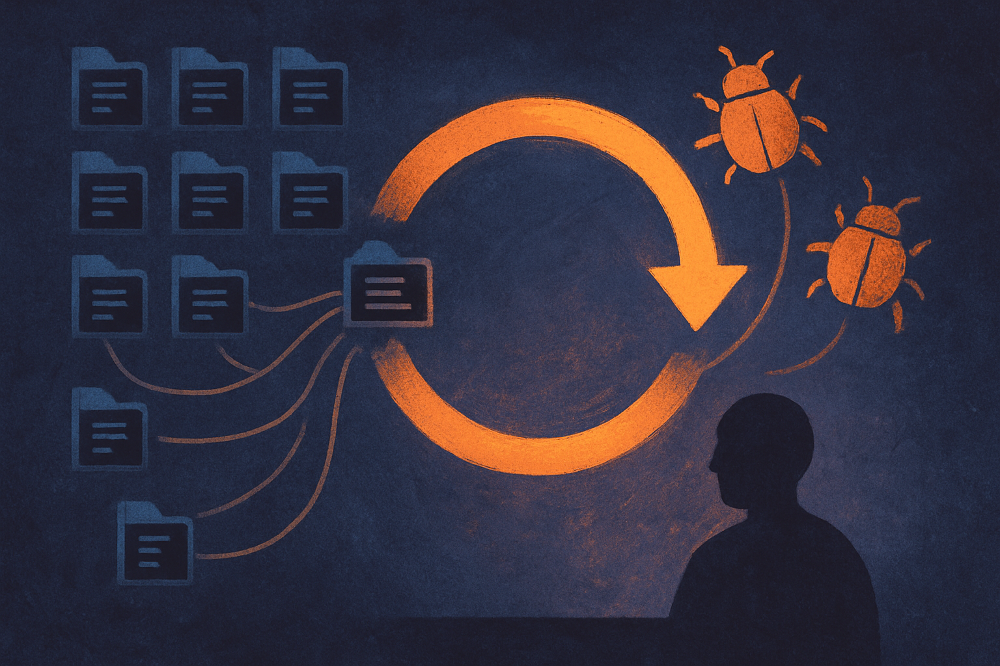

TL;DR: AI code review is becoming useful enough for real security work, but only when it is tied to disclosure, verification, and human accountability.

## What did Bitcoin Red Team actually claim?

Decrypt reported in “Bitcoin Red Team Says AI Is Finding Critical Exploits Across Core Projects” that a volunteer security effort has scanned 150 Bitcoin repositories, disclosed more than a dozen vulnerabilities, and is building an open-source AI platform for automated software security reviews.

That is the whole signal worth paying attention to.

Not “AI secures Bitcoin.” Not “agents found every bug.” Not “crypto is fixed now.” The useful claim is narrower: a volunteer group says AI-assisted review helped it find and disclose real vulnerabilities across a meaningful number of repositories.

The number matters. 150 repos is not a demo against a hand-picked vulnerable app. It suggests a workflow aimed at breadth: scan a lot of code, surface likely issues, route them into some human process, then disclose. That is where AI can help today. It can read more boring code than a volunteer team has time to read manually.

The “more than a dozen” disclosures also matters, but it needs caution. A disclosure is not the same thing as a confirmed fix, a CVE, or proof of exploitability. Decrypt’s report frames the vulnerabilities as critical, but without a full public write-up for each issue, the right posture is interest, not victory lap.

## Why does this matter outside Bitcoin?

Bitcoin is a useful testbed because the code is high-stakes, public, old enough to contain history, and fragmented across many supporting projects. Wallets, libraries, explorers, infrastructure tools, integrations, test frameworks. Security risk does not only live in the famous core repo.

That is true for most software organizations now.

The interesting part is not that an AI system looked at code. Every vendor says that. The interesting part is the shape of the workflow: broad scanning across many repos, probable issue detection, human review, responsible disclosure, and then iteration on an open-source platform.

That pattern maps cleanly to non-crypto teams. A company with 80 internal services, 30 abandoned utilities, and a pile of SDKs has the same problem. The scary bugs often hide in code nobody feels ownership over anymore. Human security teams triage the loudest things first. AI can cheaply make the quiet backlog visible.

But this only works if teams resist the temptation to treat model output as proof. AI security tools are good at suspicion. They are not courts. They produce leads, not truth. A hallucinated vulnerability can waste days. A missed vulnerability can create false comfort. Both are normal failure modes.

## What would a serious builder do with this?

I would not start by asking an AI tool to “secure the codebase.” Too vague.

Start with a bounded pass. Pick one class of issue: unsafe deserialization, auth bypass patterns, secret handling, input validation around transaction-like operations, dependency confusion, or permission checks across service boundaries. Run the model against repos where that class is plausible. Ask for file paths, call chains, minimal reproduction ideas, and confidence. Then make a human prove or discard each finding.

The disclosure piece is the hidden hard part. If you scan open-source projects, you need a responsible process before you find something spicy. Who gets contacted? What evidence do you share? How do you avoid publishing an exploit before maintainers can patch? Volunteer security work can help ecosystems, but sloppy disclosure can also create harm.

For internal teams, the same principle applies. Do not dump 400 model-generated findings into Jira. Create a review lane. Require reproduction. Track false positives. Track time saved. Track whether issues were real enough to patch. If the tool cannot improve those numbers after a few weeks, it is noise with a nice interface.

A builder should treat the Bitcoin Red Team claim as a prompt to test AI-assisted security review on neglected code, not as proof that AI can replace security engineers. Try it on stale repos first. Look for repeatable bug classes. Keep humans in the loop for verification and disclosure. The catch most readers miss: the value is not the model finding one dramatic exploit, it is the boring system that turns many uncertain findings into a few confirmed fixes.
