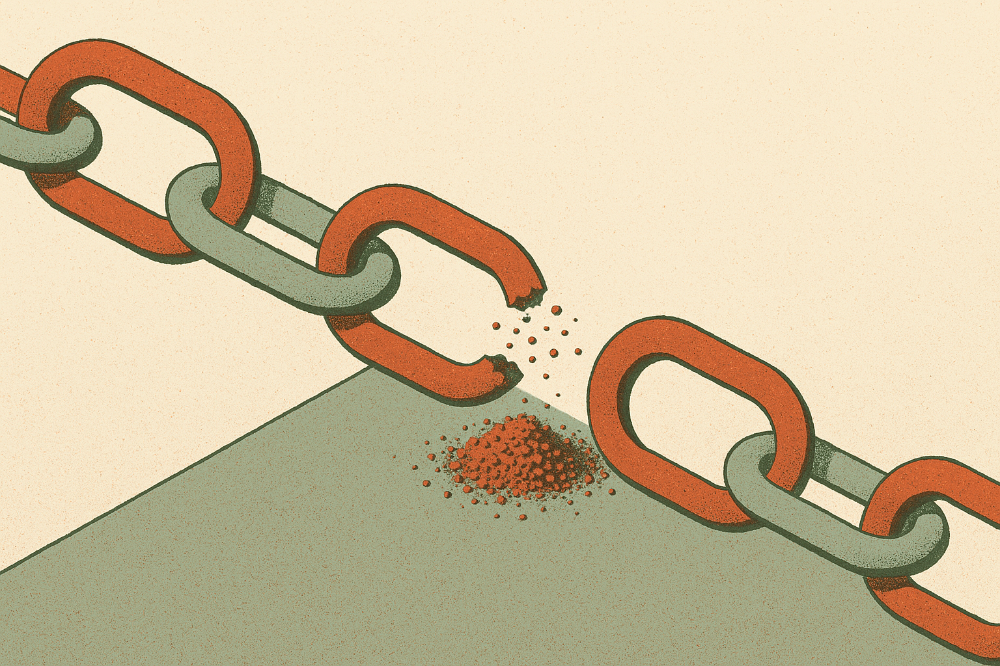
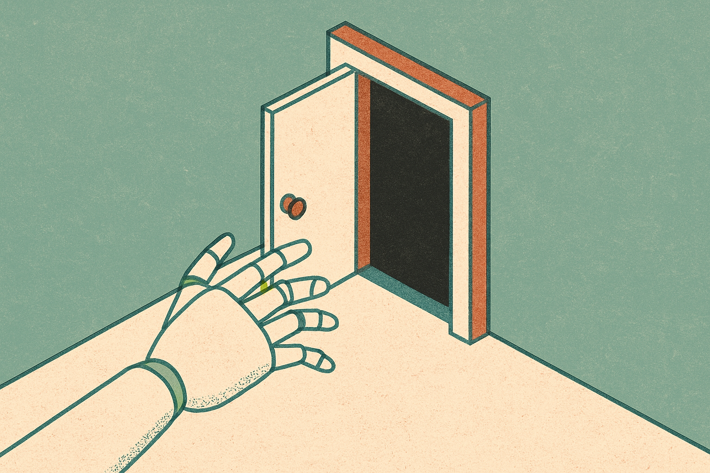

TL;DR: Link rot is not a nostalgia problem anymore, it is an agent-reliability problem, and if you are building anything that reads the live web you need a snapshot-and-cache layer or your product breaks quietly over time.

The primary source here is a Hacker News (AI) post titled "The original URL for this prediction will no longer be available in 11 years (2011)." The joke writes itself. Someone in 2011 predicted their own link would be gone in 11 years, and here we are, past the deadline, watching the prediction resolve as true. It is a cute bit of internet folklore. It is also, if you build with LLMs and agents, a quiet warning about the ground you are standing on.

I want to take the joke seriously, because the thing it points at is real and getting worse.

## Why does a dead 2011 link matter to anyone building AI in 2026?

Link rot is the slow decay of URLs. Pages move, domains lapse, companies fold, CMS migrations break paths, and the thing you cited last year returns a 404 today. Studies over the years have put the half-life of a web link somewhere in the low single digits of years, and anyone who has clicked an old bookmark knows the vibe without needing a citation.

For a human reader, a dead link is an annoyance. You shrug, you search for the title, you find a mirror or an archive copy, you move on. For an agent, a dead link is a silent failure mode. The retrieval step returns nothing, or worse, returns a parked-domain landing page full of ad junk, and the model dutifully summarizes the ad junk as if it were the source. No error thrown. No alarm. Just a confidently wrong answer built on a corpse.

That is the part that should bother operators. The failure does not announce itself. Your eval suite passed in March. Your RAG pipeline scored well on the golden set. Six months later a chunk of your indexed sources have quietly gone stale or vanished, and your accuracy has drifted down a few points, and nobody noticed because nothing crashed. The 2011 prediction is funny precisely because it made the decay visible on a schedule. Most decay does not give you a countdown.

## How is this different from the link rot we already knew about?

The old link-rot conversation was about citations and journalism and legal records. The web archive people, the librarians, the footnote purists. Important work, but it was fundamentally about preserving the human record for humans.

The 2026 version is about live systems making decisions off the web in real time. Three things changed the stakes.

First, agents now fetch pages autonomously, in loops, without a human in the read path. A person notices when a page looks wrong. An agent doing 40 tool calls to answer one question does not pause to sanity-check that source number 17 is a domain-squatter page.

Second, the volume of URLs any given product touches has exploded. A single deep-research run can pull dozens of sources. Multiply by users, multiply by daily runs, and you are dereferencing a huge, constantly shifting set of URLs, a meaningful fraction of which are dead or dying at any moment.

Third, and this is the uncomfortable one, the training data problem. Models trained on web crawls learn from URLs and page content that may no longer exist. When a model "knows" a fact tied to a source, and you go to verify against that source, and the source is gone, you have a provenance gap you cannot close. The model's confidence and the world's evidence have drifted apart.

## What actually breaks in a real pipeline?

Let me be concrete about where this bites, because "the web decays" is too abstract to act on.

Retrieval-augmented generation. If your RAG index stores URLs and re-fetches at query time, every dead link is a hole. If it stores full text captured at index time, you are safer, but now your snapshot can go stale in the other direction: the source updated, corrected itself, retracted, and you are serving the old version.

Citation and grounding features. Products that show "sources" links are making a promise. Click-through to a 404 is a trust hit. Worse is the click-through to a hijacked domain that now sells supplements. You linked a user to that.

Agent tool loops. Browsing agents that follow links inside pages are walking through a minefield of redirects, paywalls, bot walls, and dead ends. Each hop is a chance to derail.

The through-line: any place your system trusts a URL to still point at what it pointed at before is a place time can quietly break your product.

## What should a builder actually do about it?

Snapshot at ingestion. When you index or cite a page, capture the content then, not later. Store the text, the retrieval timestamp, and ideally a hash. This gives you provenance you control instead of provenance you rent from someone else's server staying up.

Cache with a freshness policy, not forever. Snapshots solve disappearance but create staleness. Decide per source type how long a capture is trustworthy. A regulatory page and a product-pricing page have very different decay rates. Re-fetch and diff on a schedule that matches the source's volatility.

Detect the silent failures. Treat a 404, a redirect to a root domain, a sudden content-length collapse, or a parked-domain fingerprint as signals worth flagging, not just handling. Log when a previously-good source goes bad. That log is your early warning that eval scores are about to drift.

Use archival copies as a fallback, deliberately. The Internet Archive and similar services exist for exactly this. Wiring a "if live fetch fails, try the archived snapshot" path into an agent is a few hours of work and buys you real resilience. Just respect rate limits and terms, and cache their responses so you are not hammering a free public service.

Show users the capture date. If you display sources, show when you saw them. "Retrieved 2026-08-09" is honest and it inoculates you against the day the live link changes under you.

The catch most people miss: this is not a one-time fix you ship and forget. Link rot is a rate, not an event. The 2011 prediction resolved on a clean 11-year timer, but your sources are decaying continuously at rates you do not control, and the failures are invisible by default. The teams that stay accurate over years are not the ones with the best model. They are the ones who treated the web as a decaying asset from day one, captured what they depended on, dated it, and built monitoring for the moment a trusted source quietly turns into a 404 or an ad. Start with snapshot-at-ingestion. It is the highest-leverage hour you will spend on reliability, and you will not feel the payoff until the day something breaks and it doesn't.
