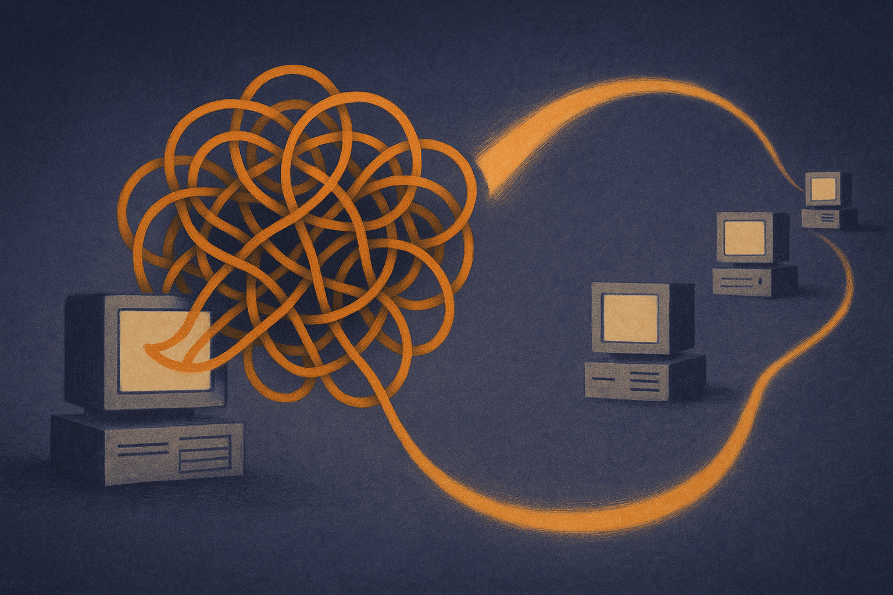

TL;DR: Diffusion LLMs may change how text is generated, but this paper argues their safety behavior can still depend on small, transferable circuits that attackers can target across model families.

## What did the paper actually show?

The primary source here is the arXiv paper “Diffusion LLMs as Targets and Adversaries: Mechanistic Safety Exploits,” posted under cs.AI and cs.LG. The paper looks at diffusion large language models, or DLLMs, which generate text through iterative parallel denoising instead of the familiar autoregressive next-token loop.

That architectural difference is the hook. A lot of people hear “not next-token prediction” and mentally file diffusion LLMs as a separate safety category. The paper pushes against that. Its core claim is that safety alignment in these models can remain sparse, mechanical, and transferable.

The reported numbers are not subtle. Self-pruning increased attack success rate from 2.6% to 73.8% on LLaDA, and from 1.9% to 86.6% on Dream. Transfer pruning from Qwen2.5 increased attack success from 1.9% to 73.2% on Dream, and from 7.0% to 86.3% on Fast-dLLM.

The important part is not just “jailbreaks work.” We already knew models can be brittle. The sharper point is inheritance. According to the paper, DLLMs initialized from autoregressive predecessors inherit a similar “mechanistic safety footprint.” In plain English: if a diffusion model starts life from an autoregressive model, some of the same safety-critical internal features may come along for the ride.

That means the safety surface is not erased by changing the generation method.

## Why does this matter if you are not training a model?

Most builders are not pruning neurons or training diffusion LLMs. They are wiring models into products. Still, this matters because it changes what “model diversity” might mean in practice.

If two systems look different at the API or decoding level but share internal safety structure, then routing between them may not buy as much protection as expected. A fallback model, a second vendor, or a “different architecture” can still fail in related ways if the underlying safety representations transfer.

The paper also introduces SN-Guided Diffusion, described as a fully offline black-box jailbreak framework. It steers the diffusion process away from safety-triggering regions using a weighted safety neuron loss. The reported transfer results include attack success rates up to 77.1% on Llama-3-8B-Instruct, 86.9% on Qwen2.5-7B-Instruct, and 74.3% against Gemini-2.5-Flash-Lite, with 20 generation episodes per prompt.

I would not overread that into “all models are broken.” Benchmarks, prompt sets, and evaluation choices matter. The paper’s claims need replication, especially on production systems with layered defenses. But I would not ignore it either. The cost claim is the part that should make operators pay attention: competitive transfer with much lower generation cost than prior jailbreak frameworks, according to the paper.

Lower cost changes threat models. It means more attempts, more variants, and less need for deep access.

## What should teams do differently?

First, stop treating architecture labels as safety guarantees. “Diffusion” may change latency, controllability, sampling behavior, and UX. It does not automatically mean a safer alignment substrate.

Second, test across families. If your product uses a primary model plus a backup model, red-team the combined workflow, not each model in isolation. The failure mode may sit in the handoff, the retry loop, the moderation boundary, or the agent tool call after generation.

Third, watch for sparse-control assumptions. The paper’s safety-neuron framing suggests that some refusal behavior may depend on relatively concentrated internal features. If that holds up, then model providers need defenses that are less brittle than a few internal tripwires. Product teams cannot fix that inside closed models, but they can avoid pretending the model is the whole safety system.

The practical answer is layered evaluation. Keep harmful-output tests, but add transfer tests. Run the same adversarial intent through your main model, fallback model, summarizer, classifier, and agent planner. Log where refusals disappear. Test after model upgrades, not just before launch. The catch most teams miss: switching model architecture can create a false sense of independence. If the models share training lineage, distillation paths, or safety mechanisms, your “backup” may be correlated risk with a different logo.
