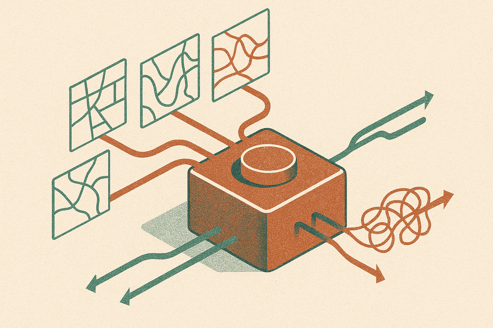

TL;DR: If your AI system needs to reason about location, distance, regions, or time, test that directly, because general LLM quality does not guarantee geospatial competence.

## What does GeoBenchLLM actually test?

The primary source here is the arXiv paper "GeoBenchLLM: A Comprehensive Benchmark for Evaluating LLMs on Geo-Related Tasks", listed in both cs.CL and cs.LG, with the benchmark released at https://github.com/Rfr2003/GeoBenchLLM.

The useful bit is not that another benchmark exists. We have plenty of those. The useful bit is the shape of the benchmark: twelve publicly available datasets, selected across geo-related tasks and domains, meant to probe both geo-spatial and temporal understanding.

That matters because “geodata” is usually treated too narrowly in model evaluation. A model might answer a trivia question about capitals, then fail on a routing-like inference, a regional comparison, a time-sensitive place question, or a task that requires matching language to spatial structure. Those are different skills.

GeoBenchLLM’s framing calls out that prior work often studied LLMs in a more homogeneous setting. That is the right complaint. If you only test one flavor of place-based question, you can fool yourself into thinking the model has a coherent internal grasp of geography. It may only have memorized common facts, learned frequent co-occurrences, or gotten good at a particular dataset format.

## Why do reasoning and model size matter here?

GeoBenchLLM reports that reasoning and size have a strong impact on overall performance. That tracks with what I see in applied work.

Geospatial questions often punish shallow pattern matching. “Is this place closer to X or Y?” can require approximate world knowledge, unit handling, coordinate intuition, and a sense of topology. “What changed over time in this region?” adds temporal ordering. Even simple-sounding local queries can hide ambiguity: neighborhood names, administrative boundaries, colloquial regions, and stale place data.

Bigger models tend to carry more geographic knowledge and more latent associations. Reasoning-oriented models are better at chaining constraints instead of blurting out the most familiar place name. Neither solves the whole problem.

The catch is that geospatial reasoning is not just language reasoning with map words sprinkled on top. Real systems often need grounding in external data: GIS layers, map APIs, business locations, satellite metadata, census tables, shipping zones, sensor readings, or time-indexed events. An LLM can be the interface and planner. It should not be the source of truth for every coordinate, boundary, or distance.

That is where benchmarks like GeoBenchLLM are helpful. They separate “the model sounds geographically literate” from “the model can perform across multiple geo-related task types.” Still, because the benchmark uses publicly available datasets, teams should be careful about over-reading scores. Public data can show up in training mixtures. A strong result may reflect skill, memory, or both.

## What should builders do with this?

If you are building anything involving location intelligence, I would not use GeoBenchLLM as a leaderboard to pick a model and call it done. I would use it as a checklist for failure modes.

Start by naming the kind of geography your product actually needs. Place lookup is not route reasoning. Regional summarization is not coordinate math. Temporal change detection is not local recommendation. If your app touches all of these, your eval set should too.

Then build a small internal benchmark using your own data shape. Include stale names, edge cases, ambiguous places, multilingual place references if relevant, and questions where the correct answer depends on current external data. Test with and without retrieval. Test the model’s final answer, but also inspect whether it chose the right tool, asked for clarification, or invented a fact.

The practical read: GeoBenchLLM is a reminder to stop treating “geo” as a single checkbox. Try a reasoning model for the steps that need constraint solving, connect it to authoritative geodata for facts, and keep a domain eval that matches your real workflows. The catch most readers miss is that a model can pass a geography-style benchmark and still be unsafe for production if it is allowed to guess coordinates, boundaries, or time-sensitive facts from memory.
