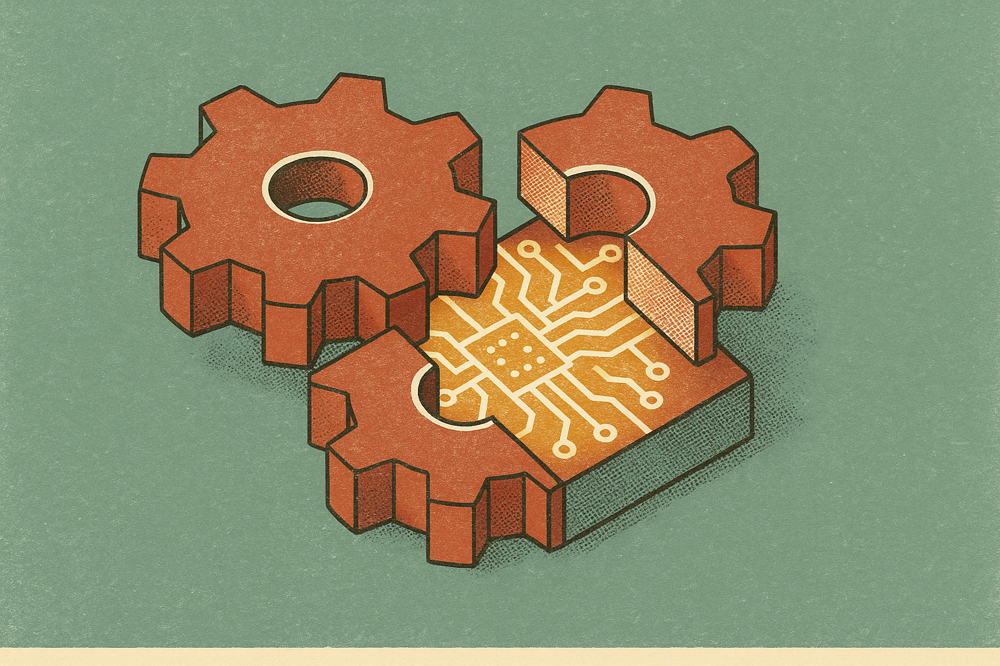

TL;DR: Muon can make small transformers grok modular arithmetic faster, but the learned solution may later fail because the representation and readout keep moving out of alignment after the task is already solved.

## What actually collapses after grokking?

The primary source here is the arXiv paper titled “Post-Grokking Collapse at the Representation-Readout Interface in Muon-Trained Transformers.” It studies a weird failure mode in tiny transformers trained on modular arithmetic, mainly $(a+b) \bmod 113$.

The headline is not just “Muon is unstable.” That is too broad. The sharper finding is that a model can grok, hit strong generalization, and then lose it later. All nine tested configurations on modular addition grokked and then lost generalization. Across five seeds, the selected AdamW reference also fell below threshold on four, bottoming at 27.59%, so this is not a clean Muon-good, AdamW-bad story either.

But Muon changes the shape of the failure. In the setup tested, Muon trains the hidden matrices while AdamW trains embeddings and the output head. That split matters. The model has a representation on one side and a readout on the other. Those two are only jointly identified up to an invertible map. In plain English: the loss does not care which internal coordinate system the model uses, as long as the representation and readout agree.

After the training set is solved, the gradient drops to around $10^\{-6\}$. At that point, tiny optimizer differences can become the whole story. The paper reports step-size elasticity of -0.03 for Muon versus +1.5 for AdamW, and the Muon group moves 8.0 times faster per parameter. So one half of the system keeps shifting differently from the other half, even though the task already looks done.

## Is the circuit gone, or just masked?

This is the useful part. The paper separates two failure modes: circuit failure and masking.

In circuit failure, the task-aligned component no longer solves the task. That is the obvious bad case.

In masking, the circuit is still there. It still works. Across 43 checkpoints over five seeds and three regimes, the task-aligned family reaches exactly 100% alone. Yet the full model can fall to 45.85% because a near-equal adversarial remainder outvotes it. The task-aligned part has a positive margin on every example, including examples the full model gets wrong. Rescaling that component restores 99.9%.

That is a much stranger failure than “the model forgot.” It is closer to “the right answer is still represented, but the final vote is being drowned out.”

The Fourier evidence backs that up. Across an abrupt collapse, standard Fourier support is unchanged, and the power-distribution cosine stays at 0.9899. So if you only inspect broad frequency support, you may conclude that nothing important changed. The failure lives at a finer interface between representation and readout.

This is a good reminder for interpretability work. A circuit can be present and still not control behavior. Finding a feature, family, or subspace is not enough. You also need to know whether it wins the downstream competition.

## What should builders take from this?

I would not generalize this straight to frontier training. Modular arithmetic transformers are toy systems by design. That is the point. They let you see a failure cleanly enough to name it.

The practical warning is about optimizer splits and late-training drift. If different parameter groups are trained by different optimizers, or by the same optimizer under very different effective update scales, the interface between those groups can become the hidden weak point. The model may pass evals, then keep training into a worse internal alignment.

The strongest intervention in the paper was simple: freeze one side. From bit-identical states, freezing either group prevented failure. Freezing embeddings and readout removed collapse in five runs over 451,400 post-grokking steps and five paired seeds. The unfrozen arms recorded 137 to 321 sub-threshold evaluations. The frozen arms recorded none.

Also, removing Muon’s normalization and orthogonalization was not a clean substitute. It collapsed the representation from 326 effective conjugate pairs to 4, showed no recurrent collapse, and failed terminally. So “turn off the weird optimizer parts” is not automatically the right repair.

For a builder, the move is not to panic about Muon. It is to add interface checks when mixing optimizers or parameter-group policies. Try freezing embeddings or heads after a capability appears. Track whether a known task circuit still wins the logits, not just whether it exists in an activation probe. And when an eval regresses late in training, do not assume the model forgot. The catch is that the answer may still be inside the model, just no longer in charge.
