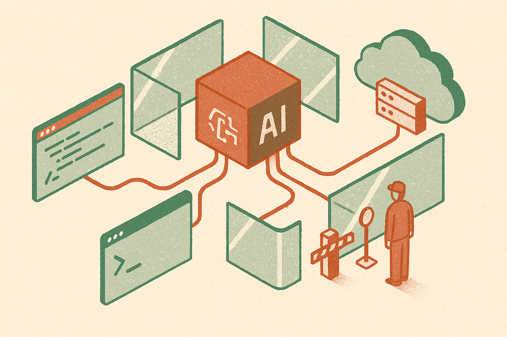

TL;DR: The useful takeaway from OpenAI’s reported Astra pause is that autonomous cyber capability is becoming a real release gate, and builders should treat agent permissions like production infrastructure, not like chat features.

## What did OpenAI actually say about Astra?

Decrypt reported in “OpenAI Says Its Next AI Model Astra May Be Too Dangerous, Pauses Development” that OpenAI says its next major model may be dangerous enough to write its own cyberweapons, and that the company is pulling back until safeguards catch up.

That is a serious claim. It is also a thin public record, at least from the material available here. We do not have a model card. We do not have the eval thresholds. We do not know whether “pauses development” means pausing training, deployment, internal access, external release, or some narrower milestone. We do not know what “safeguards” means in OpenAI’s internal process.

So the most important word is “may.”

Still, the signal matters. The risk is not that a chatbot says scary things about hacking. That has been true for years. The harder problem is tool use: a model that can plan, write code, run tests, inspect errors, search documentation, call APIs, and iterate toward a working exploit. That is a different class of system.

Cyber is also not a clean “good use, bad use” category. A model that can identify vulnerable code and draft a proof of concept may help defenders. The same capability can help attackers. Intent matters, but systems cannot reliably infer intent from a prompt. Permissions matter more.

## Why should builders care if they are nowhere near frontier models?

Because most production risk comes from model capability plus access.

A mid-tier model with shell access, cloud credentials, internal documentation, and a retry loop can do more damage than a frontier model trapped in a chat box. The spooky part is not “Astra.” It is the pattern every company is copying: give an agent tools, let it work across systems, then hope the instruction layer keeps it inside the lines.

That is not enough.

If OpenAI is worried about a model being able to write cyberweapons, a startup should be worried about its support agent being able to pull logs, query customer records, trigger deployments, or edit infrastructure-as-code files. The failure mode may not be an intentional cyberweapon. It may be a confused agent following a malicious ticket, a poisoned dependency, a prompt injection in a web page, or a test workflow accidentally pointed at production.

This is where the frontier lab story becomes operational. Safety is not a press release. It is a permissions model.

## What would “safeguards catch up” actually mean?

For cyber-capable agents, safeguards need to be concrete.

Pre-release evals should test whether the model can chain tasks, not just answer isolated questions. Can it discover a vulnerability, write exploit code, run it, debug it, and adapt? Can it use public tools in a way that changes the threat level? Can it bypass its own refusals by reframing the task?

Product controls matter just as much. Sandboxed execution. No default network access. No secrets in the agent context. Scoped credentials. Human approval before scanning external systems, modifying infrastructure, or running generated code. Logging that security teams can actually inspect. Rate limits and kill switches. Clear separation between defensive workflows and offensive capability.

Refusals help, but they are not a security boundary. A model policy can reduce obvious abuse. It cannot replace architecture. Generated code can be copied. Tool calls can be redirected. Context can be poisoned. If the agent has the authority to act, the system around it has to assume mistakes and misuse will happen.

The practical move: inventory every place an AI system can read, write, execute, or exfiltrate. Put each permission behind least-privilege scopes and dry-run modes first. Test hostile prompts before launch, especially through tickets, docs, web pages, and repo content the agent may read. Add approvals around terminals, cloud APIs, credentials, and outbound network calls. The catch most teams miss is simple: the model is only half the product. The workflow around it is what turns a helpful coder into a cyber tool.
