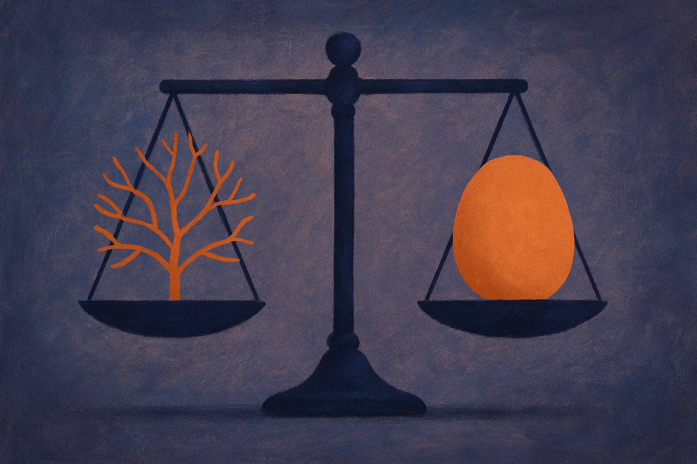

TL;DR: Post-training makes models more helpful but flattens their creativity, and CreativeInstruct teaches a model to flip back into a more diverse, base-model-like mode on demand, which also happens to make reinforcement learning work better.

There is a tradeoff most people who fine-tune models learn the hard way. You take a base model, run it through instruction tuning and preference optimization, and you get something that follows directions, refuses less usefully, and produces cleaner output. You also get something duller. Ask it to write ten short stories and you get ten variations on the same story. Ask it for brainstorm ideas and the list converges. That collapse in variety is the quiet cost of alignment, and it has been hard to fix without giving back the quality gains that made post-training worth doing.

The paper "CreativeInstruct: Scalably Teaching LLMs to Balance Quality, Creativity, and Diversity" (arXiv, cs.AI and cs.CL) takes a direct swing at this. The pitch is simple enough to explain in a sentence: teach the model a special marker, [StartCreativity], that shifts its generation toward the wide-open distribution of a base model, so you can dial creativity up when you want it and keep the polish when you do not.

## What actually breaks during post-training?

Base models are trained to predict the next token across the whole internet. That gives them an enormous, messy distribution to draw from. Post-training narrows it. Instruction tuning teaches the model what a "good" answer looks like, and preference methods like RLHF or DPO sharpen that further by rewarding responses humans prefer. The result is a model that concentrates probability mass on a smaller set of safe, high-quality completions.

For most tasks that is exactly what you want. For anything that lives or dies on variety, it is a problem. The authors call out two categories. The explicit one is obvious: story generation, ideation, anything where sameness is failure. The implicit one is the more interesting claim. They argue reinforcement learning itself needs diversity, because RL algorithms explore by sampling different completions and learning from the good ones. If your model always samples near-identical outputs, there is nothing to explore, and the learning signal thins out.

That framing matters because it reframes creativity from a nice-to-have for writers into a training-efficiency issue for everyone. If diversity collapse hurts RL, then it is silently taxing the exact post-training loops labs use to push math and reasoning scores.

## How does the [StartCreativity] span work?

Instead of maintaining two models, one creative and one aligned, or blending their weights, CreativeInstruct keeps a single model and teaches it a switch. During instruction tuning it learns to inject special [StartCreativity] spans that bias the following generation toward base-model-like breadth. The model learns when and how to enter that mode as part of normal training, so at inference you get creativity on demand without running multiple models or paying for extra serving infrastructure.

This is the part I find most practical. A lot of proposed fixes for diversity collapse involve ensembles, sampling from several models, or distilling their combined outputs. That is expensive and awkward to operate. A single checkpoint with a learned mode switch is something you could actually deploy. The authors report that CreativeInstruct matches or exceeds the diversity of both multi-model baselines and distilled variants of those outputs, without needing multiple models at inference time. If that holds up outside their setup, it is a cleaner engineering story than the alternatives.

The measurement piece is worth flagging too. Diversity is famously slippery to score. Lexical metrics catch surface word variation, semantic metrics catch meaning-level variation, but both miss structure. Two stories can use different words and mean different things while following the identical narrative arc. CreativeInstruct introduces a structural diversity metric based on graph edit distance, meant to capture narrative-level variation those other metrics miss. I read that as an admission that the field has been grading creativity on the wrong rubric, measuring vocabulary churn and calling it imagination.

## Does more diversity actually cost quality?

This is the question that decides whether any of it is useful, and it is where I want to see more before I fully buy in. The headline human-eval result is that annotators rated CreativeInstruct generations as more creative than the post-trained model's generations in 70.3% of cases. That is a strong margin. The claim attached to it is that this happens without sacrificing quality.

Two cautions. First, "creative" and "quality" are both judged by humans here, and creativity ratings can drift toward "surprising" or "weird," which is not the same as good. A 70.3% preference on creativity tells you the switch changes the output noticeably; it does not by itself tell you the quality held perfectly steady. The paper says quality is preserved, and I take that at face value, but this is exactly the kind of claim that deserves independent replication before anyone bets a product on it.

Second, the diversity metric is their own invention. A graph-edit-distance structural score is a reasonable idea, and I like that it targets narrative structure rather than word choice. But when a method's headline diversity gains are measured partly on a metric the same authors designed, you want to see how it fares on metrics they did not.

## Why should someone doing RL care?

Here is the result that stops this from being a niche writing-tools paper. The authors apply GRPO, a common reinforcement-learning method, to a CreativeInstruct checkpoint and compare it against the same GRPO training run on the standard post-trained checkpoint. Starting from the more creative base, they report roughly a 4% improvement on AMC and about 5 points on MATH.

Read that carefully. These are math benchmarks, not story benchmarks. The gain does not come from creativity being intrinsically valuable to arithmetic. It comes from the model having a wider distribution to explore during RL, which gives the algorithm more varied completions to learn from. Diversity as a substrate, in their words. If that mechanism is real and general, it suggests a lot of RL pipelines are leaving performance on the table by starting from over-collapsed checkpoints.

That is the most transferable idea in the whole paper. Not "creativity is good," but "premature distribution collapse is a hidden cost, and preserving optionality before you run RL pays off downstream."

The catch most readers will miss is that this is not a prompt trick you can bolt onto an existing API model. The [StartCreativity] span is learned during instruction tuning; it only works on a checkpoint you trained this way, so if you are calling a hosted frontier model you cannot just paste the token and get diversity. What you can do today: if you run your own fine-tuning, test the underlying idea by keeping a less-collapsed checkpoint around and comparing RL runs seeded from it versus your fully post-trained one, on your real reward. If you cannot train, the usable takeaway is diagnostic. Measure diversity on your production outputs with something structural, not just n-gram overlap, before you assume more preference tuning is the answer. Sometimes your model is not wrong, it is just narrow, and the fix is upstream of the prompt.
