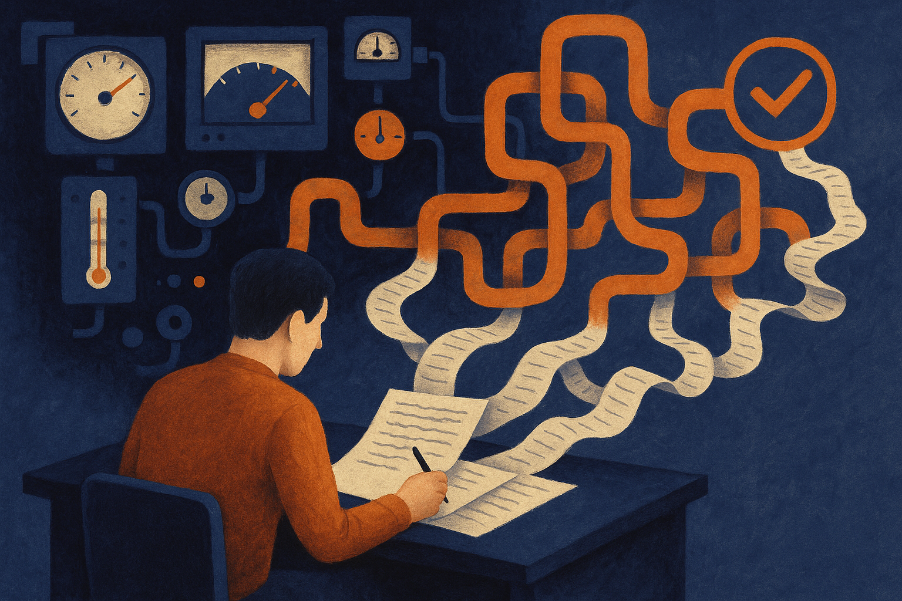

TL;DR: AI detectors are too inconsistent to act as judges, but they can still be useful as weak signals inside a better editorial workflow.

## What did the detector test actually show?

The primary source here is Search Engine Journal’s “The AI Detection False Economy: Fueling FOW (Fear of Writing)” by Andy Betts. Betts reported that AI detectors gave wildly different verdicts on the same human-written article, and even flagged writing from 2014, before the current ChatGPT-era writing panic existed.

That second point matters. A detector that calls old human writing AI-generated is not catching AI. It is catching style.

Clean structure. Predictable phrasing. Generic transitions. Low variance sentence patterns. The exact traits editors have often rewarded in SEO content, corporate blogs, help docs, and web copy.

That creates a nasty loop. Writers are told to be clear, concise, scannable, and consistent. Then a detector punishes them for producing text that looks clear, concise, scannable, and consistent.

This is the false economy Betts is pointing at. A company buys a detector to save editorial time, reduce risk, or enforce originality. But if the tool generates enough false alarms, the cost comes back as review queues, writer anxiety, damaged trust, and slower publishing.

Not free. Just hidden.

## Why are teams so tempted to trust these tools?

Because “AI-written” sounds like a binary label.

It is not.

Most detectors are estimating probability from patterns. They are not reading intent. They do not know whether a person drafted from scratch, used a model for outline help, cleaned up awkward sentences, translated a paragraph, or pasted raw model output. They infer.

That inference can be useful in narrow settings. For example, if a batch of 500 product blurbs all shares the same weird phrasing, a detector score might help flag the batch for sampling. If student essays suddenly match a known template, it might be one input into a conversation.

But using the score as a verdict is where the process breaks.

The deeper problem is policy laundering. A manager wants a simple rule. A vendor offers a simple score. The team converts uncertainty into enforcement. Now the detector is not a tool. It is an authority.

That is how you get Fear of Writing, or FOW, as Betts frames it. Writers start optimizing for the detector instead of the reader. They add awkward phrasing, inject needless personal asides, or deliberately make text messier so it “looks human.” That is not quality control. That is theater.

## What should replace AI detection as policy?

Start with the thing you actually care about.

If the concern is plagiarism, use plagiarism checks and citation review. If the concern is factual accuracy, require source links, quotes, and verification. If the concern is brand voice, use human editorial standards and examples. If the concern is undisclosed automation, set a disclosure rule for workflows, not a purity test for prose.

The practical standard should be provenance plus accountability.

Who assigned the piece? Who drafted it? What tools were used? Who checked claims? Which claims need citations? Who signs off before publication?

That process is less exciting than a detector score, but it maps to actual risk. It also avoids punishing the wrong people. A strong writer should not have to defend a clean paragraph because a black-box tool dislikes it.

I would still keep detectors in the toolbox, but only with a small role. Treat them like smoke alarms, not judges. A signal can trigger review. It should not trigger discipline, rejection, or accusation on its own.

For builders, the move is simple: write an AI-use policy that separates assistance from accountability. Let writers use models for outlines, variants, editing, and research prompts where appropriate. Require human ownership of facts, claims, and final judgment. If you use detectors, log them as one weak signal in an editorial checklist. The catch most teams miss: the goal is not to prove a human typed every word. The goal is to publish work that is accurate, useful, original enough for the job, and owned by someone willing to stand behind it.
