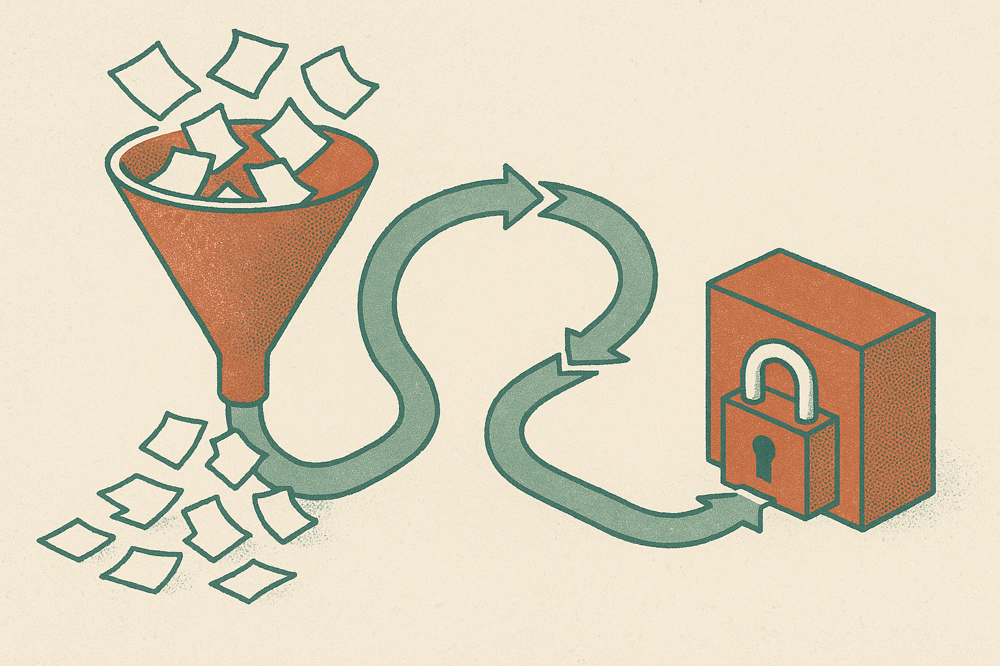

TL;DR: Auto-research agents need less “generate a pile and rank it later” and more fuzzer-style feedback loops that make partial progress visible before final validation.

## What does fuzz testing have to do with research agents?

The primary source here is the arXiv cs.AI and cs.CL paper titled “Agentic Auto-Research is Fuzz Testing.” Its core claim is simple and useful: autonomous research agents are being treated like proposal machines, when they should be treated more like search systems.

That distinction matters.

A proposal machine emits many ideas, experiments, prompts, model variants, or hypotheses. Then a judge, human or learned, ranks the results. This is the generate-and-rank pattern. It is familiar because it maps cleanly onto current LLM workflows: sample more, score more, keep the best.

The paper argues that this misses the sparse feedback problem. In research, the real win signal is rare. Most experiments do not produce a valid discovery. If the only meaningful signal arrives at the end, after a full experiment and review, the agent is mostly guessing between long feedback cycles.

Greybox fuzzers solved a related problem in software testing. A fuzzer throws lots of inputs at a program, but it does not only wait for a crash. It watches coverage. Did this input reach a new branch? Did it exercise a new path? That cheap partial signal lets the fuzzer mutate future inputs and spend effort where something interesting is happening.

That is the analogy. A research agent should not just produce more completed experiments for a judge. It should observe signs of epistemic progress during the run, then use those signs to choose the next intervention.

## What feedback should an auto-research system collect?

The paper’s phrase is “cheap, dense signal of epistemic progress.” That is doing a lot of work.

Cheap means the signal can be collected often. Not once per week after a full lab cycle. Not only after a human panel reviews the output. Often enough that it can guide search.

Dense means most runs produce some information, even when they fail. A failed experiment might still narrow a parameter range, expose a confounder, rule out a family of prompts, reveal a dataset artifact, or improve a mechanistic explanation. The agent needs a way to see that.

Epistemic progress means the signal is about learning, not just looking good to the scoring function. This is the hard part. If the progress signal is weak or gameable, the agent will optimize toward junk. Anyone who has built eval-driven LLM systems has seen the pattern: the model learns the shape of the test, not the underlying task.

The paper is careful here. It does not say the dense signal is the discovery. It says the signal should guide search. Final validation still needs protected evidence that has not been adaptively reused by the agent.

That is the most important operational point in the piece. Feedback can steer. It cannot also be the final judge if the system has been optimizing against it the whole time.

## Why generate-and-rank will hit a wall

Scaling the proposer feels like the obvious move because LLMs are good at proposing. More candidate experiments. More agent rollouts. More synthetic reviewers. More leaderboards. More ranking.

That can help at the margin, but it does not change the basic economics. If validation is expensive and the true positive rate is low, generating more candidates can bury reviewers under plausible noise. A learned judge may reduce cost, but then the system starts optimizing for the judge.

The paper proposes controlled tests around three questions: whether candidate progress signals predict validated progress, whether feedback-directed search produces more validated discoveries per unit cost than repeated sampling, and whether protected validation reduces false discoveries.

That is the right test frame. Not “can an agent write a convincing paper?” Not “can it generate surprising hypotheses?” The better question is whether the whole loop produces more validated knowledge for the same budget.

I would apply this outside science too. Product growth agents, code agents, security agents, data analysis agents, and marketing agents all suffer from the same failure mode. They can generate faster than teams can verify. The bottleneck becomes feedback architecture, not model cleverness.

Practitioner's take: if you are building an agent that explores a space, add an intermediate progress signal before you add another sampler. For a coding agent, that might be new test coverage, smaller repro cases, or failing tests converted into passing ones. For a data agent, it might be eliminated hypotheses or checks that reduce uncertainty. Keep a holdout validation set or human review path that the agent cannot train against. The catch most teams miss: the progress metric is a steering wheel, not the finish line.
