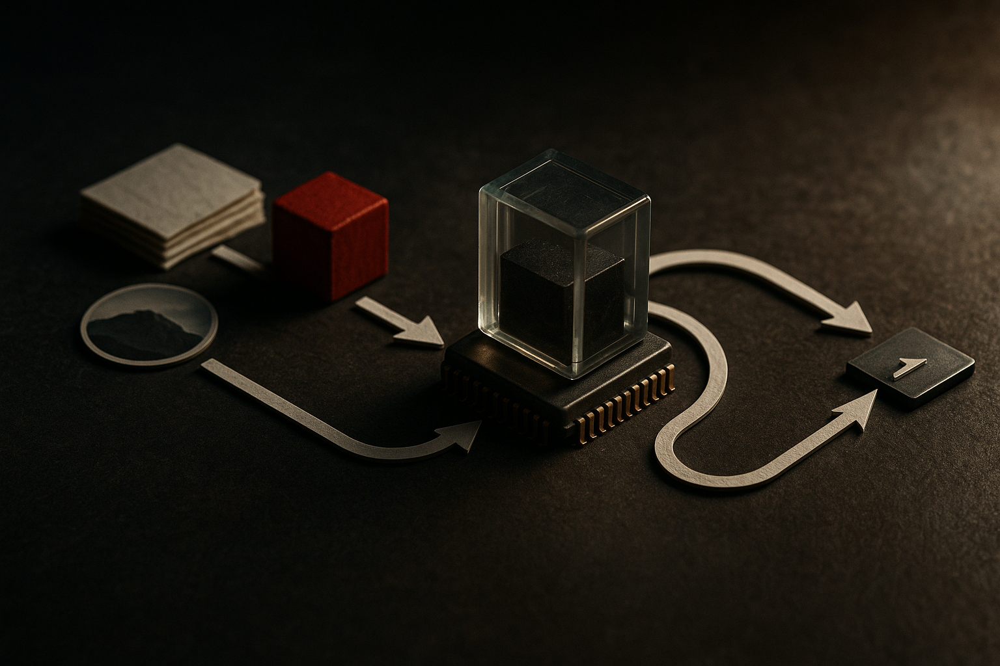

TL;DR: BDH-CQ’s interesting claim is not that it “solves” ARC, but that a small model can use recurrent latent computation to get better cost-efficiency on abstract reasoning tasks.

## What did BDH-CQ actually change?

The primary source here is the arXiv paper titled **“BDH-CQ: In-Context Learning with Recurrent Latent Reasoning.”** It describes a model that combines two ideas that usually get discussed separately: in-context learning and recurrent reasoning.

The in-context part is familiar. The model sees examples at inference time, then uses them to answer a query. The recurrent part is the twist. Instead of producing a visible chain of thought, BDH-CQ updates an internal memory as it reads the inputs, then runs iterative computation in a high-dimensional latent space.

Plain English: it thinks for multiple steps, but not in words.

That matters because a lot of current reasoning work pushes models to externalize reasoning as text. Sometimes that helps. Sometimes it is expensive ceremony. BDH-CQ points at another route: keep the intermediate work internal, run it recurrently, and spend tokens only on the final answer.

The paper reports a 150M-parameter configuration reaching **29.5% pass@2** on the public **ARC-AGI-1** evaluation set at a computed inference cost of **$0.0007 per task**. The paper says this breaks the previously reported ARC-AGI-1 cost-accuracy Pareto frontier.

That is a narrow claim, but a useful one. Small model. Cheap run. Nontrivial result on a benchmark designed to punish pattern matching.

## Why does ARC-AGI-1 cost efficiency matter?

ARC-AGI-1 is not a production workload. Nobody is paying models to recolor tiny grids all day. But ARC-style tasks are useful because they test whether a system can infer a transformation from a few demonstrations, then apply it consistently.

That is closer to many real workflows than leaderboard chat feels. Think: “Here are three cleaned records, now clean the fourth.” Or: “Here are examples of how this team formats exceptions, now handle this new case.” The task shape is demonstration, abstraction, application.

BDH-CQ is interesting because it studies that exact loop. The paper uses controlled ARC-like interventions to test what the model learns from demonstrations, how consistently it applies an inferred transformation, and which concepts remain hard.

The catch is that the public summary does not tell us enough to treat this as a general reasoning breakthrough. ARC-AGI-1 has been gamed, studied, and optimized against by many teams. “State of the art in benchmark cost efficiency” is not the same as “general intelligence got cheap.”

Still, cost matters. A lot. If a 150M-parameter model can do useful iterative inference at fractions of a cent per task, that is a different deployment conversation than calling a giant frontier model for every micro-decision.

## What should builders take from this?

The best lesson is architectural, not promotional. BDH-CQ suggests that some reasoning tasks may benefit from three ingredients: examples supplied at runtime, a memory that updates as those examples arrive, and repeated hidden computation before answering.

That pattern is worth watching for agents and workflow tools. Not every task needs a verbose scratchpad. In fact, visible reasoning can create latency, cost, privacy, and evaluation problems. Latent reasoning gives up easy inspection, but it may be a better fit when the task is structured, repeated, and cheap answers matter.

I would not swap a production system based on this result alone. I would test the shape. Build a small benchmark from your own work: a few demonstrations in, one transformed output out. Compare a normal prompting baseline, a chain-of-thought style baseline, and a smaller model allowed more internal or repeated compute if your stack supports it. Measure accuracy, latency, and cost together. The catch most readers miss: the win is not “smaller models beat big models.” The win is matching the inference method to the task geometry.
