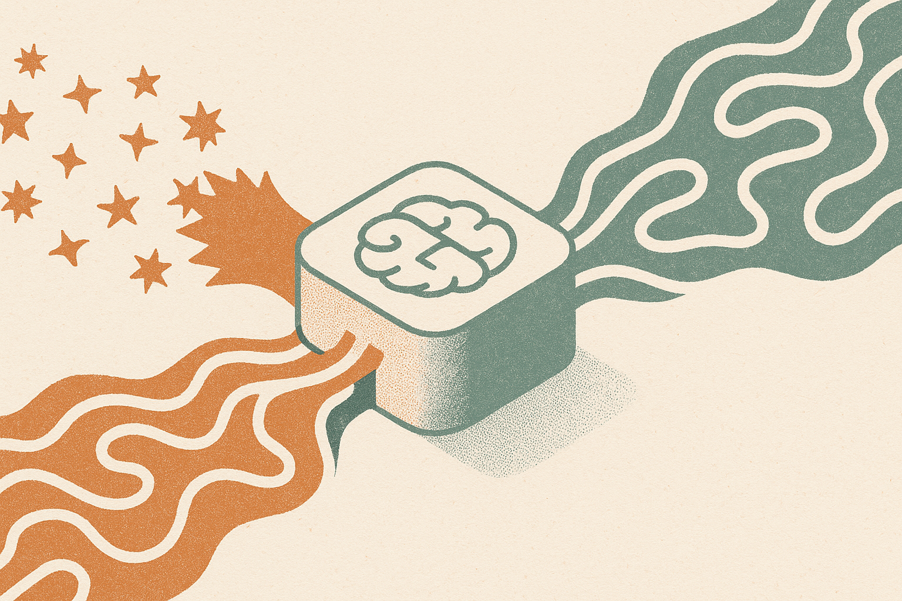

TL;DR: Training one model to be both terse and deeply reasoned is not free, and too much concise-answer supervision can measurably hurt the model’s reasoning mode.

## Can one model be both short and thoughtful?

That is the product dream behind Thinking Mode Fusion, or TMF. One model, two behaviors. Ask for a direct answer, it responds without the long scratchpad. Ask for hard math or planning, it shifts into extended reasoning.

The arXiv paper “Fusion Training for Mathematical Generalization in Large Language Models” tests that idea in a narrow but useful setting: mathematical problem solving. The paper looks at how TMF behaves when you vary two knobs, the ratio of thinking to non-thinking training data, and the training schedule used to mix those modes. The team also released code and data through Fusion Bench at `https://github.com/caocongfeng/Fusion-Bench.git`.

The key result is not that TMF fails. It is more interesting than that. The two modes interfere asymmetrically. Increasing non-thinking supervision reduces thinking-mode accuracy. In plain English: teaching the model to skip the reasoning too often can make it worse when you later ask it to reason.

That matters because most product teams want the same thing TMF promises. Fast answers for easy tasks. Longer reasoning for hard tasks. Lower latency when possible. Better explanations when needed. But the training setup is not just a UI toggle. The behavior you reward during training changes the model’s internal trade-offs.

## What is the actual training lesson?

The useful part of “Fusion Training for Mathematical Generalization in Large Language Models” is that it does not treat “thinking” as magic. It treats it as supervision. How much thinking data? How much non-thinking data? In what order? Mixed together, staged, or scheduled differently?

The paper reports that the best schedule depends on the data ratio. That is an annoying answer, but a real one. There is no single recipe that wins across every mixture. The training schedule modulates the trade-off between modes, and the paper quantifies a negative correlation between thinking and non-thinking supervision.

This is a good reminder for anyone fine-tuning models on internal data. If your dataset is full of final answers, short replies, compressed summaries, and “just give me the result” examples, you may be training out the behavior you expect on harder tasks. The model may still sound competent. It may still answer quickly. But when the task needs multi-step reasoning, the habit of jumping to the final answer can become a liability.

The asymmetry is the part I would underline. More concise supervision hurts thinking accuracy. The inverse claim, that more thinking supervision equally damages concise mode, is not presented as the main finding here. That suggests teams should be especially careful when adding large volumes of short-answer data to a fused model.

## What should builders test before shipping this?

Do not evaluate only the final model average. Split the eval by mode. Short answer mode should be tested separately from reasoning mode, with separate pass rates, latency, token cost, and failure patterns. Then test the routing instruction itself: when users ask for “just the answer,” does the model stay concise? When they ask for reasoning, does it actually do the harder work?

For math, this is straightforward. For business workflows, it is messier. A support agent may need a short refund decision on one ticket and a careful policy analysis on another. A coding assistant may need a one-line fix sometimes and a full debugging trace other times. If you train both behaviors into the same model, your eval set needs both behaviors too.

I would also watch for silent degradation. A model can preserve the tone of reasoning while losing the substance. It writes longer. It uses connective phrases. It appears careful. But the intermediate steps are weaker. That is why outcome-based evals still matter, especially on tasks where the final answer can be checked.

The practical move is simple: before adopting fused thinking and non-thinking behavior, build a small Fusion-Bench-style eval for your own domain. Create paired tasks where the same underlying problem is tested in concise mode and reasoning mode. Try different data mixes if you are fine-tuning. The catch most readers miss is that “make it shorter” is not just an inference-time preference. If you bake too much shortcut behavior into training, you may pay for it exactly when the work gets hard.
