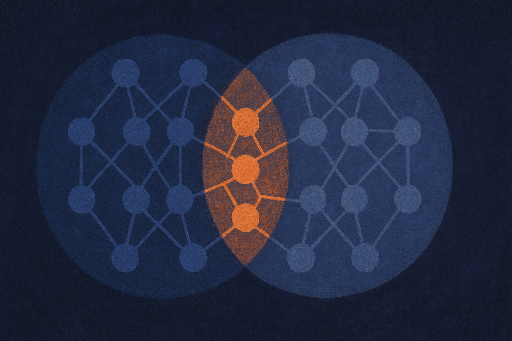

TL;DR: MMDiff isolates the specific internal features that multimodal training adds to a language model, then lets you remove or steer them to measurably change spatial reasoning, OCR, and jailbreak resistance without wrecking general performance.

Most interpretability work on vision-language models has a gap you can drive a truck through. We know MLLMs read charts, follow spatial instructions, and get jailbroken through images. We do not know, at the level of actual model internals, which parts of the network are responsible. Sparse autoencoders help you decompose hidden states into cleaner feature directions, but on their own they do not tell you which of those features came from the vision training versus the language model you started with. That distinction matters a lot if you want to audit or fix behavior.

That is the gap the paper "Multimodal Model Diffing for Feature Discovery and Control" goes after. It introduces MMDiff, a framework built around one simple idea: train an SAE on the base language model, train another on its multimodal-adapted version, and diff them. The features that changed are the features multimodal training introduced. From there you can find the ones that actually cause a behavior, and then turn them up or down.

## What is model diffing, and why does it beat a plain SAE?

A plain sparse autoencoder gives you a dictionary of feature directions and tells you which ones fire on a given input. Useful for inspection. Not useful for the question a practitioner actually has, which is: what did adding vision do to this model?

Model diffing answers that by comparison. You have a base LM. You have its multimodal descendant. Both get their own SAE. When you diff the two dictionaries, you isolate the directions that are new or substantially altered. Everything the base model already did stays in the background. What surfaces is the delta from multimodal training.

This is the move that makes the rest possible. Instead of staring at thousands of features and guessing which ones matter for vision, you start with a much smaller, already-filtered set: the ones training changed. That is a real reduction in search space, and it is the difference between "here is an interpretability toy" and "here is something you could run an audit with."

MMDiff layers two more capabilities on top. Task-specific feature detection uses per-token contrastive firing analysis to find which of those changed features are causally tied to a specific behavior, not just correlated. And feature-level control lets you remove or steer those directions to see what actually happens to the output. Isolation, then detection, then control. Three stages, one pipeline.

## Does removing a feature actually change behavior?

This is where the paper earns its keep, because ablation results separate real causal features from features that merely light up.

The team trained multimodal SAEs for three model families: LLaVA-MORE, PaliGemma 2, and InternVL3.5. Not one cherry-picked model, three different lineages. They then evaluated on visual-spatial understanding, multimodal safety, and OCR.

When they causally removed the discovered features, target behaviors degraded in a targeted way. Spatial task performance dropped by an average of 12 percent. OCR dropped by 17 percent. On multimodal safety attacks, removing the relevant features cut attack success rate by 24 percent. And here is the part that makes it a control mechanism rather than a wrecking ball: general VQA performance was unaffected. You knock out the thing you targeted and leave the rest standing.

That selectivity is the whole point. A feature you can remove that only breaks the behavior you meant to break is a feature you understand. A feature whose removal also tanks unrelated tasks is just a load-bearing wall you found by accident. MMDiff's features look like the former.

Steering in the other direction worked too, though more modestly. Pushing on the discovered directions improved spatial accuracy by 3.6 percent and OCR by 1.8 percent on average over a standard single-layer steering baseline. Small numbers, but they are gains on top of a baseline that already steers, and they come from targeting features the diffing process surfaced rather than picking a layer and hoping.

## What can an operator actually do with this?

The safety result is the one I would watch. Multimodal jailbreaks, where an attacker smuggles instructions through an image, are a real and annoying attack surface, and most defenses are input filters bolted on the outside. A 24 percent reduction in attack success rate from removing internal features is a different kind of defense: it changes what the model can be talked into, not what reaches its input.

I want to be careful about what that number means, though. A 24 percent cut is meaningful, not a solve. The remaining three quarters of attacks still land. And the evaluation is on a specific set of safety attacks, so the honest read is "this is a promising internal lever," not "multimodal jailbreaks are handled." Anyone reading a 24 percent as a security guarantee is reading it wrong.

The OCR and spatial numbers point somewhere more mundane and more immediately useful. If you can steer the features that drive OCR quality, you have a knob for document-heavy workloads that does not require retraining. Same for spatial reasoning in tasks like layout understanding or robotics perception. The steering gains are small today, but the mechanism generalizes across three model families, which suggests it is not a fluke of one architecture.

## Where this fits in the interpretability picture

For a while, SAE-based interpretability has been fighting a "so what" problem. You can decompose a model into features, name some of them, and write a nice blog post. Turning that into something that changes model behavior on purpose has been harder. MMDiff is part of a shift from interpretability-as-observation to interpretability-as-control, and the diffing framing is what makes it tractable for multimodal models specifically, where the interesting features are exactly the ones training added.

The obvious caveats: the effect sizes on steering are small, the safety gains are partial, and training a pair of SAEs for every model you want to audit is not free. This is a research framework, not a product you drop into a pipeline next week.

Practitioner's take: if you run a vision-language model in production and you have ever wished you could ask "which part of this model handles OCR" and get an answer you could act on, this is the shape of the tool that gets you there. Do not wait for it to be a library. Do borrow the core idea now: when you fine-tune or adapt a model, keep the base around and compare behavior deltas systematically rather than eyeballing outputs. The diffing mindset, base versus adapted, is useful even without SAEs. The catch most readers will miss is that the impressive selectivity depends on having a clean base-model SAE to diff against, so this works best when you control the training lineage. If you are handed a black-box MLLM with no base checkpoint, the neat isolation story gets a lot murkier.
