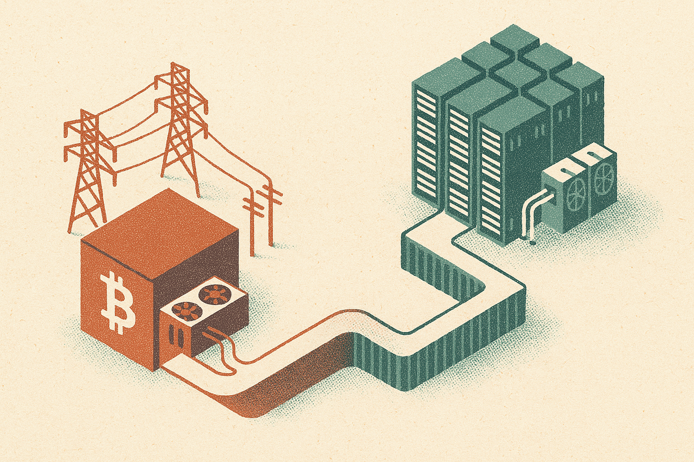

TL;DR: Bitcoin miners with power and land are trying to sell AI infrastructure, but a giant reported contract is not the same as proven GPU data center execution.

## What did Riot actually announce?

My primary source here is CoinDesk’s “Riot Platforms surges 20% in pre-market trading on $9.1 billion Anthropic deal,” cross-checked against The Block’s “Riot Platforms stock jumps 25% after-hours on $9.1 billion AI deal reportedly with Anthropic.”

The basic shape is clear. Riot Platforms, a bitcoin miner, has a 20-year agreement tied to AI infrastructure revenue. CoinDesk reported the contract at $9.1 billion and named Anthropic. The Block reported the deal as reportedly with Anthropic and added that two five-year extension options could raise the potential contract value to $16.1 billion.

The stock reaction was loud: CoinDesk reported a 20% pre-market surge, while The Block reported a 25% after-hours jump. Those are useful signals of market attention, not proof of operating success. I would not read too much into the exact percentage difference either. The important thing is that investors saw this as more than another miner trying to diversify. They saw a possible long-duration AI infrastructure customer.

That is the real story.

Bitcoin miners have spent years building around cheap power, large sites, grid interconnects, and cooling. AI companies now need the same scarce inputs, plus far more demanding compute infrastructure. So miners are trying to turn yesterday’s energy footprint into tomorrow’s AI data center business.

## Why are bitcoin miners chasing AI infrastructure?

Mining bitcoin and serving frontier AI labs are not the same business. But they rhyme at the infrastructure layer.

A miner needs power at scale. It needs real estate. It needs electrical work, cooling, hardware operations, and a tolerance for huge capital outlays. Those are not trivial capabilities. In a world where AI demand is bottlenecked by power and data center capacity, that gives miners a story to tell.

The catch is that AI infrastructure customers do not want generic megawatts. They want dependable GPU clusters, networking, uptime, security, maintenance, and contract performance. A bitcoin ASIC can go offline and the miner loses production. A training or inference customer may have service commitments, workload deadlines, and expensive idle hardware if the site fails.

That changes the operating model.

The best version of this shift is simple: miners with advantaged power sites become landlords, operators, or partners for AI compute. The worst version is also simple: miners announce AI pivots because the market rewards the words “AI infrastructure,” then discover that high-performance data centers are a different sport.

Riot’s reported contract size makes this worth watching. A 20-year term is long enough to reshape a company, if delivered. The optional extensions reported by The Block make the upside look even bigger. But operators should focus on what has to be built, financed, powered, cooled, staffed, and maintained over that period.

## What should builders take from this?

For AI builders, this is another sign that compute scarcity is moving down the stack. Model quality still matters. Tooling still matters. But the boring inputs, electricity, land, interconnects, transformers, cooling, and delivery timelines, are becoming strategy.

That affects startups too. If you depend on heavy training runs, hosted inference at scale, or specialized GPU availability, your roadmap is partly exposed to infrastructure markets you do not control. The same is true if you are building agent products with spiky usage, video generation workflows, synthetic data pipelines, or enterprise inference systems with strict latency needs.

For miners, the message is harsher: power is an entry ticket, not a moat by itself. The AI customer will care about delivered capacity and reliability, not mining heritage. A big customer name can open the door. Execution keeps it open.

I would treat Riot’s reported Anthropic deal as a marker for the next phase of AI infrastructure, not as a verdict on Riot or any other tradable asset. The useful move for builders is to map your compute exposure now: which workloads are optional, which are margin-critical, which can move between providers, and which would break if GPU supply tightens. The catch most teams miss is that “AI infra” sounds abstract until procurement delays become product delays.
