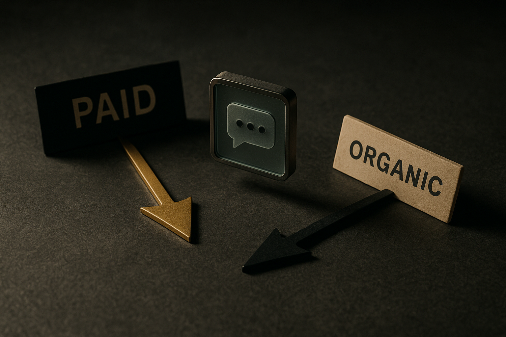

TL;DR: OpenAI now runs a self-serve ad platform inside ChatGPT with a $25/day floor, and separately, consumers are already using ChatGPT to research and choose products, so brands need both a paid-media plan and an authority plan, and the two are not the same job.

Two things happened that most marketing teams are still treating as one. OpenAI opened a real ad platform inside ChatGPT. And separately, buyers started using ChatGPT as a research surface whether or not anyone pays. These get lumped together as "AI marketing," but they demand different work, different budgets, and different people. This post maps where both stand as of August 2026: what is confirmed, what is still soft, and what an operator should do this quarter.

I am anchoring this on three sources. OpenAI's own post, "How Zapier transformed core marketing processes with ChatGPT Work," on a marketing team using ChatGPT internally. Martech's "A 7-step guide to running ads on ChatGPT," a hands-on account of the paid platform with real numbers. And Martech's analysis "How AI, publishers, and social media are rewriting product discovery" by Adam Weiss, on the organic side. Where they disagree or stay thin, I will say so.

## What is actually confirmed about ChatGPT Ads?

Start with what is settled, because the platform is new enough that a lot of confident writing online is guesswork.

The Martech guide, which describes spending the author's own and clients' money, reports these specifics. The self-serve platform opened to everyone in May 2026. You create an account at ads.openai.com. The daily budget floor is $25, down sharply from the $200,000 minimum commitments required during the pilot phase. That drop is the real story: it moves ChatGPT Ads from an enterprise pilot to something a small team can test on a Tuesday.

The mechanics will feel familiar. The campaign structure is Campaign > Ad group > Ad, the same nesting Google and Meta use. Objectives are Reach, Clicks, or Conversions. You can target and exclude by country, region, DMA, or postal code, and upload first-party data as custom audiences. Headlines cap at 50 characters and can be truncated. Martech reports average CPCs in the $2 to $5 range across industries, with a hard floor: set a max CPC below $3 and the platform warns your ad may not deliver. Martech reads that $3 threshold as hard-coded, not a dynamic auction signal. Treat that as a reported observation from one advertiser, not confirmed platform behavior.

Targeting is the part most people miss. Per the guide, ads serve only to users OpenAI believes are 18 or older, on the Free and Go tiers, including logged-out sessions. Paying subscribers on higher tiers do not see ads. So the audience is, by construction, the cheaper and free end of ChatGPT's user base. If your buyer is a heavy paid-tier power user, this channel structurally cannot reach them. That is a real constraint, not a temporary one, and it should shape whether you bother at all.

Geography is limited too: the United States, Australia, Canada, Japan, New Zealand, South Korea, and the United Kingdom, with more "likely coming soon," which is the guide's phrasing, not a commitment from OpenAI.

## What is still messy or unconfirmed?

Plenty. And a pillar should be honest about the soft spots rather than smooth them over.

The policies contradict themselves. Martech points out that the ad policy page says legal services ads "are not permitted," while the changelog says some legal ads are allowed, and ads for lawyers have been running since at least May 2026. Restricted categories include adult content, alcohol, tobacco, financial services, and gambling. If you are in or near a gray-area category, do not trust the policy page alone. Check the changelog and, honestly, check what is actually running.

The account plumbing is immature. OpenAI has no equivalent to Google Ads Manager or Meta Business Manager yet. Per Martech, OpenAI says agencies should not create accounts on behalf of clients; instead an advertiser adds the agency as a user. One user can access multiple accounts, but the guide is not aware of a way for one user to create multiple accounts. For an agency running dozens of clients, that is a genuine operational headache today.

The measurement story is thin. The guide describes a conversion event as optional and mentions "context hints" for ad groups without fully documenting how attribution works. I would not build a performance-marketing forecast on this platform's reporting yet. And the author is refreshingly blunt about the whole thing: they refuse to call themselves ChatGPT Ads experts because "the platform is simply too new and constantly evolving for anyone to claim expertise with any accuracy." That is the right posture. Anyone selling you a ChatGPT Ads masterclass in August 2026 is selling ahead of the evidence.

## How is product discovery actually changing, separate from ads?

This is the shift that matters even if you never spend a dollar on ChatGPT Ads, and it is the one Adam Weiss's Martech analysis gets at.

The argument: the buying journey no longer starts with a Google search. Per Weiss, consumers move between ChatGPT, Google, TikTok, Reddit, YouTube, LinkedIn, and influencer recommendations, gathering from multiple trusted sources until they feel confident. Generative AI compresses what used to be ten open browser tabs into one conversation, where the assistant compares products, summarizes reviews, and recommends an option. The answer is assembled from what already exists across the web: publisher articles, product reviews, buying guides, brand content.

Two numbers from Weiss's research, which I will attribute as his and treat as reported rather than independently verified: 55% of AI users now turn to AI tools to research what they buy, and 38% have made or considered a purchase they had not before based on an AI recommendation. I cannot see the methodology behind those figures, so hold them as directional. But the direction lines up with what I have watched happen in real workflows. This is the same compression logic I wrote about in [Virgin Atlantic's ChatGPT story is really about workflow compression](/blog/2026-07-17-virgin-atlantics-chatgpt-story-is-really-about-workflow-compression/): a task that used to sprawl across many tabs and tools collapses into one surface.

Weiss's practical takeaway is that visibility now means being present wherever models source trusted information. Ranking high on a search engine still matters but is no longer sufficient. Editorial coverage, expert reviews, and third-party recommendations shape both consumer perception and the AI's generated answer at once. His framing: invest in authority, not just search optimization. He also notes discovery now happens before shopping, with social feeds seeding consideration weeks before anyone actively searches, and LinkedIn moving from pure networking toward a discovery destination.

The honest gap here: Weiss describes the shift and prescribes "authority," but neither his piece nor OpenAI's tells you exactly how ChatGPT weights sources when it recommends a product. That is the black box. Anyone claiming a repeatable "get cited by ChatGPT" playbook is extrapolating.

## Are ads and organic discovery the same problem? No.

This is the distinction I most want operators to hold, because collapsing it wastes budget.

The paid platform reaches a specific, bounded audience: free and Go-tier users, logged-out sessions, in seven countries, served ads at $2 to $5 CPCs. It behaves like search advertising, promoting your brand at a moment of relevant interest, per Martech's framing that it is "similar to Google Search ads."

Organic discovery is a different game entirely. When ChatGPT recommends a product inside a research conversation, that is not an ad slot you bought. It is the model synthesizing existing web authority. You do not bid your way into it. You earn it through the editorial coverage, reviews, and third-party mentions Weiss describes. And crucially, it reaches everyone, including the paid-tier power users the ad platform cannot touch. For a lot of B2B and premium brands, the organic side is the only one that reaches the buyer that matters.

So the two channels are close to complementary. Ads buy attention from the price-sensitive end of the user base. Authority earns you a place in the answer for everyone. Budgeting them as one line item, or assigning both to the same person, is how teams end up doing neither well.

## What does a marketing team actually do internally? The Zapier signal

OpenAI's post on Zapier is the third leg, and it is worth reading for what it is rather than what the headline implies.

Per OpenAI, Zapier's enterprise marketing team uses ChatGPT Work to reduce drop-offs in its lead funnel, build campaign assets, and automate reporting. Note what that list is: funnel operations, asset production, reporting. It is internal workflow, not paid media and not discovery strategy. This is a vendor case study, so read it as a directional signal of intended use rather than an audited result. OpenAI is not going to publish the campaigns that flopped.

But the pattern is consistent with the rest of ChatGPT Work's positioning. As I argued in [ChatGPT Work's real pitch is templated outputs, not a smarter model](/blog/2026-07-14-chatgpt-works-real-pitch-is-templated-outputs-not-a-smarter-model/), the value here is not a smarter model, it is repeatable, templated production of the boring assets a marketing team churns out. Reporting automation is the clearest win: it is high-volume, low-judgment work. The same logic ran through [OpenAI's small business push is really a workflow bet](/blog/2026-07-22-openais-small-business-push-is-really-a-workflow-bet/) and [ChatGPT Work turns sales AI into a revenue feedback loop](/blog/2026-07-28-chatgpt-work-turns-sales-ai-into-a-revenue-feedback-loop/).

So OpenAI is playing three roles at once in the marketing stack: the ad platform you buy from, the discovery surface you try to earn placement in, and the internal tool your team uses to make the assets. That vertical integration is the thing to watch. When the same company owns the audience, the recommendation engine, and your production tooling, you want to be deliberate about how much of your stack depends on it.

## What should an operator do right now?

Concrete moves, split by which shift they address.

On the ad platform, if your buyer skews toward free and Go-tier ChatGPT users in one of the seven eligible countries, run a genuine test. The $25/day floor makes this cheap to learn from. Set a max CPC at or above $3 so the platform will actually deliver, upload a first-party custom audience if you have one, and start with a Clicks or Conversions objective against a clean landing page. Do not port your full-scale performance-marketing expectations onto it. Measurement is immature, attribution is lightly documented, and you are early. Treat the first month as tuition, not ROI. And if your buyer lives on the paid tiers, skip it for now and revisit when OpenAI expands audience access, if it does.

On discovery, do the authority work regardless of whether you touch ads. That means earned editorial coverage, credible third-party reviews, and presence in the communities Weiss names (Reddit, YouTube, LinkedIn, creator content) where consideration forms before the search. You cannot buy your way into a ChatGPT recommendation, so build the source material the model pulls from. This is slow, unglamorous, and it is the part with the longest half-life.

On internal tooling, if you adopt ChatGPT Work for the Zapier-style use, point it at the highest-volume, lowest-judgment tasks first: reporting, asset variants, funnel copy. That is where the templated-output value shows up fastest. This is the same delegation lesson from [Shopify's agent lesson is delegation, not autonomy](/blog/2026-07-18-shopifys-agent-lesson-is-delegation-not-autonomy/): hand over bounded, repeatable work, keep judgment in human hands.

## What to watch next

Three things will tell you where this goes.

First, audience expansion. The single biggest limiter on ChatGPT Ads today is that it cannot reach paid-tier users. If OpenAI ever opens ads to higher tiers, the platform's addressable market and its strategic weight change overnight. Watch for that before you scale spend.

Second, transparency on how recommendations get made. Right now the organic discovery mechanism is a black box, and the browser is increasingly the runtime where these agentic research sessions play out, a shift I traced in [ChatGPT's computer control turns the browser into the new agent runtime](/blog/2026-07-18-chatgpts-computer-control-turns-the-browser-into-the-new-agent-runtime/). If OpenAI or regulators force any disclosure of how sponsored versus organic recommendations blend inside a chat, that reshapes the authority game and raises real questions about whether "product discovery" and "advertising" stay separate at all.

Third, the policy and account infrastructure maturing. The contradictory policies and missing manager-account layer are early-platform friction. When OpenAI ships a proper agency-management tier and a coherent policy page, that is the signal it considers ads a core business, not an experiment.

My forward-looking judgment, the part you will not get from any single source: the ad platform is the loud story, but the quiet one wins. The $25 floor makes ChatGPT Ads easy to test and easy to overrate. The durable advantage is being the brand the model reaches for when someone asks it what to buy, and that is earned over quarters through authority you cannot purchase in an auction. Build the boring authority now. Test the ads with money you can afford to lose. And keep a clear line between the two, because OpenAI increasingly owns all three layers of your marketing stack, and the operators who stay deliberate about that dependency will be the ones still standing when the platform stops changing every week.
