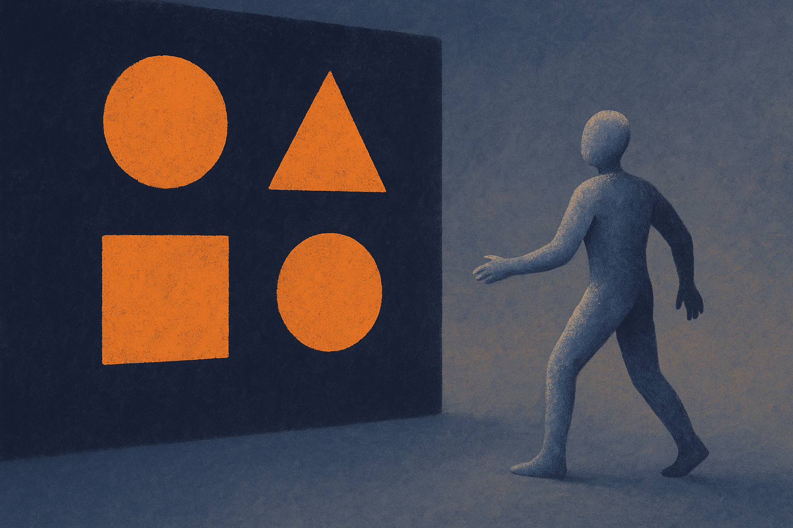
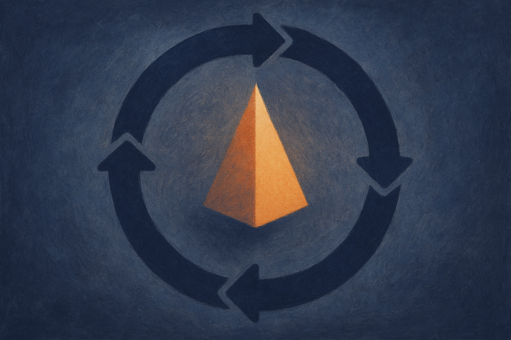

TL;DR: A GUI agent that freezes its weights after training keeps failing on interfaces it has never seen, and this paper shows a way to let the model teach itself on the job, without ground-truth labels, for a reported 7.4% average accuracy bump across six benchmarks.

The paper is "Test-Time Self-Evolving GUI Visual Grounding via Reflection-Guided On-Policy Self-Distillation," posted to arXiv under cs.AI and cs.CL. It targets one narrow, unglamorous, and genuinely important problem: getting an agent to click the right pixel on a screen it has never encountered.

## What problem is this actually solving?

GUI visual grounding is the part of a computer-use agent that turns an instruction like "open the settings menu" into an actual coordinate on the screen. Get the coordinate wrong and everything downstream breaks. The agent clicks empty space, misreads the result, and the whole task derails.

The standard failure mode is simple. You train a grounding model, ship it, freeze the weights. Then it meets an app it never saw in training: a niche enterprise tool, a redesigned dashboard, a layout that puts the button somewhere unexpected. Accuracy drops and stays dropped, because the model cannot learn from what it is seeing right now.

Some recent work tries test-time reinforcement learning to patch this. The authors' complaint is specific and fair: those methods "cannot reflect upon failed exploration." The agent tries, fails, and gets a scalar reward signal, but never reasons about *why* the click was wrong. That is a lot of information thrown away on every failure.

## How does the self-evolving loop work?

The framework is a closed loop with four stages: Exploration, Evaluation, Reflection, Internalization.

Exploration is the agent predicting grounding coordinates for an instruction on a new interface. Nothing exotic yet.

Evaluation and Reflection are where the interesting move happens. Instead of a human label saying "correct" or "wrong," they use an MLLM-based Reflector, a multimodal model that looks at the agent's attempt and produces reasoning about whether it worked and why. So the supervision comes from a separate model's judgment, not from annotated ground truth.

Internalization is the part that turns a critique into a weight update. They call it Reflection-Guided On-Policy Self-Distillation. The high-level reasoning from the Reflector gets translated into dense token-level supervision through what they describe as a "conditioned self-teacher." In plain terms: the model's own outputs, shaped by the reflection, become the training target for the model. It teaches itself, conditioned on the critique of its last attempt.

The authors claim this is the first work to make on-policy self-distillation work for test-time adaptation in GUI grounding. I cannot independently verify the "first" claim, and neither can you, so treat it as their framing rather than settled history.

## Why does the Contrastive Calibration piece matter?

This is the detail I would flag to anyone tempted to hand-wave the method as "just let the model grade itself."

Self-distillation on your own outputs is dangerous when the outputs are wrong. If the model failed an exploration, its auto-regressive prefix, the sequence of tokens it already generated, is partly garbage. Distill on that garbage and you reinforce the mistake. The model gets more confidently wrong.

Their answer is a Contrastive Calibration method meant to "prevent incorrect auto-regressive prefixes from corrupting the supervisory signals during failed explorations." That is the load-bearing safeguard. Without it, a self-teaching loop on unlabeled data is a fast road to model collapse, where errors compound because the student and teacher are the same network drifting together.

Whether the calibration fully solves that is the open question. The paper reports a 7.4% average accuracy improvement over the base model across six benchmarks, which suggests the loop nets out positive rather than degenerating. But "average across six benchmarks" hides the spread. The abstract does not give per-benchmark numbers, so I would want to see whether any benchmark regressed, and by how much, before trusting this in production. The code is promised but described as "will be released," meaning as of this writing you cannot run it yourself.

## Does this generalize beyond GUI clicking?

The pattern here is bigger than screen agents, and that is why I am writing about a fairly narrow grounding paper.

The recurring wall in agent work is post-deployment adaptation without labels. You ship a model, it hits the real world, the real world does not match training, and you have no annotated examples of the new situation. The usual fix is collect data, label it, retrain, redeploy. Slow and expensive.

This paper's shape is an attempt to close that loop automatically: explore, get a critique from a second model, turn the critique into a weight update, with a guardrail against poisoning yourself. That structure could apply to plenty of agent tasks where correctness is checkable-ish but not cheaply labeled.

The honest caveat is that the whole thing leans on the Reflector being a reliable judge. If the MLLM critic is wrong about whether a click succeeded, the agent internalizes bad supervision. For GUI grounding you often can verify success from the resulting screen state, which makes the critic's job more tractable than in open-ended domains. In tasks with no observable ground truth signal at all, this recipe gets much shakier.

## What a builder should do with this

If you run a computer-use agent, the immediate lesson is not "adopt this framework tomorrow," because the code is not out and the benchmark detail is thin. The lesson is architectural: your grounding model failing on new interfaces is a fixable problem, not a fixed cost, and the fix does not require a human labeling pipeline.

Concretely, I would start by measuring the gap the paper targets. Log your agent's grounding accuracy on interfaces it was not trained on, separately from your in-distribution numbers. Most teams do not, and they blame the base model when the real issue is deployment drift on unseen layouts.

Then, if you want to experiment before the code drops, the cheap version of this idea is a two-model loop you can build today: your grounding model proposes a click, a stronger multimodal model checks the resulting screen and writes a critique, and you collect those critiques as adaptation data. You do not need their exact self-distillation math to test whether reflection-driven feedback improves your agent. Start with logging and a critic, prove the signal is real, then decide whether the on-policy weight-update machinery is worth it.

The catch most readers will miss: the Contrastive Calibration is not a footnote, it is the reason the loop does not eat itself. Any self-improvement scheme on unlabeled data lives or dies on how it handles its own wrong answers. If you copy the loop and skip the guardrail, you will not get 7.4% better. You will get confidently worse, and it will take you a while to notice.
