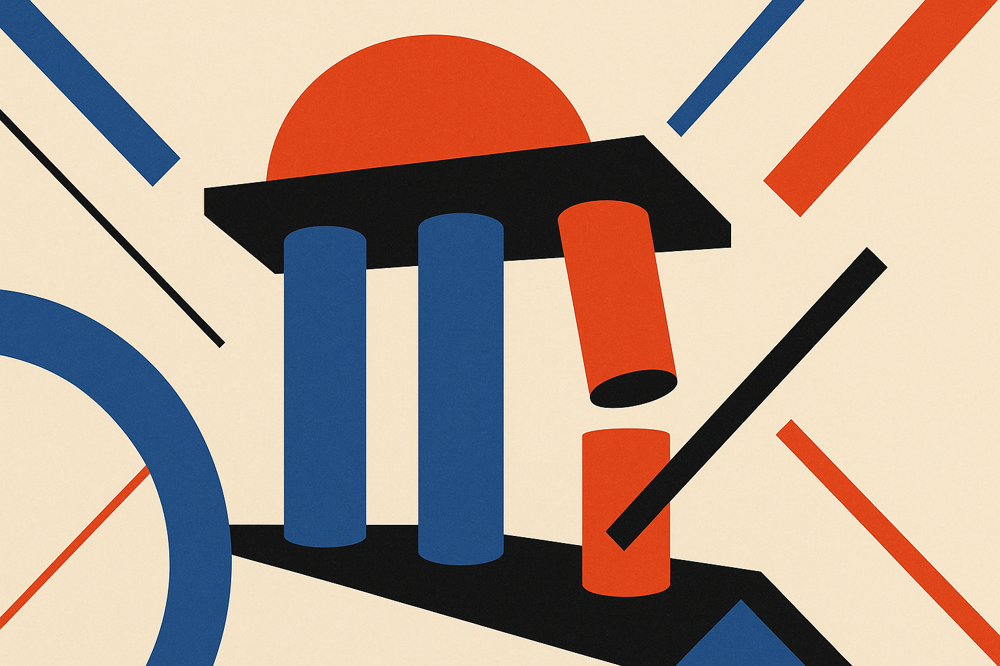

TL;DR: OpenAI leadership churn is not just boardroom drama, it is a reminder that builders should treat frontier model providers as strategic vendors with real organizational risk.

## What did Decrypt actually report?

Decrypt reported in “Another OpenAI Exec Quits in Leadership Shake-Up as AI Giant Eyes IPO” that a former operating chief at OpenAI is leaving to start a new venture, amid other departures across the ChatGPT developer’s leadership and safety teams. Decrypt also framed the move against OpenAI’s reported interest in an IPO.

That is the hard center of the story from the material here. No confirmed IPO timing. No first-party pricing change. No product shutdown. No named operational change from OpenAI in the provided source.

So the wrong read is: “OpenAI is falling apart.” That is not supported here.

The better read is narrower: when a company becomes core infrastructure for other companies, leadership churn stops being an inside-baseball story. It becomes part of vendor due diligence.

OpenAI is not a normal SaaS vendor. Its APIs, ChatGPT products, model roadmap, enterprise posture, safety process, and partnership stack all affect how builders plan. A departure in operations is different from a random middle-manager exit because operations is where research ambition becomes shipping cadence, compliance posture, support quality, and customer predictability.

That does not mean one executive leaving breaks the machine. It means the machine is worth watching.

## Why does exec churn matter if the models still work?

Because model quality is only one part of the platform.

If you build on OpenAI, you are betting on a bundle: model performance, API stability, pricing direction, enterprise controls, latency, data policies, support, eval tooling, partner integrations, and the company’s ability to explain itself to regulators and large buyers.

Leadership churn can affect that bundle in quiet ways. Not always instantly. Not always publicly.

A model can keep improving while enterprise support gets slower. A product can get more capable while roadmap messaging gets fuzzier. A company can prepare for public-market scrutiny while also tightening internal priorities in ways that change which customers get attention.

The IPO angle matters only if it changes incentives. Public-market prep, if it happens, tends to reward cleaner narratives: revenue growth, margin discipline, repeatable enterprise sales, lower reputational risk. That can be good for customers. It can also mean fewer weird experiments, more packaging, more account segmentation, and a stronger push toward products that are easier to sell than explain.

Again, Decrypt reported the company is eyeing an IPO. OpenAI has not been cited here making a first-party announcement. Treat the IPO piece as reported context, not a settled event.

## What should builders watch instead of the drama?

Watch the parts that touch your roadmap.

Does API behavior stay predictable across model updates? Do deprecations come with enough runway? Are enterprise controls getting clearer or just renamed? Are safety and policy changes documented in a way your team can implement, or do they arrive as vague platform shifts? Do support channels improve as usage grows? Are product launches aligned with developer needs, or are they mostly demos for the market?

The most useful signal is not whether another executive starts another AI company. That is almost expected in this market. The useful signal is whether OpenAI can keep converting frontier research into dependable infrastructure while senior people rotate out.

There is also a talent-market angle. Departing OpenAI leaders starting new ventures will keep seeding the ecosystem with serious operating knowledge. Some of those companies will be real. Some will be pitch decks with pedigree. The badge alone is not a product.

For operators, I would not rip out OpenAI because of a Decrypt-reported executive exit. I would update the risk model. Keep OpenAI in the stack if it earns the job. But avoid hard-coding one provider into workflows you cannot move. Maintain evals across at least one alternative model family. Keep prompts, routing, logging, and retrieval layers under your control. The catch most readers miss: vendor risk in AI is not just outage risk. It is roadmap risk, policy risk, pricing risk, and org-design risk, all hiding behind a model that still answers perfectly well today.
