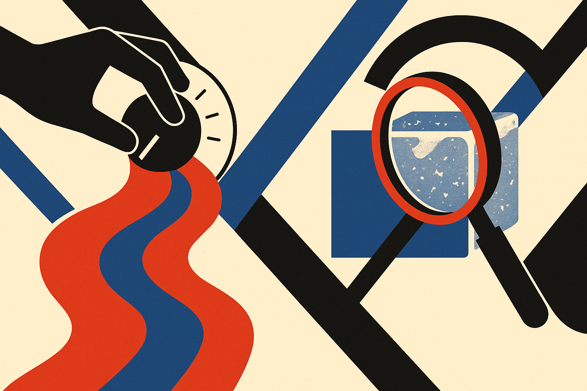

TL;DR: Trust research in NLP followed capability, not the other way around: each new model generation reshaped what researchers worried about, and the field moved from explaining finished models to steering them while they run.

There is a paper worth reading if you want to understand how AI safety research actually moves, and it is not another benchmark. It is "From Interpretability to Control: Insights from Six Years of the TrustNLP Workshop," posted to arXiv under both cs.AI and cs.CL. The authors did something most of us do not have the patience for: they read all 144 proceedings papers from six editions of the TrustNLP workshop, co-located with the big ACL conferences since 2021, and classified every one along six trust dimensions borrowed from established frameworks (TrustLLM and DecodingTrust).

The result is a map of what the research community chose to worry about, year by year, and how tightly those worries tracked what models could suddenly do. That mapping is the interesting part. Safety work is often described as running behind capability. This survey gives you the receipts on exactly how far behind, and where it caught up.

## Did trust research lead or follow model capability?

It followed. That is the honest read.

The paper documents that when the first high-impact chat models shipped, all six trust dimensions activated at once. Before that, the workshop had eight proceedings papers in a single edition. By the sixth edition it had 41. The spike is not researchers getting ahead of a problem. It is researchers reacting to a product that landed in millions of hands and forced every question open simultaneously: is it truthful, is it fair, is it safe, can we explain it.

Then something more specific happened. The authors note that subsequent model generations shifted focus toward truthfulness and safety alignment. In other words, once the general panic settled, the field narrowed onto the failures that kept showing up in actual deployment. Hallucination and jailbreaks are not abstract worries. They are the things that break demos and lose customers, so they are the things that pulled research attention.

If you are a builder, this pattern matters more than any single finding. The safety literature is a lagging indicator of what real systems get wrong. When a new class of model appears, expect the rigorous mitigation work to arrive a year or two later, after the failure modes have been observed at scale. Plan your own guardrails accordingly, because the papers you would want to cite may not exist yet.

## What grew, what stayed flat, and what came back?

The single sharpest trend is truthfulness. The authors report it was absent in 2021 and 2022, then grew to 37% of papers by 2025 and 2026. That is the fastest-growing dimension in the whole survey, and it lines up cleanly with when hallucination became the defining reliability problem for generative models. Nobody was writing truthfulness papers when the models were mostly classifiers and taggers. Once the models generated fluent, confident, occasionally fabricated prose, truthfulness became the field's biggest single concern.

Fairness, by contrast, is described as the most consistent theme across all six years. It did not spike and it did not fade. This reads to me as the mature dimension: bias in language systems was a well-formed research problem before the chat era, it had methods and benchmarks, and it kept a steady share of attention throughout. Nothing about a bigger model made the fairness question go away, and nothing made it newly urgent either. It was already there.

The most telling shape is explainability, which the paper describes as U-shaped. It declined as post-hoc interpretability methods lost relevance, then resurged in 2026 through mechanistic interpretability. This is the part I would underline twice. Post-hoc explanation, the practice of poking a trained model from the outside to guess why it did something, made sense for static classifiers. It made much less sense for enormous generative systems, so the work faded. What brought explainability back was a different bet entirely: mechanistic interpretability, the effort to understand the actual internal circuits and features a model uses to compute. Same dimension on the chart, completely different research program underneath. That distinction is the whole story of the paper's title, from interpretability to control.

## Is TrustNLP representative or a niche?

Fair question, and the authors anticipated it. They ran a cross-venue comparison against roughly 2,000 papers from ACL, NAACL, EACL, and EMNLP over the same period. Their finding is that TrustNLP's topical distribution closely follows the field average.

That comparison does a lot of work. It means the workshop is not a fringe corner with its own obsessions. Its shifts are the field's shifts. When you read that truthfulness went from zero to 37%, you are not looking at one small community's fashion, you are looking at a representative slice of what NLP research as a whole decided mattered. For anyone trying to forecast where safety tooling is headed, that representativeness is what makes the survey usable rather than anecdotal.

I will flag the honest limit here. A workshop survey classifies papers by topic, not by impact or by whether the proposed methods actually work in production. Knowing that 37% of recent papers address truthfulness tells you where attention went. It does not tell you the hallucination problem is solved, and the authors do not claim it is. Attention and progress are different axes.

## What does this mean for people shipping AI systems?

The framing that stuck with me is the paper's own arc: interpretability to control. Early trust work was about understanding a fixed artifact after the fact. Current work is increasingly about steering a generative system while it runs. That is a shift from diagnosis to intervention, and it maps onto what operators actually need, which is not an explanation of why the model failed but a lever to stop it failing.

Practitioner's take: use this survey as a reading roadmap, not a solution. If truthfulness is 37% of recent trust papers, that is where the freshest mitigation techniques live, so that is where you look before you build your own hallucination guardrail from scratch. If explainability came back through mechanistic interpretability rather than post-hoc methods, do not waste time on saliency-map style tooling for large generative models: it is the dimension that already got abandoned once. The catch most readers will miss is the timing lag baked into the whole dataset. Every trend here is a reaction to a model generation that already shipped. So the papers describing how to control the models you are deploying today are the ones being written now, not the ones you can cite yet. Build your fallbacks assuming the literature is a step behind your stack, because according to six years of this survey, it always has been.
