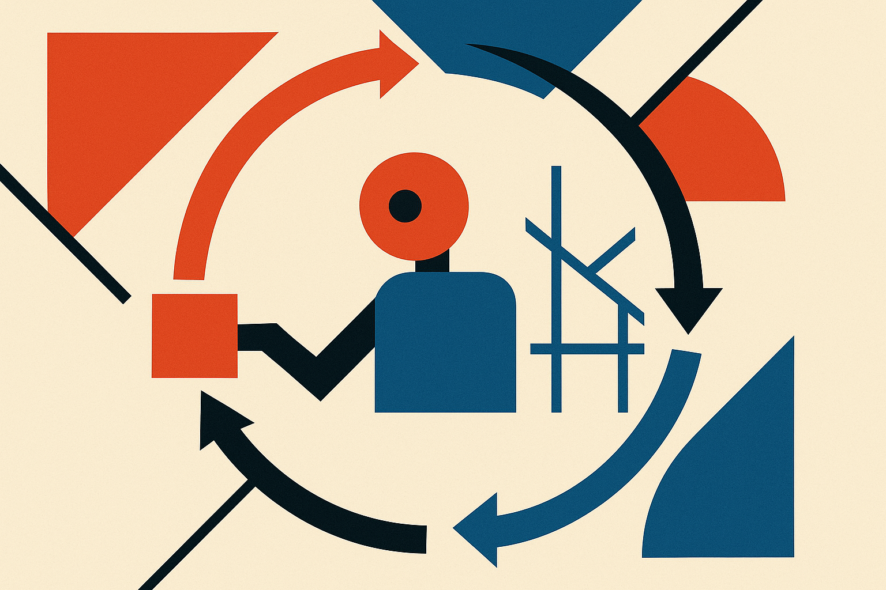
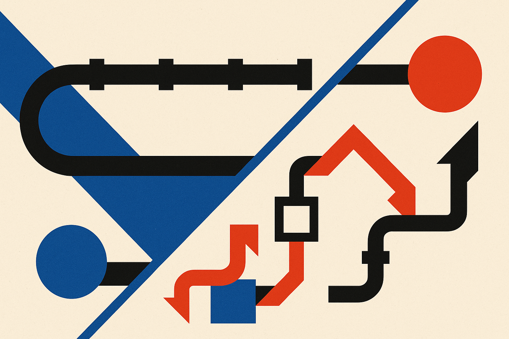
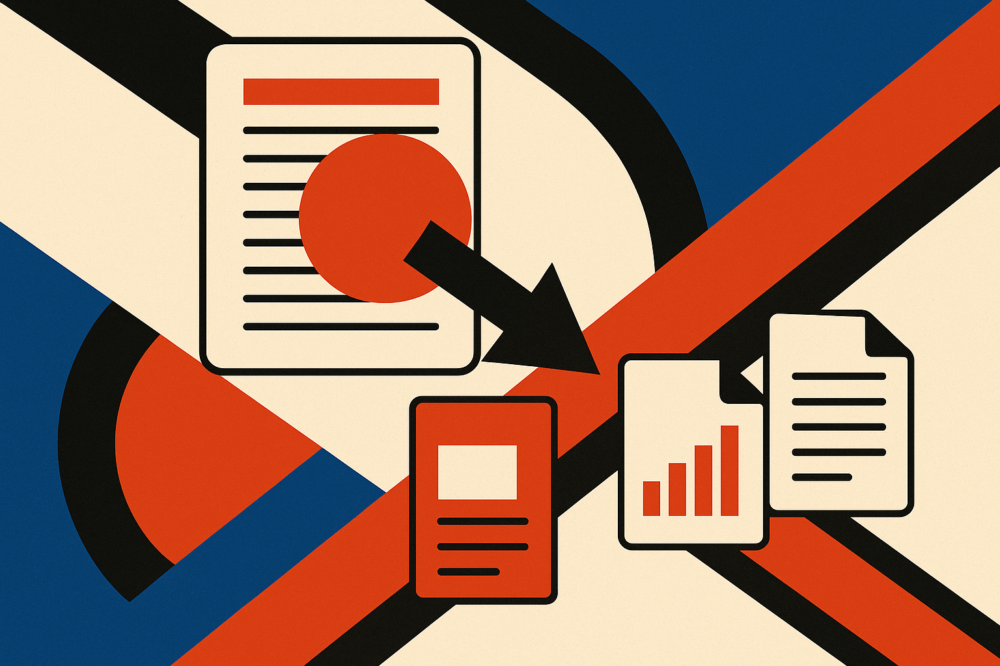

TL;DR: AutoDesign shows that the reusable win in agentic design work is not a better model, it is a better harness the agent optimizes for itself, and on paper-to-poster generation that swap moved scores from 54.99 to 67.39 across seven configs without changing the underlying model.

The primary source here is a single paper, "AutoDesign: Meta-Harness Optimization for Long-Horizon Agentic Design," posted to arXiv under both cs.AI and cs.CL. Same abstract, same numbers, cross-listed. I have not seen the full method section beyond what the abstract lays out, so I am going to be careful about what is claimed versus what is demonstrated. But the framing is worth your attention even if you never generate a poster in your life.

## What is a "harness" and why does it matter more than the model?

In agent land, the model is the thing that predicts tokens. The harness is everything around it: the prompts, the tool definitions, the loop that decides when to call a tool, the feedback that gets fed back in, the rules for when to stop. Most of the engineering effort in a working agent lives in the harness, not the weights.

The AutoDesign authors treat that harness as the object to optimize. Their pitch is that existing paradigms are static: you write a harness, you ship it, it never gets better on its own. AutoDesign instead runs a "meta-harness optimizer" that guides a code agent to rewrite its own harness based on rollout feedback. The agent does a task, sees how it went, and edits the scaffolding that produced the result. Then it does the task again with the improved scaffolding.

This is recursive self-improvement, but of a very specific and bounded kind. It is not the model getting smarter. It is the workflow getting smarter while the model stays fixed. That distinction matters because it is far more reproducible and far less scary than the phrase "recursive self-improvement" usually implies. You are not training anything. You are letting an agent discover a better set of steps and freezing that as reusable experience they call the DesignHarness.

## What do the numbers actually say?

Here is where I want to separate the strong claims from the softer ones.

The strongest, cleanest result: across seven controlled code-agent-model configurations, adding the learned DesignHarness raised the average PosterBench Score from 54.99 to 67.39. That is a 12.4 percent absolute jump, and it held across all seven setups. When something improves every configuration you test rather than just your best one, that reads like a real effect rather than a lucky cherry-pick. This is the number I would build a mental model around.

The headline claim: on the PosterBench Main Track, AutoDesign scored 78.32, beating "the closed-source commercial system Claude Design" by 7.45 points. Take this one with more salt. Benchmarks the authors also built tend to flatter the authors' system, and "Claude Design" as a named commercial baseline is doing a lot of work in that sentence. Beating one proprietary competitor on your own benchmark is a data point, not a coronation. I would want to see PosterBench adopted by people who did not invent AutoDesign before I treated 78.32 as a standing.

The operational claim: a fully autonomous run executed 253 tool calls and 11 editing turns in 40 minutes for under $3, reaching "average conference-poster quality" in human evaluation. This is the part I find most useful, because it is a cost-and-latency envelope, not a leaderboard. Under three dollars and under an hour for a first-draft poster that humans rated at average conference quality is a concrete unit of work. Average is not great. But average, cheap, and unattended is a real offer for a lot of academic and internal-deck use cases.

And the preference claim: a system-blind human study put AutoDesign at the highest human preference among evaluated systems. Blind is good. It means raters did not know which output came from which system. I still want the sample size and the rater pool, which the abstract does not give, so I am filing this as promising rather than settled.

## Where does this idea generalize beyond posters?

Posters are a smart choice for a benchmark precisely because they are hard in an interesting way. You have to read a dense multimodal paper, decide what matters, condense it, and lay it out with visual design priors that humans actually respond to. That is a long-horizon task with a fuzzy quality signal, which is exactly the regime where a static harness struggles and an adaptive one has room to win.

The same shape shows up all over practical AI work. Turning a messy call transcript into a structured brief. Turning a sprawling codebase into onboarding docs. Turning a quarter of analytics into a readable board deck. Every one of those is "condense multimodal input into structured output under human design priors." If the meta-harness idea holds outside posters, the reusable artifact is not the model and not even the prompt. It is the DesignHarness: a learned, portable set of steps that encodes what good output looks like for that task.

That is the part I would watch. The paper frames the harness as accumulating reusable experience. If that experience transfers across papers within a discipline, you have a compounding asset. If it has to be relearned per task, the 40-minute, $3 loop is the real cost and it does not amortize. The abstract does not resolve this, and I would push hard on it before believing the "reusable experience" framing.

## Practitioner's take

If you build agents, the move to steal from AutoDesign is not the poster generator, it is the mindset: stop hand-tuning your scaffolding forever and let the agent edit its own harness against a scored rollout. Pick a task where you can cheaply grade the output (a rubric, a human thumbs-up, a regression against known-good examples), let a code agent propose changes to its own prompts and tool logic, keep the versions that score higher, and freeze the winner as a reusable harness. Start with something bounded, a few tens of tool calls per run, so a bad self-edit costs cents not hours.

The catch most readers will miss: this only works when your feedback signal is honest. A meta-optimizer will happily overfit to whatever you measure, so if your score rewards busy layouts or verbose summaries, that is exactly what it will learn to produce. The 54.99 to 67.39 jump is impressive because it held across seven configs, but it lives entirely inside PosterBench's definition of good. Before you copy the method, spend your effort on the rubric. The agent will optimize whatever you give it, precisely, including your mistakes.
