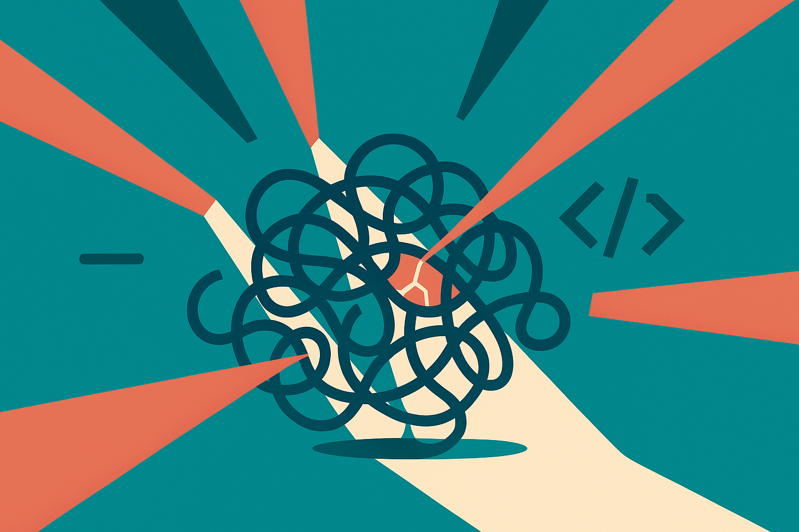

TL;DR: The useful story is not “AI finds Bitcoin bugs,” it is that security teams should test important code with multiple model families, because different models miss different things.

## What changed for Bitcoin security work?

Decrypt’s report, “‘Bitcoin Is Burning’: Red Team Turns to Chinese AI to Find Flaws,” says Bitcoin Red Team member Calle is using Chinese AI models, including Moonshot AI’s Kimi K3, to find bugs across Bitcoin’s open-source software.

That is a narrow claim, but an important one.

Bitcoin is a good stress test for AI-assisted security work because the code is public, the stakes are high, and the social review process is unforgiving. A weak bug report gets shredded. A real one matters. So when someone working in that ecosystem says model choice is helping surface flaws, I pay attention.

Not because this proves Chinese models are magically better at security. It does not. Decrypt is reporting Calle’s account, not a controlled benchmark with reproduced results, model settings, prompts, false positive rates, and confirmed CVEs. The claim is useful, but thin.

The practical shift is still real: model-assisted review has moved from “ask ChatGPT to explain this function” to “run several different models against the same codebase and compare what they flag.” That is a better pattern. Security review is not about one perfect answer. It is about coverage.

## Are Chinese coding models the point?

Partly. But I would not make this a nationality story.

The point is model diversity. If your team only uses one frontier model, you get that model’s habits. Its blind spots. Its training distribution. Its safety refusals. Its preferred style of reasoning. Its overconfidence.

Chinese models such as Kimi, Qwen, DeepSeek, and others have become serious coding tools, especially for long-context reading, repository analysis, and cheaper repeated passes. Some are strong enough that ignoring them is just lazy procurement. But “strong” is workload-specific. A model that explains code well may still be poor at exploitability. A model that finds suspicious logic may drown you in junk reports.

That distinction matters. Security work has a brutal precision problem. A model can be helpful even if most findings are wrong, if it points a skilled reviewer toward one weird invariant, one unsafe assumption, or one missed edge case. But that is not the same as autonomous auditing.

This is where hype usually goes sideways. “AI found a bug” sounds like replacement. In practice, the best setup is closer to a noisy junior reviewer with infinite patience. Useful for breadth. Dangerous if trusted without verification.

## What should maintainers copy?

Start with the workflow, not the headline.

Pick a bounded target: one module, one pull request, one parser, one wallet path, one consensus-adjacent change. Ask multiple models to review the same code under the same constraints. Force them to cite exact files and functions. Ask for failure cases, not vibes. Then run a second pass where another model critiques the first model’s findings.

Keep a ledger. Which model found what? Which reports were duplicates? Which were false positives? Which led to a test? Which led to a patch? Without that, teams will remember the one impressive catch and forget the twenty dead ends.

Also separate bug discovery from bug validation. Models are better used to generate hypotheses than to certify security. The human reviewer still needs to reproduce the issue, understand impact, check whether it violates a real invariant, and write the minimal test.

For crypto projects, there is another catch: public AI-assisted bug hunting can attract noise, spam, and scammy “security” claims. Do not turn this into token marketing. The asset price is irrelevant to the engineering lesson.

Practitioner’s take: if you maintain serious open-source software, run a small bake-off this week. Take one sensitive component and review it with your usual model plus two unfamiliar model families. Do not ask “which model is best?” Ask which one finds different plausible failures. The catch most teams miss is triage cost. Model diversity only helps if you have a tight process for reproducing, rejecting, and converting findings into tests.
