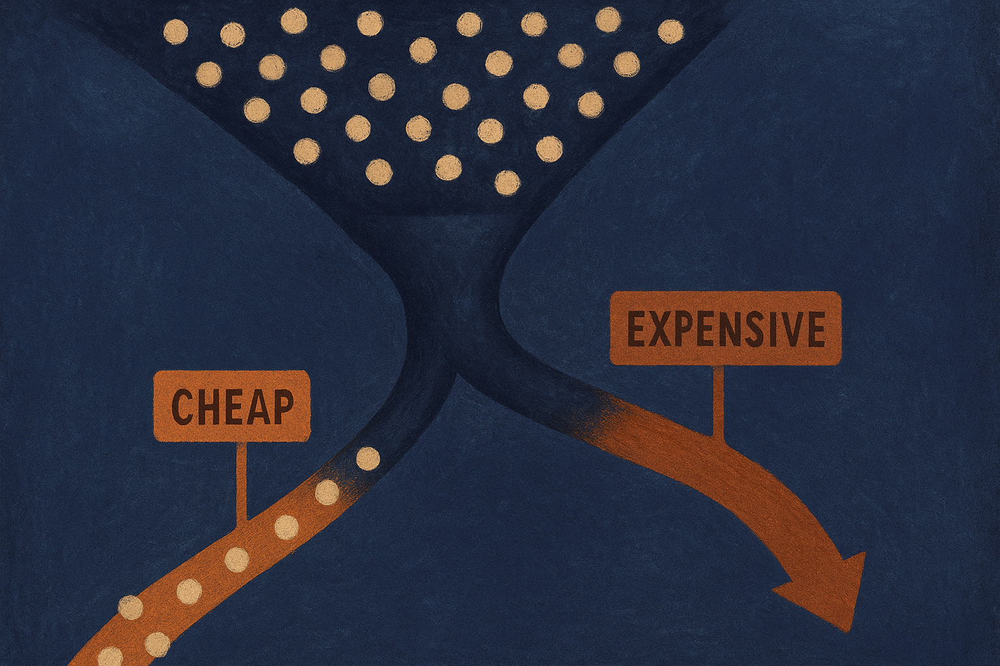
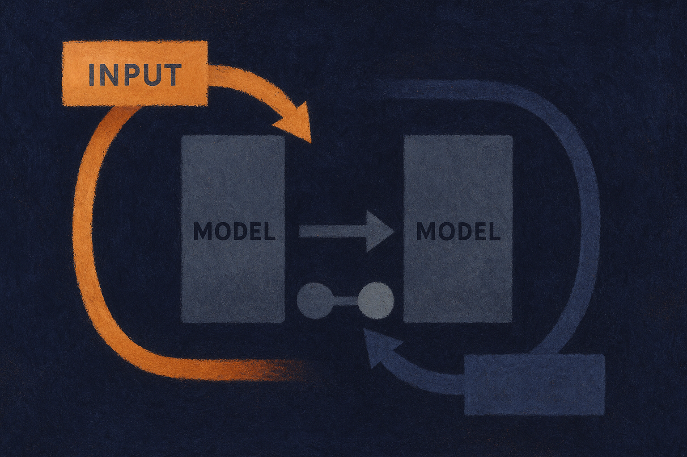

TL;DR: Google DeepMind announced Gemini 3.7 Flash, but the material available right now is an announcement plus a docs link, not a benchmark table, so treat this as "a new fast-tier model exists" and hold your evaluation until you can run it on your own tasks.

I want to be straight about what I'm working with here. The primary source is Google DeepMind's own post, "Introducing Gemini 3.7 Flash," pointed to by a Hacker News thread that links to the Gemini API docs page for the model. That's it. No pricing sheet in front of me, no context-window number I can quote, no head-to-head charts. So this post is less "here's how good 3.7 Flash is" and more "here's how to think about a Flash-tier release, and what to check the moment you get access."

That framing matters because Flash releases get judged on the wrong axis. People compare them to the flagship Pro model and come away disappointed. Wrong yardstick.

## What did Google DeepMind actually announce?

A new model in the Gemini Flash line: Gemini 3.7 Flash, per the DeepMind post "Introducing Gemini 3.7 Flash." The Hacker News link resolves to the Gemini API docs, which is where the concrete specs live once they're published.

What I can't do responsibly is fill in the blanks. I don't have a confirmed context window, a confirmed price per million tokens, confirmed rate limits, or confirmed benchmark scores from the material in front of me. If you've seen those numbers floating around, check whether they trace back to Google's own docs or to someone's guess. On a fresh release, the difference between "reported" and "confirmed" is the difference between a good decision and a rollback.

Here's the naming context that does help. "Flash" in Gemini has always meant the fast, cheaper tier: lower latency, lower cost per token, built for volume. The version bump from an earlier 3.x Flash to 3.7 signals an iteration, not a new category. So the interesting question isn't "is this the smartest Gemini." It's "did the price-performance curve move," and by how much, on the work you actually run.

## Why does the Flash tier matter more than the flagship?

Because most production AI spend is not the flagship. It's the boring, high-frequency stuff: classification, extraction, routing, summarization, first-pass drafting, the inner loops of agents that call a model dozens of times per task. That's where a cheaper, faster model with "good enough" quality quietly saves real money.

Think about an agent that makes 40 model calls to complete one job. If each call is on a flagship model, cost and latency stack up fast. Swap the routine calls to a Flash-tier model and keep the flagship for the two or three steps that genuinely need it, and you can cut cost by a large factor while barely moving output quality. That routing pattern is where Flash lives. A new Flash version is interesting exactly to the extent that it lets you move more calls down to the cheap tier without quality falling off a cliff.

So the real evaluation question for Gemini 3.7 Flash is narrow: on the specific tasks you'd route to a fast model, does 3.7 handle a bigger share of them correctly than whatever you're using now? That's a measurable thing. It's also something no announcement can answer for you.

## How should a builder evaluate it before shipping?

Don't read the announcement and swap your default model. Run the boring test.

Build a small eval set from your actual traffic. A hundred real examples beats any public benchmark for your use case. Label the expected outputs. Then run your current model and Gemini 3.7 Flash against the same set and compare on three things: correctness on your task, latency at your typical payload size, and cost per completed task (not per token, per task, because token counts differ between models).

Watch for the failure modes that generic benchmarks hide. Structured output reliability: does it hold JSON schema under pressure, or drift on the long tail? Instruction adherence on multi-step prompts. Behavior at the edges of the context window, whichever number Google's docs actually list. Tool-calling accuracy if you're using it in an agent, because a fast model that fumbles function calls will cost you more in retries than it saves in per-token price.

And check the docs for the unglamorous operational stuff before you commit: rate limits, regional availability, data handling terms, and whether the model is generally available or in preview. Those are first-party facts. Get them from Google's own docs page, not from a summary, and confirm the version string matches "gemini-3.7-flash" so you're not accidentally pinned to an older snapshot.

## What I'm skeptical about

Version-number inflation is real, and Flash releases arrive often. A ".7" bump inside the 3.x line reads as incremental. That's fine, incremental is how these tiers should improve, but it means you should expect a step, not a leap, and be pleasantly surprised if it's more. Anyone selling you "3.7 Flash changes everything" is running ahead of what a single announcement can support.

I'm also wary of the benchmark theater that usually follows these launches. Public leaderboards are useful signal and terrible ground truth for your specific workload. A model can top a reasoning benchmark and still mangle the one extraction task your pipeline depends on. Your eval set is the only leaderboard that pays your bill.

The honest summary: a new fast Gemini exists, from Google DeepMind, documented on the Gemini API docs page. The rest is for you to measure.

Practitioner's take: treat the release as a prompt to run an experiment, not a reason to migrate. Pull your top three highest-volume, lowest-complexity model calls, build a 100-example eval from real logs, and put Gemini 3.7 Flash head to head with your current fast model on cost-per-completed-task and structured-output reliability. If it moves the price-performance curve on those calls, route them over and keep your flagship for the hard steps. The catch most people miss: they compare Flash to a flagship, decide it's "worse," and never run the comparison that matters, which is Flash against the other cheap model already in their stack.
