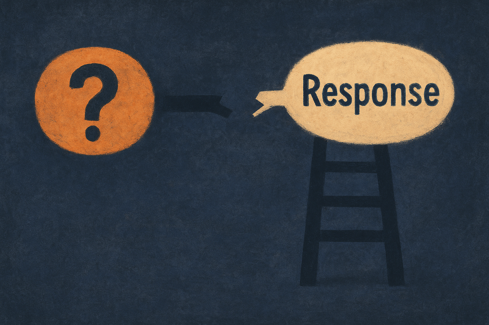

TL;DR: The useful lesson from “Toward a Gricean Retreat: Probing LLMs for Knowledge Boundaries and Referent Specificity” is that hallucination is not just missing knowledge, it is a failure to connect uncertainty to how specific the model should be.

## What is a Gricean retreat?

“Toward a Gricean Retreat: Probing LLMs for Knowledge Boundaries and Referent Specificity,” posted on arXiv cs.AI and cs.CL, frames a familiar model failure in a clean way.

A cooperative human speaker often backs off when uncertain. If I do not know the exact neighborhood where a restaurant is located, I might say “it is in Chicago” instead of inventing a street. Less informative, more likely to be true. That move is what the paper calls a Gricean retreat: moving up the specificity hierarchy when the referent is outside your knowledge boundary.

The interesting part is not that LLMs hallucinate. We know that. The interesting part is the paper’s claim that models appear to have two ingredients needed to avoid some of it.

Using a T-REx-based benchmark that varies entity familiarity and referent specificity, the researchers probe whether model activations encode two things: whether a referent is inside the model’s knowledge boundary, and whether the model anticipates the specificity of the referent it is about to generate. Their answer is yes to both.

That should make builders pause. The model is not simply blank. It may contain a signal that says, roughly, “I do not know this entity well,” and another signal that says, “I am about to say something very specific.” The failure is that generation does not reconcile those signals.

## Why does this change the hallucination story?

A lot of product work treats hallucination as a retrieval problem. Add better context. Add citations. Add a bigger model. Add a refusal instruction. Those can help. But this paper points at a different failure mode: the model may already have some internal warning lights, then choose the confident-sounding answer anyway.

That matters because “say you do not know” is a weak patch if the model’s default generation policy still rewards specificity. The paper reports that models overwhelmingly prefer specific referents even when the entity is unknown to them, and even when correct generic alternatives are offered. That is the nasty bit. The safer answer is available, but the model still reaches for the sharper one.

This fits what I see in applied workflows. Ask about a well-known company and the model is often useful. Ask about a niche vendor, a small nonprofit, a local regulation, or an internal project name, and it may produce the same shape of answer with worse grounding. The prose quality barely changes. That is why users get fooled.

The paper’s “Gricean alignment” framing is useful because it turns a vague reliability complaint into a more testable product requirement. Not “make the model honest,” which is too broad. More like: when knowledge-boundary uncertainty rises, reduce referent specificity unless grounded evidence supports the detail.

That is a much better target.

## What should builders do with it?

I would not read this paper as saying we can now solve hallucination with a probe. It is a benchmark result, not a shipped reliability layer. The source does not give a drop-in method, model list, or production recipe. The claim is narrower: the substrate for retreat appears to be present, but the policy that acts on it is missing.

For builders, the immediate move is to design around specificity, not just confidence. In high-risk answer flows, make the model choose among answer types before it writes: exact claim, generic claim, request for clarification, or abstention. If retrieval returns weak evidence, constrain the model to broader language. If the user asks for a named entity that is not in context, require the answer to say what category it can safely identify and what it cannot verify.

This is especially useful for agents. Agents love specific actions: email this person, update this record, file this ticket under this label. A Gricean retreat for agents would mean backing off from a specific action to a safer plan when the referent is under-specified or unfamiliar. “I found three similar vendors, confirm which one” beats silently picking the plausible one.

Practitioner’s Take: Add a specificity gate to one workflow this week. Pick a place where your system answers about entities, customers, products, policies, tickets, files. Before final generation, ask whether the answer is making an exact referent claim and whether that claim is grounded in provided context. If not, force a generic answer or a clarification. The catch most teams miss: refusals are not the only safe behavior. Often the best answer is still useful, just less specific.
