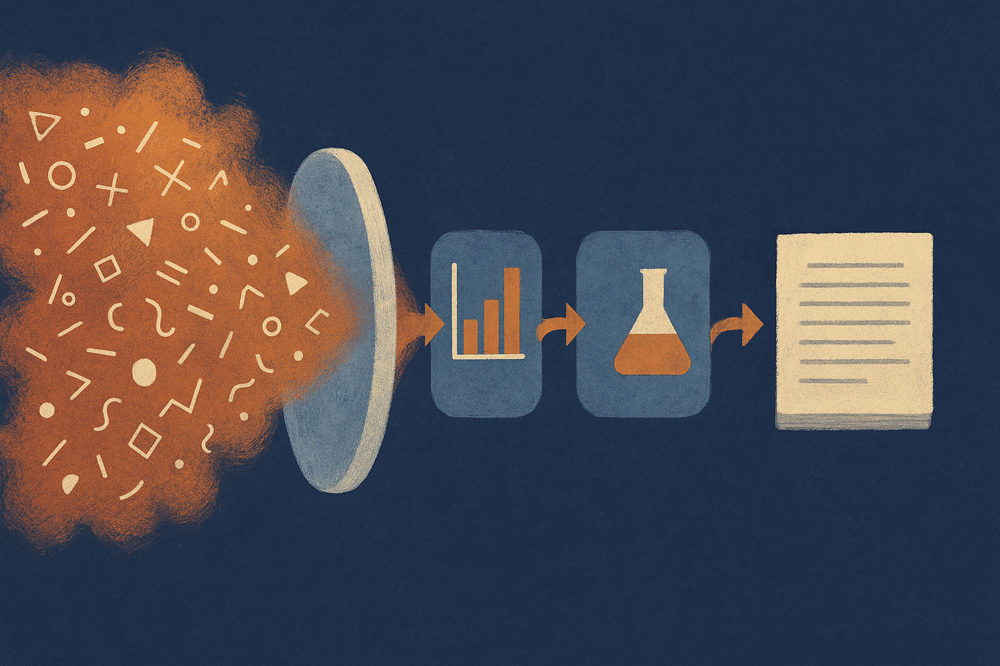

TL;DR: The useful idea in OmniScientist is not “AI writes papers,” it is that research agents need direct access to raw multimodal evidence if we want their claims to track reality.

## What is different about OmniScientist?

The arXiv paper **“OmniScientist: An Omni-Modal Omni-Discipline AI Scientist”** makes a simple bet: the bottleneck in AI science is not only planning, tool use, or manuscript generation. It is perception.

Most “AI scientist” systems operate on cleaned-up inputs. Text. Code. Tables. Labels. Summary features. That works when the important signal has already been compressed into the right representation. It breaks when the decisive fact is spatial, temporal, cross-channel, or procedural.

OmniScientist is built around that gap. The system uses a perception layer plus three autonomous agents for ideation, experiment, and writeup. The pipeline is deterministic, which matters. It is not just a chatty agent loop with a lab coat. The paper says observations can shape the research question, the experimental decisions, and the final claims across the full lifecycle.

The authors also describe code-based checks for novelty screening, statistical validity, execution provenance, and numerical traceability. That is the part I like. If an AI research system cannot show where a number came from, what ran, and which claim depends on which result, it is a demo, not a scientific assistant.

## Does direct perception actually help?

According to **“OmniScientist: An Omni-Modal Omni-Discipline AI Scientist,”** the system was evaluated on 36 real-data cases across 5 discipline families and 4 families of scientific evidence. The modalities included images, signals, audio, video, 3-D structures, trajectories, tables, formulae, and graphs.

The paper reports that OmniScientist completed the path from raw data to a compiled manuscript in all 36 cases. It also reports a mean overall paper score of 6.3 with the reference reasoning backbone.

The more interesting comparison is the blind variant. That version received only precomputed scalar features. In paired comparisons, direct perception improved all 7 evaluation dimensions and won 85% of head-to-head judgments.

That tracks with common sense. If you are studying animal movement, microscope imagery, satellite video, material structures, instrument signals, or lab procedures, summaries can erase the thing you needed to notice. A scalar feature is someone else’s bet about what matters. Sometimes that bet is right. Sometimes the discovery is hiding in the residual.

Still, this is not proof that we now have broadly capable autonomous scientists. The evaluation is 36 cases. The scoring is paper-oriented. The abstract does not establish that the system found important new science, survived adversarial peer review, or generalized outside the selected tasks. It shows a stronger claim than “agents can write papers,” but a narrower one than “AI can do science.”

## What should builders take from this?

The big design lesson is portable: stop treating multimodal inputs as attachments to be summarized before reasoning starts.

For applied teams, the right pattern is probably smaller than OmniScientist. A medical imaging workflow, a manufacturing defect workflow, a field inspection workflow, a bioacoustics workflow. Give the system raw evidence, structured metadata, executable analysis, and a claim ledger. Make it cite pixels, frames, waveform intervals, table rows, and code outputs. Then make every conclusion trace back to those artifacts.

That will beat a generic agent asked to “analyze this dataset” from a CSV export. Not because the model is smarter, but because the workflow preserves the evidence long enough for the model to use it.

Practitioner’s Take: If I were building from this, I would not start with a fully autonomous scientist. I would start with one domain where raw evidence clearly matters, then wire three pieces together: perception over the original files, executable experiments with logged provenance, and a writeup layer that cannot make unsupported claims. The catch most readers miss is that the “agent” is not the moat here. The evidence pipeline is.
