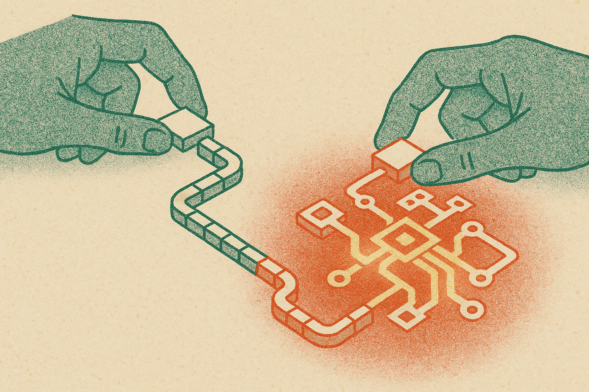

TL;DR: If you want better intuition for AI systems, trace a small model or workflow by hand before you automate it.

## What does “AI by hand” actually buy you?

The supplied primary source here is the Hacker News item titled “AI by Hand.” There is not enough source material to make claims about a specific project, demo, or method behind that title. So I’m taking the useful part plainly: “AI by hand” is a good constraint.

Not because anyone should run production AI systems manually. They should not.

Because the hand version exposes the places where abstractions hide reality.

When you manually walk through a tiny classifier, a toy attention block, a retrieval step, or an agent loop, you see the shape of the system. Inputs get reduced. Similarity scores flatten nuance. Ranking matters more than the generator sometimes. Tool calls fail in boring ways. Memory is usually just stored text plus retrieval rules, not magic continuity.

That is the practical value. It turns “the model is smart” into smaller statements you can test.

A lot of AI work now starts too high in the stack. Pick a hosted model, wire up a framework, add retrieval, add tools, add evals later. That can ship, and I like shipping. But it also creates a nasty debugging problem. When the output is wrong, you do not know whether the issue is the prompt, the context, the retrieval query, the chunking, the schema, the model, the tool result, or the product requirement.

Doing one pass by hand forces you to name each step.

## Where should builders use this?

Start with retrieval.

Take one real user question. Before writing code, choose the documents you think the system should retrieve. Then compare that against what your search stack actually returns. If your manual answer needs paragraph four from a policy doc and your retriever pulls three stale onboarding pages, the model is not the problem.

Do the same for agents. Write the decision trace yourself. What should the agent know? What tool should it call first? What should it do if the tool returns nothing? What state should survive into the next turn? If you cannot write that path in plain English, the agent framework will not rescue you. It will just fail with better logging.

This also helps with evals. Too many teams treat evals as a scoreboard. Better to start as a worksheet. What would a good answer include? What would be unacceptable? What facts must be cited? What behavior should trigger refusal, escalation, or a second lookup? Once you can grade ten examples by hand, you have the bones of an automated eval.

The pattern is simple: manual trace first, automation second.

## What is the catch?

The catch is that “by hand” does not scale, and that is the point.

It is a diagnostic move, not an operating model. The goal is not to become artisanal about AI. The goal is to find the hidden assumptions before they become expensive product behavior.

There is also a humility benefit. Hand tracing makes it harder to anthropomorphize the system. You stop saying the model “understood the policy” when what happened is closer to: a chunk matched the query, the model compressed it into an answer, and the prompt style made that answer sound confident.

That distinction matters in production. Especially in support, legal, medical, finance, internal ops, and any workflow where users will treat fluent text as authority.

I would use “AI by hand” as a pre-build ritual. Pick one workflow you want to automate. Run three real examples manually. Write down the inputs, intermediate decisions, missing context, expected output, and failure modes. Then build the smallest version that copies that path. The catch most teams miss: if the manual version is vague, the automated version will be vague at scale.
