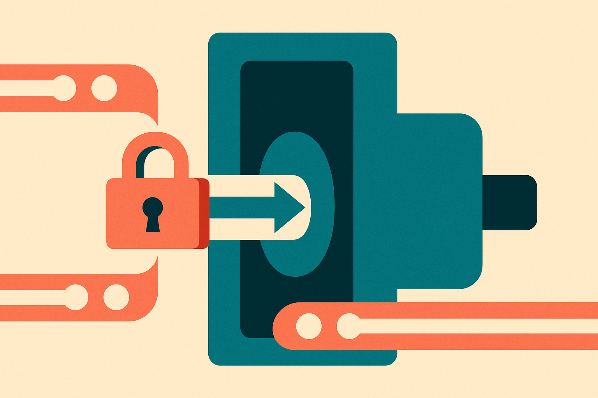

TL;DR: Homomorphic encryption could make some AI inference safer for sensitive data, but builders should treat it as one privacy tool, not a blanket guarantee that a whole AI product is private.

## What does homomorphic encryption actually change for AI?

The primary source here is the Hacker News item titled “Google is making private AI practical with homomorphic encryption.” That phrasing matters. The claim is not just that homomorphic encryption exists. It has for decades. The claim is that it is becoming practical enough to matter for AI systems.

At a basic level, homomorphic encryption lets a system compute on encrypted data without first decrypting it. A user encrypts an input. A server runs an approved computation over that encrypted input. The user gets back an encrypted output and decrypts it locally.

For AI, the appeal is obvious. Prompts, documents, medical records, financial records, customer support transcripts, code, and personal context are exactly the inputs people do not want floating around in plaintext inside someone else’s infrastructure.

The hard part is that AI models are not one neat operation. They are stacks of matrix math, tokenization, retrieval, logging, moderation, caching, tool calls, embeddings, memory stores, and product analytics. Homomorphic encryption may protect one computation path while the surrounding product still leaks sensitive data through metadata, logs, retrieved documents, or human review queues.

That is why I read “private AI” carefully. Encrypted inference is a big deal if the model can do useful work while never seeing raw user data. But privacy is a system property. One cryptographic layer does not automatically cover the rest of the application.

## Where would this be useful first?

The best early use cases are probably narrow, repetitive, high-value workflows where the privacy requirement is stronger than the need for maximum model flexibility.

Think classification over sensitive records. Risk scoring. Policy checks. Matching. Structured extraction from confidential documents. Maybe parts of healthcare, finance, legal, and enterprise security workflows. These are places where customers already pay for privacy, compliance, and auditability, and where the task can be constrained enough to make encrypted computation realistic.

The weaker fit is the current agent dream: long-running agents with memory, tools, browsing, file access, and open-ended planning. Those workflows touch too many surfaces. Even if one model call is encrypted, the agent may still expose sensitive data when it searches, calls an API, writes to a database, or asks another model to summarize its state.

This is the catch in a lot of “private AI” messaging. The demo often protects the core inference step. The product risk often lives around that step.

Google, if the Hacker News framing reflects its actual work, is aiming at a real bottleneck. Cloud AI wants enterprise and regulated data. Enterprises want model capability without handing over plaintext. Homomorphic encryption is one of the few approaches that changes the trust model instead of just asking customers to trust a policy.

But I would still want first-party details before treating any specific Google capability as shipped, generally available, fast enough, or cheap enough. The Hacker News title points to the story. It does not give the operating limits.

## What should builders ask before adopting it?

The first question is not “is it private?” It is “which data is encrypted, during which operation, and who holds the keys?”

Then ask what the model can actually do under encryption. Is this full LLM inference, a smaller model, a fixed function, or a narrow layer in a larger pipeline? What accuracy tradeoffs show up? What latency does the user feel? What happens to batching and cost? Can you inspect failures without exposing the data you promised to protect?

Also ask what is outside the encrypted boundary. Tokenization. Retrieval. Fine-tuning data. Embedding indexes. Prompt logs. Abuse monitoring. Evaluation traces. Vendor support access. Backups. Error reports. These boring parts decide whether the privacy claim survives contact with production.

The practical move is to prototype one sensitive workflow with a tight threat model. Pick a task where plaintext exposure is the blocker, not a nice-to-have. Compare homomorphic encryption against on-device inference, redaction, trusted execution environments, and plain old data minimization. If encrypted computation wins on risk without wrecking latency or cost, use it there first. The miss most teams will make is branding the whole product as private because one model call is protected. Don’t do that. Draw the boundary, test the boundary, and sell only what the boundary actually covers.
