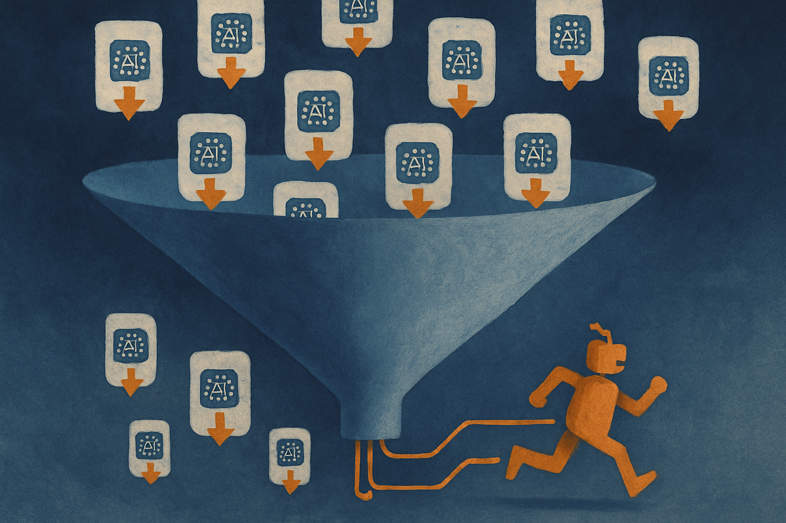

TL;DR: Open models are no longer a scrappy alternative to closed APIs for a big slice of real work, but the gap between "downloaded" and "actually deployed" is where most teams still lose the plot.

I want to be careful here, because "State of Open Models: Summer 2026 Observations" from the Hugging Face Blog is the primary source for this post, and a state-of report is exactly the kind of thing people quote loosely and then round up into claims it never made. So I'll treat its high-level observations as the frame and be honest about what it does and doesn't settle. Where I add my own read as an operator, I'll say so.

## What is the report actually claiming?

The Hugging Face observations track the open model ecosystem: how many capable models are shipping with open weights, how download and usage patterns are moving, and which model families are drawing real adoption versus a spike of curiosity and then silence. That framing matters. A "state of" post from a platform is useful precisely because it sits on the distribution layer. Hugging Face sees the downloads, the Spaces, the fine-tunes, the inference traffic. It is not neutral (they benefit from open models thriving), but they have the meter readings almost nobody else has.

What I take from it, plainly: the number of genuinely usable open models has kept climbing, and the center of gravity has shifted from "can we get a decent base model at all" to "which of these many decent base models do we standardize on." That is a different problem, and a healthier one.

The catch is that a platform-level report measures activity, not outcomes. Downloads are a demand signal, not a deployment signal. A model with a million pulls and a model quietly running in production at ten companies look very different on a leaderboard and very similar in a download chart. So read the counts as interest, and look elsewhere (your own logs, your own evals) for whether interest turned into anything.

## Why does the download-to-deployment gap keep biting teams?

Here is the pattern I keep seeing, and I think the Hugging Face data hints at it without quite naming it: teams treat "we can download it" as the finish line when it is the starting line.

An open model gives you weights. It does not give you the serving stack, the eval harness, the quantization that fits your hardware, the guardrails, the prompt scaffolding, or the person who owns it at 2am. Closed APIs hide all of that behind a bill. That is the actual trade. When people say open models are "free," they mean the license is free. The operating cost is real and it lands on your team instead of a vendor's.

So the gap is not about model quality anymore. For a large share of tasks (classification, extraction, summarization, retrieval-augmented answers, structured output, mid-tier code assist) the open options are good enough that quality is no longer the bottleneck. The bottleneck is operational maturity. Do you have an eval you trust? Can you swap models without rewriting your app? Do you know your cost per thousand requests on your own infra? If the answer is no, an open model does not save you money. It just moves the risk onto you and you find out later.

The teams that win with open weights are the ones who built the harness first and the model choice second. The model becomes a variable you can swap, not a decision you marry.

## Should you fine-tune, or just prompt a strong base model?

This is the question I get most, and the honest answer for 2026 is: fine-tune less than your instinct says, and later than you think.

The base models shipping now are strong enough that a lot of what people reach for fine-tuning to fix is actually a prompting, retrieval, or data-formatting problem. Fine-tuning is powerful when you have a narrow, stable task with clean labeled examples and a real distribution shift from what the base model knows. It is a trap when you use it to paper over a vague spec or to chase a few points on a benchmark that does not map to your use.

The Hugging Face view of who is fine-tuning versus who is just downloading is telling, if you read it as a maturity curve. Most activity is download-and-prompt. Fine-tuning is a smaller, more committed cohort. That ratio is roughly correct. Fine-tuning should be the exception you earn, not the default you start with.

My rule of thumb: prove the task works with prompting and retrieval on a strong open base first. If you hit a wall that is clearly the model's behavior and not your inputs, and you have the labeled data to fix it, then fine-tune. If you skip that order, you will spend weeks tuning a model to do something you could have gotten from a better prompt and a cleaner context window.

## What should an operator do with this report this quarter?

Not a lot of dramatic re-platforming, honestly. The signal from the summer 2026 data is continuity, not rupture: more good open models, steadier adoption, a maturing middle of the market. That is the boring, good kind of news.

The concrete move is to treat model choice as reversible. If your app is welded to one provider's exact API shape, you cannot take advantage of any of this, open or closed. Build a thin abstraction so switching a model is a config change and a re-run of your eval, not a rewrite.

And be skeptical of the framing that open models are "winning" or "losing" against closed ones. That is the wrong axis. They are converging on different jobs. Closed APIs still lead at the frontier and remove operational burden. Open weights give you control, privacy, cost predictability at scale, and the ability to run where the data lives. Most serious stacks I see now use both, on purpose, matched to the task.

Practitioner's take: this quarter, pick one internal task you currently send to a closed API and stand up an open-weight version behind the same interface, with a real eval harness scoring both on your actual data. Do not decide the winner by vibe or by the download counts in any state-of report, including this one. Measure cost per request on your own hardware and quality on your own examples, then let the numbers pick. The catch most people miss: the eval harness is the actual asset. The model is the cheap, swappable part. Build the thing that lets you keep choosing, and every future open model release becomes an upgrade you can test in an afternoon instead of a migration you dread.
