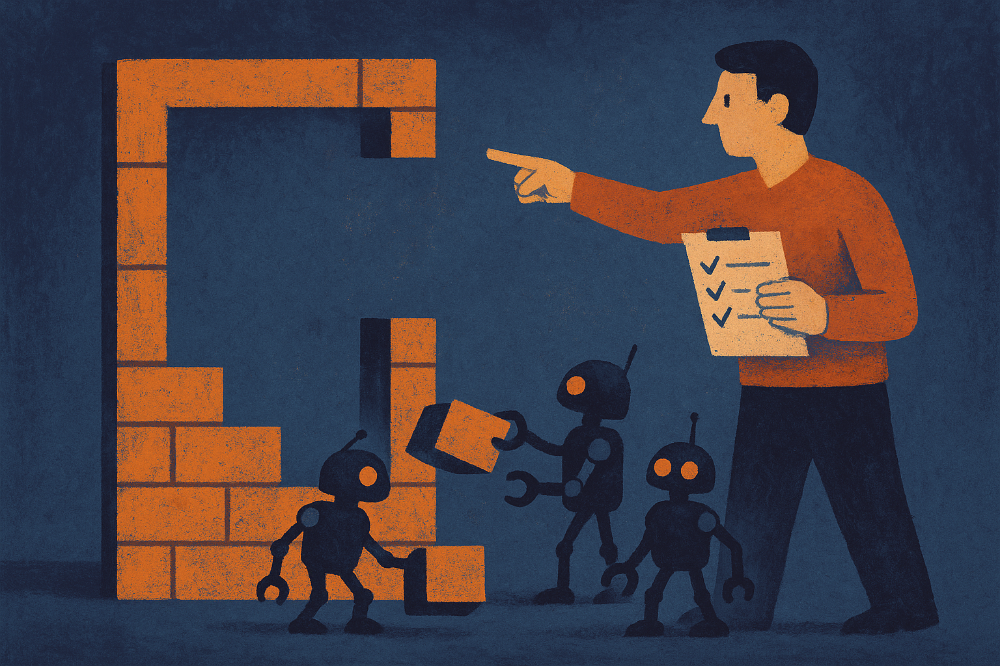

TL;DR: The best AI coding workflow is less about typing faster and more about managing the model well: set context, define the job, inspect the work, and stay accountable.

## What does “leadership” mean when the worker is a model?

The useful claim in the Hacker News thread titled “Working with AI feels more like leadership than coding” is not that engineers are becoming executives. It is that the shape of the work has changed.

A good AI coding session now looks a lot like assigning work to a very eager junior engineer who has read half the codebase, forgot the other half, and will confidently paper over ambiguity. You do not get the best result by saying “fix auth.” You get it by saying which flow is broken, what files matter, what constraints cannot move, what tests should pass, and what kind of change is off limits.

That is leadership behavior. Not inspirational posters. Operating discipline.

The model needs a brief. It needs boundaries. It needs examples of what good looks like. It needs someone to notice when it solved the wrong problem. The human is not just “prompting.” The human is setting direction, reducing uncertainty, and deciding whether the output belongs in production.

This is why the coding assistant story is both more exciting and less magical than the marketing version. The model can produce a lot of code. Sometimes good code. Sometimes surprisingly good code. But the hard part has moved up a level: deciding what should exist, what should not, and how to tell the difference.

## Where does the coding skill still matter?

The leadership analogy breaks if people hear it as “you no longer need to code.”

You still need enough technical taste to inspect the work. Otherwise you are not leading. You are forwarding tickets to a stochastic contractor and hoping the demo passes.

AI coding tools are strongest when the user can read the diff with suspicion. Did it introduce a second source of truth? Did it catch the edge case or just the happy path? Did it add a dependency because that was easiest? Did it preserve the existing architecture, or quietly create a new one in the corner?

These are not abstract concerns. They are the daily failure modes of generated code. The model often optimizes for plausible completion. The builder has to optimize for maintainable systems.

That means senior engineers may get more from these tools than beginners, at least for serious work. Not because beginners cannot benefit. They can. AI can explain unfamiliar APIs, sketch a starting point, and make practice less lonely. But shipping is different. In shipping, the expensive mistakes are often the ones that look fine in the first pass.

The human skill stack shifts toward problem framing, code review, testing strategy, product judgment, and taste. Still technical. Just less centered on keystrokes.

## What should builders change in their workflow?

Treat AI coding like delegation, not autocomplete.

Before asking for code, write the assignment. One paragraph is often enough: goal, context, constraints, and definition of done. Point the model at the relevant files. Ask it to explain the planned change before editing. For larger work, split the task into stages: understand, propose, implement, test, review.

Then make the model produce artifacts you can judge. Tests. Migration notes. Risk lists. A diff summary. A rollback plan if the change touches production paths. These are management handles. They turn a blob of generated work into something inspectable.

I also like asking the model what it is uncertain about before it writes code. That single move often exposes missing context. It makes the tool less like a vending machine and more like a collaborator with gaps.

Practitioner’s Take: Try one day where you stop using the model as a faster typist and start using it as a small team. Write tighter briefs, demand a plan, review the diff, and ask for tests before you merge anything. The catch most readers miss: delegation does not remove accountability. It concentrates it.
