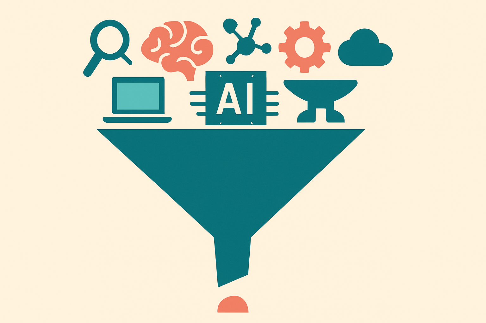
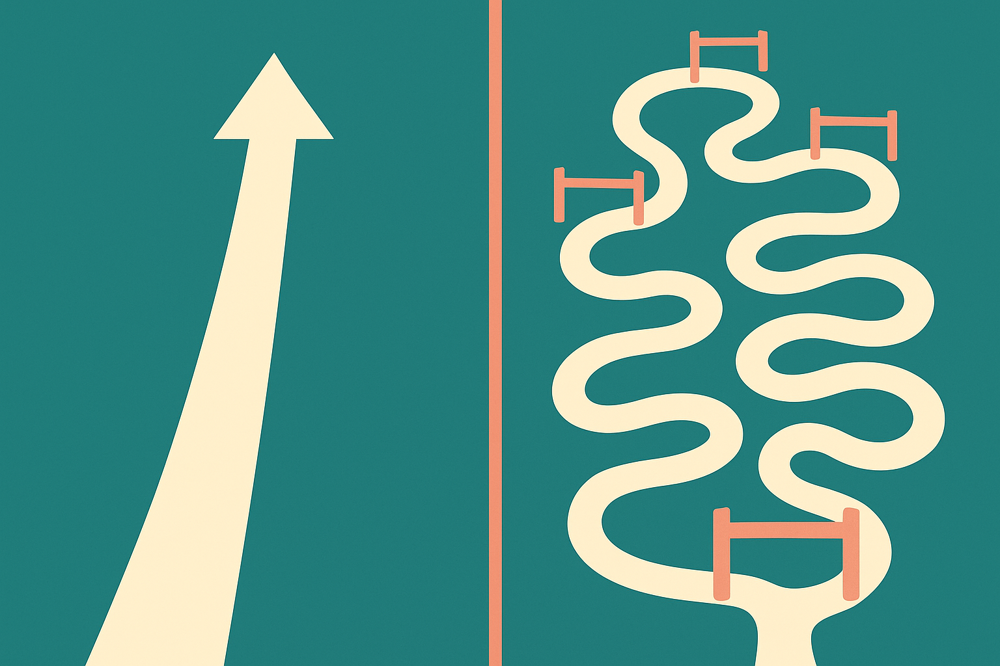
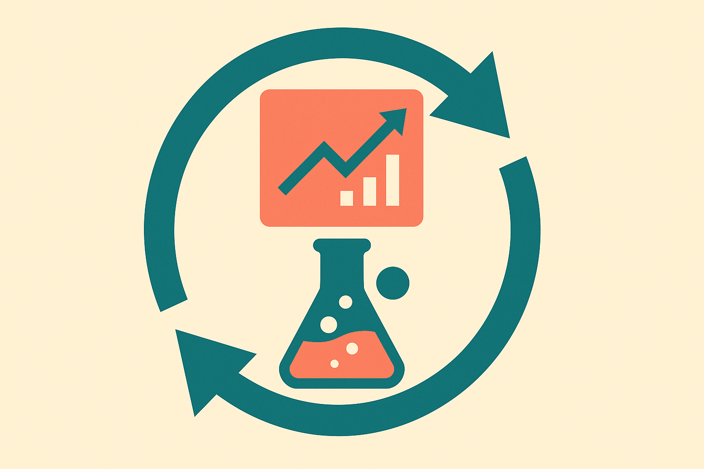

TL;DR: AI has genuinely changed the early, computational parts of drug discovery, but no AI-designed drug has cleared the full approval gauntlet yet, and the honest read is that we are years of clinical readouts away from knowing how much the hype was worth.

The primary source here is a review published in Nature Reviews Drug Discovery, "AI in drug discovery: what it is, where we stand and the path forward" (nature.com/articles/s41573-026-01496-2). It surfaced on Hacker News, which is where I picked it up. I want to be careful about attribution: I am working from the framing that surfaced, and where I make a claim about a specific trial or molecule I will flag it as reported rather than settled, because the one thing this field does not need is another confident number pulled from thin air.

Let me tell you what I actually take from this, because the interesting part is not "AI is coming for pharma." That train left years ago. The interesting part is the shape of where it works and where it stalls.

## What has AI actually changed in drug discovery?

The clearest win is structural biology. AlphaFold and its successors turned protein structure prediction from a multi-year experimental slog into something you query in an afternoon. That is real. It changed how researchers approach targets, and it is the example everyone reaches for when they want to say AI is transforming the field.

But structure prediction is upstream. Knowing what a protein looks like is not the same as knowing which molecule will bind it, whether that binding does anything useful, whether the molecule survives the body, and whether it helps a patient without hurting them. Each of those steps is its own hard problem, and each one has less clean data than the last.

That funnel is the whole story. The top of the pipeline, target identification and molecule generation and virtual screening, is where AI has the most traction, because it is the part that looks most like a pattern-matching problem with a lot of data. Generative models can propose novel candidate molecules. Screening models can rank millions of compounds faster than any wet lab. This genuinely compresses the earliest, cheapest phase.

The catch: the earliest phase was never where drugs died. Drugs die in the clinic, in phase 2 and phase 3, when a molecule that looked perfect in a dish or a mouse turns out not to help humans. AI has done the least to move that number, and that number is where most of the cost and most of the risk lives.

## Where does the hype outrun the evidence?

Here is my skeptic's read. A lot of the "AI-discovered drug" headlines describe molecules that used AI somewhere in their discovery, then went through the same slow, expensive, high-failure clinical process as everything else. Using AI to generate a candidate is not the same as AI having de-risked the drug. Those get conflated constantly in press releases, and the review is useful precisely because it separates the computational front end from the clinical back end.

The honest status, as I read the field in 2026: several AI-originated or AI-optimized molecules have entered clinical trials, some have reached later phases, and the industry is still waiting on the readouts that would prove the approach produces drugs that work better, faster, or cheaper than the old way. No AI-designed drug has been approved and shown a clear win attributable to the AI, at least none that would settle the argument. If someone tells you otherwise, ask them for the specific molecule, the specific trial, and the specific endpoint.

The gap between those two paths is the gap between a demo and a drug. And it is not a gap AI closes by itself, because the bottleneck downstream is not compute or model quality. It is biology being genuinely unpredictable, clinical trials taking years by design, and regulators wanting evidence that no model can shortcut.

## Why is data the real constraint, not model size?

This is the part operators outside pharma should sit with, because it generalizes. In language and images, the internet handed us oceans of training data. In drug discovery, the useful data is small, expensive, proprietary, and biased toward what already worked.

Think about what that means. Failed trials often are not published. Negative results sit in company vaults. The compounds that reached the clinic are a filtered, non-random slice of chemical space. So a model trained on "drugs that made it" is learning from survivors, and survivorship bias in your training set is a quiet way to keep reinventing the kinds of molecules the field already knows.

That is a harder problem than scale. You cannot just add more parameters. You need better, broader, honestly-labeled experimental data, and generating that data means running the slow wet-lab and clinical work AI was supposed to speed up. The dependency runs in a loop, and the loop is the thing that makes this field move at biology's pace, not software's.

The labs making real progress seem to understand this. They are building the experimental data-generation engine alongside the models, treating the wet lab as part of the training loop rather than an afterthought. That is expensive and unglamorous and does not fit in a keynote slide, which is exactly why I trust it more than the pure in-silico pitches.

## What should a builder actually do with this?

If you work in or near this space, the useful frame is: use AI aggressively where the data is dense and the feedback is fast, and stay humble where it is neither. Molecule generation, screening, structure prediction, property prediction on well-characterized assays. Those are places where a model earns its keep today and you can measure whether it helped.

Do not sell, or buy, the claim that a model shortens the clinic. It does not, not yet, and the review's value is in making that boundary explicit rather than letting the front-end wins bleed into back-end promises. The catch most readers miss is that "AI-discovered" is a claim about process, not outcome. The outcome still takes eight to twelve years and mostly fails, same as always. When the first AI-originated drug wins a phase 3 on a hard endpoint, that will be the day the story actually changes. We are not there. Watch the clinical readouts, not the generation demos, and treat anyone who conflates the two as either confused or selling something.
