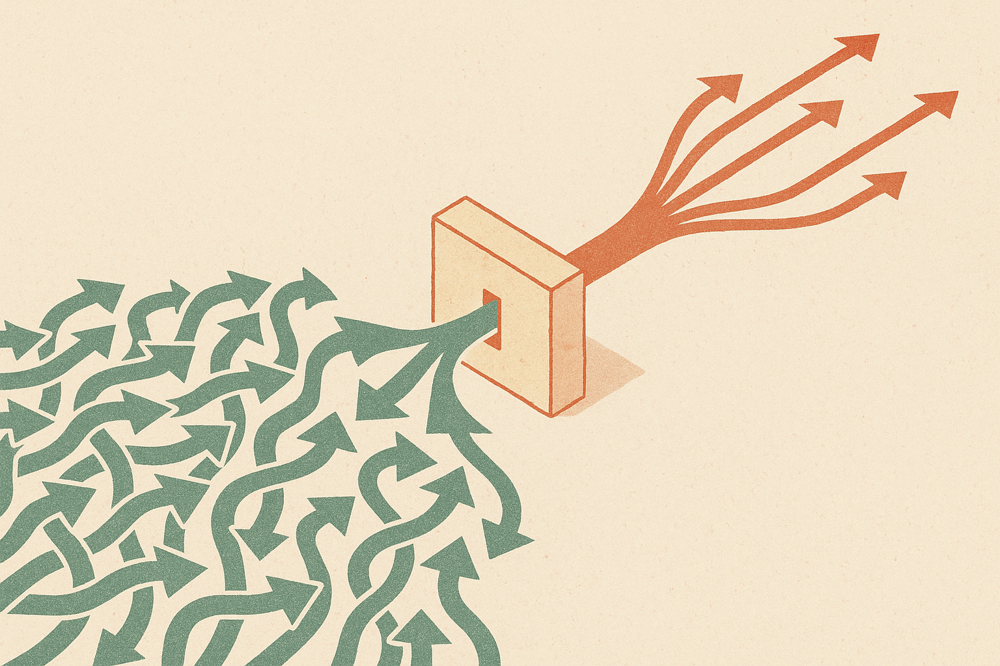

TL;DR: AI will help attackers move faster, but defenders can still gain ground if they use models to compress triage, investigation, and response time before the attack surface expands again.

## What does OpenAI mean by the defender’s window?

The primary source here is OpenAI’s blog post, “The Defender’s Window.” OpenAI’s stated frame is simple: AI is changing cybersecurity for both attackers and defenders, and there is a period where defenders can strengthen their posture before AI-native abuse becomes more common and more automated.

That framing is useful because it avoids the lazy binary. AI is not “good for defenders” or “bad because attackers have it too.” It changes the unit economics on both sides.

Attackers get cheaper content generation, faster scripting help, better translation, more convincing social engineering, and easier iteration. Defenders get faster log review, alert clustering, playbook drafting, code review, policy comparison, and incident summaries. The gap is not model access. The gap is execution inside the organization.

That is why I like the phrase “window.” It implies timing. Not inevitability. A security team that spends the next six months debating model policy in the abstract will lose ground. A team that plugs models into bounded workflows, with audit trails and human review, can probably reduce response latency today.

The catch: this window is not magic. It is not a vendor feature you buy once. It is an operating period where defenders may be able to turn messy institutional data into faster action before attackers industrialize the same tools against them.

## Where should defenders actually apply models first?

Start where the work is high volume, language-heavy, and already supervised.

Security teams drown in alerts, tickets, logs, Slack threads, vendor advisories, IAM changes, pull requests, endpoint notes, and incident timelines. A model does not need to “run security” to be useful there. It can summarize a messy incident channel into a timeline. It can compare a new vendor advisory against an asset inventory. It can draft a detection query for review. It can explain why three alerts are probably one incident instead of three separate events.

That is not glamorous agent theater. It is compression.

OpenAI says it is strengthening its own defenses and giving guidance for security teams in “The Defender’s Window.” Without overclaiming beyond OpenAI’s own summary, the direction is clear: the near-term gain is defensive acceleration. Shorten the time between signal and judgment. Shorten the time between judgment and containment. Shorten the time between containment and learning.

I would put the first wave of AI security work into four places: alert triage, incident summarization, control validation, and secure engineering review. Those are good candidates because the model can assist without becoming the final authority. A human can inspect the artifact. A system can log the prompt, input, output, and action taken. A bad answer can be caught before it mutates production.

Do not start with autonomous remediation across your cloud estate. That is how a helper becomes a new incident class.

## What should security leaders be skeptical about?

Be skeptical of any pitch that treats AI as a replacement for basic security hygiene.

If identity is sloppy, secrets are scattered, devices are unmanaged, logs are missing, and ownership is unclear, a model will mostly summarize the mess faster. Useful, but not a strategy.

Be skeptical of demos that only show clean prompts against clean data. Real incidents are partial, contradictory, and political. Someone says the service is down. Someone else says deploys were frozen. A vendor status page lags reality. The model’s job in that setting is not to sound confident. It is to surface likely connections, missing evidence, and next checks.

Also be skeptical of “AI SOC analyst” language when it hides governance. Who can ask the model questions over sensitive logs? Which data leaves the environment? Are outputs stored? Can the model call tools? Can it change firewall rules, disable accounts, or open tickets? What happens when it is wrong?

The defender’s window closes fastest for teams that confuse access with adoption. Giving analysts a chatbot is not the same as redesigning triage. Real adoption means workflow changes, permissions, evals, and post-incident review.

Practitioner’s take: pick one narrow defensive workflow this week, not ten. I would choose incident summarization or alert clustering because the downside is manageable and the feedback loop is fast. Feed the model only the data it needs, require citations back to the underlying logs or tickets, and measure whether analysts reach better decisions faster. The miss most teams make is chasing autonomy before they have observability, ownership, and review discipline.
