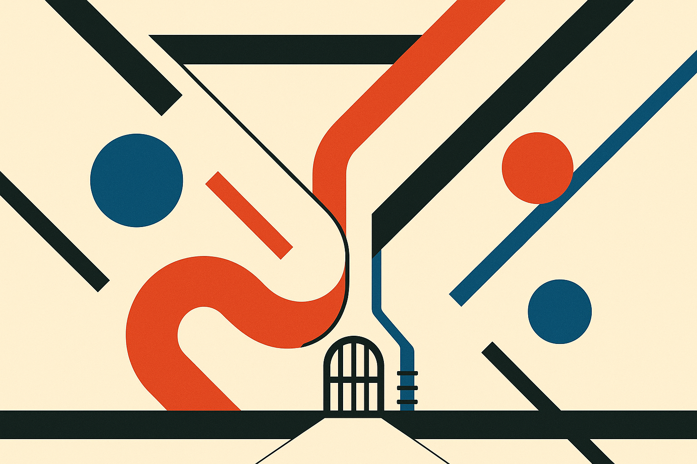
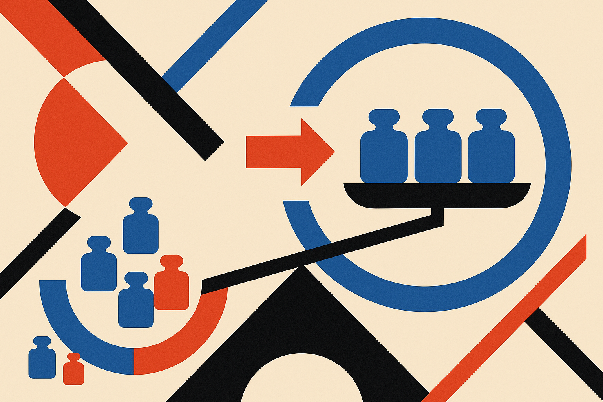

TL;DR: When you hand a language model a pile of sources and ask for one answer, you are secretly running two different operations in one step, and the paper "Split the Labor: Separating Evidence Interpretation from Decision Aggregation" shows that pulling them apart fixes a quiet bug where your decision threshold drifts with the number of sources you happened to retrieve.

The primary source here is "Split the Labor: Separating Evidence Interpretation from Decision Aggregation," posted to arXiv across cs.AI, cs.CL, and cs.LG. It is one of those papers that sounds like plumbing and turns out to be about a mistake almost everyone shipping retrieval-augmented systems is making without noticing.

## What is the actual mistake in most RAG systems?

Here is the standard pattern. You retrieve five, ten, twenty documents. You concatenate them into one big prompt. You ask the model: given all this, is the answer yes or no, is this claim supported, does this patient match the criteria, is this transaction fraud. One prompt, one verdict.

The paper's argument is that this prompt is doing two jobs that want opposite things.

Job one is interpreting a single source. What does this document actually say about the hypothesis? That job rewards capacity and context. You want a big model that reads carefully.

Job two is combining those interpretations into a decision. That job rewards fixed arithmetic, comparability across cases, and the option to abstain. You do not want creativity here. You want the same evidence to move the needle the same amount every time.

Jam both into one prompt and you get a system where the combining step is improvised anew on every call, invisible, and impossible to audit. The authors' move is to force an interface between the two. Every source read produces a four-field tuple: hypothesis, reliability bucket, rationale, provenance. The reader fills that in. A separate, dumb aggregator combines the tuples. The claim is that fixing this tuple determines both halves of the design, which is a strong claim and the interesting part of the paper.

## What is count-scale drift and why should you care?

This is the finding worth the price of admission.

When you sum up "evidence weights" across sources and threshold that sum to make a yes/no call, you are, mathematically, doing posterior thresholding. Fine. Except the operating point of that threshold slides depending on how many sources you consulted. The authors call this count-scale drift.

Think about what that means operationally. You tuned your system on cases where retrieval returned eight documents. In production, some queries pull three, some pull fifteen. The same underlying truth now crosses your decision line at different places purely because the count changed. Your threshold is silently a function of retrieval volume. And the paper says the slide grows with reader reliability, so a better reader makes the drift worse, not better. That is a genuinely counterintuitive and uncomfortable result.

It gets worse when sources have different reliabilities. The paper states that in that case the vote rule and the true posterior order your instances differently, and no single threshold reconciles them. There is no knob you can turn. The ranking itself is wrong.

If you have ever watched a RAG eval score wander when you changed your retriever's `top_k` and assumed it was noise, this is a candidate explanation. It was not noise. It was the aggregation math reacting to the count.

## Is the fix a bigger model or better prompts?

No, and this is the part I like. The fix is arithmetic, not architectural.

Instead of summing unnormalized weights, you pool calibrated log-likelihood ratios. Each source's contribution gets expressed as a proper likelihood ratio, calibrated, and then those add up in a way that does not drift with count and does respect differing reliabilities. That is it. No new model, no agent graph, no retrieval rerank. You change how the numbers combine.

I want to be careful about what the paper claims versus what it demonstrates. The count-scale drift result is presented as a mathematical property of threshold-on-a-sum rules, and the log-likelihood-ratio pooling is presented as the correction. That reasoning stands on its own if the framing holds. The paper also generalizes the fix to a whole class of systems that are not LLMs at all: score-summing triage engines, diagnostic panels that count positives, additive multi-signal detectors. So if you run a fraud model that adds up rule hits, or a clinical panel scored by counting flags, this drift lives in your stack too. That generalization is the ambition, and it is where I would want to see it stress-tested by other groups before treating it as settled.

## Does the empirical result back this up?

The authors instantiate the principle twice on one longitudinal corpus. Once retrospectively, after outcomes resolve, where the partition helps at the granularity of reading. Once prospectively, before outcomes resolve, where it helps at the granularity of learning capacity.

The headline number in the prospective setting: a small sequence encoder trained on an easy auxiliary objective, plus a tree ensemble carrying a censored survival loss, reaches 0.921 AUPRC against 0.805 for a hand-crafted baseline. That is a real gap on a precision-recall metric, not a rounding-error improvement. And notice the shape of the winning system. It is not one giant model. It is a small reader doing an easy job feeding a boring, fixed combiner. That is the whole thesis expressed as an architecture.

What earns my trust more than the AUPRC is the paper's own posture. The authors state five predictions that would falsify the framework, three negative results, and which comparisons remain confounded. That is rare. Most systems papers report the wins and bury the confounds. Naming the falsifiers up front means the framing is meant to be tested, not just admired. It also means you should read those confounds before you assume the 0.921 transfers to your domain. The paper is explicit that some things transfer and some must be re-estimated per domain, which is the honest answer and also the annoying one.

## Practitioner's take

If you run a RAG pipeline or any multi-signal decision system, do one cheap diagnostic this week: hold the ground truth fixed and vary `top_k` or the number of sources fed in, then watch whether your final yes/no rate moves. If it does, you have count-scale drift, and no amount of prompt tuning fixes it because the bug lives in the combine step, not the read step.

The concrete build is: make your reader emit a structured verdict per source (hypothesis, a reliability bucket, a rationale, provenance) instead of one blended answer, then combine those with pooled calibrated log-likelihood ratios rather than a raw sum or a majority vote. You get a decision you can audit, a threshold that does not wander with retrieval volume, and a clean place to let the system abstain.

The catch most readers will miss: calibration is not free. Log-likelihood-ratio pooling only removes the drift if each reliability bucket is actually calibrated on your data, and the paper is clear that this piece must be re-estimated per domain. Ship the separation with a stale or borrowed calibration and you have traded a drift you understood for a bias you do not. Split the labor, yes. Then do the unglamorous work of calibrating the combiner before you trust its verdicts.
