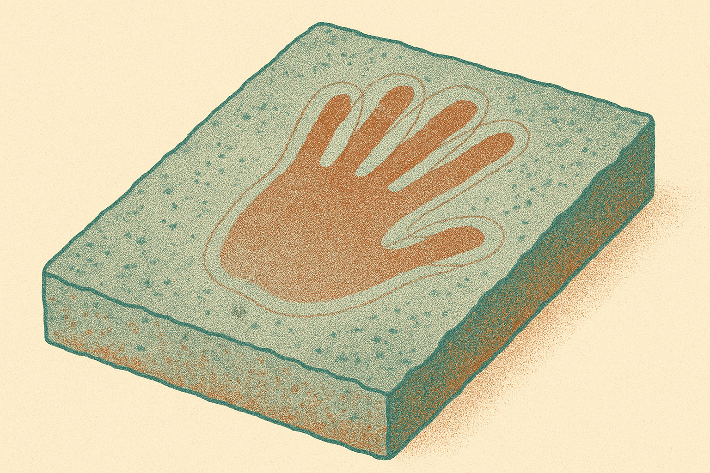
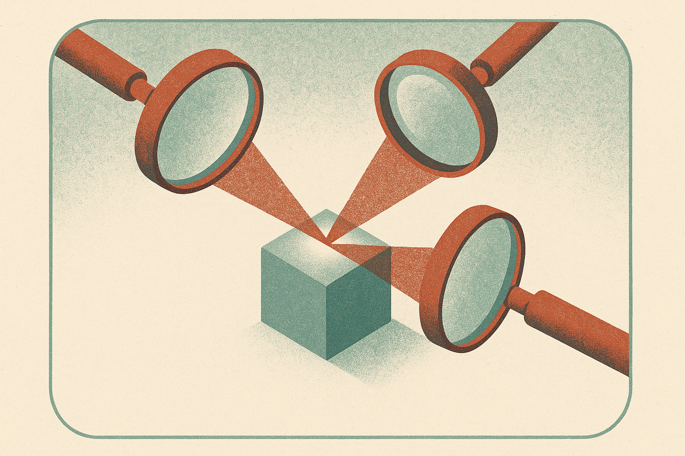
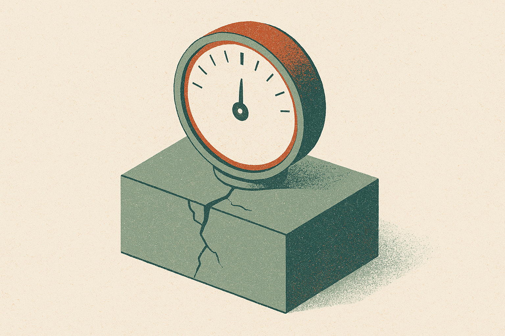

TL;DR: The headline is "AI dates cave-wall handprints," but the transferable idea is a pipeline that measures and reports its own confidence, which is exactly what you need whenever your training data and your real target come from different worlds.

The paper is "Decoding the Past: An Uncertainty-Aware Deep Learning Framework for Sex Attribution in Prehistoric Hand Stencils," posted to arXiv under both cs.AI and cs.LG. The task sounds niche: look at hand stencils painted on cave walls tens of thousands of years ago and predict whether a man or a woman made them. But strip away the archaeology and you have a problem shape that shows up constantly in applied ML. You train on data you can label, you deploy on data you cannot, and nobody can ever check your answer against ground truth. That gap is where most models quietly fail. This one is built to make the gap visible instead of hiding it.

## Why is sex attribution on cave art such a hard ML problem?

Three things make it brutal, and the authors are upfront about all three.

There is no ground truth. The people who made these stencils are gone. You cannot go back and confirm anything. So you can never compute a real accuracy number on the actual task. Every claim of "88% accuracy" comes from contemporary hands, not prehistoric ones.

The training and deployment populations differ. The model learns from 14,036 modern hand samples. Prehistoric humans had different body proportions, different nutrition, different everything. A model that nails modern hands may generalize poorly to ancient ones, and you have no way to measure how poorly.

The inputs are degraded. A stencil sprayed with pigment onto rock and weathered for millennia has fuzzy, ambiguous boundaries. Where exactly does the finger end? Two reasonable people trace the outline differently, and that tracing choice changes the prediction.

Traditional morphometric methods (measuring finger-length ratios and such) struggle here because male and female hands overlap heavily, the measurements do not transfer across populations, and picking which features to measure is subjective. The paper's framing is that these are not bugs to eliminate. They are uncertainty to quantify.

## What does the pipeline actually do differently?

Most classifiers give you one input, one answer, one confidence score that means very little. This framework refuses to do that at every stage.

It starts by generating twelve plausible silhouette realizations per stencil. Instead of committing to one tracing of a blurry handprint, it produces a spread of reasonable interpretations. That is the boundary uncertainty, made into data rather than assumed away.

Those silhouettes feed two separate ensembles: ten EfficientNet-B3 networks and ten MobileViT-S networks. Two different architectures, ten models each, because architectural diversity means the models fail in different ways and their disagreement is informative. When twenty models trained across twelve versions of an image all agree, that agreement means something. When they scatter, that scatter is the signal that this particular stencil is ambiguous.

Then comes the part I find most useful. The authors do not trust the ensemble alone. They run a triangulated validation scheme with three independent checks: the ensemble predictions themselves, an unsupervised look at where each stencil lands in a 2D latent-space map (UMAP plus k-nearest-neighbors), and explainable-AI spatial attributions via LayerCAM to confirm the model is looking at anatomically sensible parts of the hand and not some artifact of the rock.

Convergence across all three is the actual output. Not "female, 0.71." Rather: the ensembles agree, the latent-space neighbors agree, and the attribution maps land on real hand structure. That is a claim you can defend. When the three disagree, the framework flags the case as ambiguous instead of forcing a false answer.

## What can an operator take from this outside archaeology?

Almost everything, because the domain is the least important part.

Swap "prehistoric hand stencils" for any high-stakes prediction on out-of-distribution data with no feedback loop. Medical imaging on a hospital population your training set never saw. Fraud scoring on a new market. Document classification on a client whose paperwork looks nothing like your labeled corpus. Same shape: confident training metrics, unknowable deployment accuracy.

The design moves here generalize cleanly.

Turn input ambiguity into an ensemble. If your inputs are noisy or your preprocessing involves judgment calls, do not pick one version. Generate several plausible versions and let the model vote across them. The spread is a free uncertainty estimate.

Use architecture diversity as a disagreement detector. Two model families that agree are more trustworthy than one model run twice. Cheap to add, and the disagreement rate is a live quality signal in production.

Triangulate with methods that fail independently. The supervised classifier, the unsupervised manifold view, and the interpretability check can each be wrong, but they are unlikely to be wrong in the same direction at the same time. Agreement across all three is a much stronger claim than any one score.

Ship the confidence, not just the label. The most honest thing this pipeline does is separate the morphologically stable cases from the ambiguous ones. A model that says "I am confident here, uncertain there" is far more useful in the real world than one that emits a decisive answer for every input regardless of whether it should.

## Where should you stay skeptical?

Two things keep me honest about this paper.

First, the 88% figure is on contemporary data in older age groups, not on the prehistoric task. That is the only place ground truth exists. The paper is careful about this, and you should be too when you read the summary. Nobody has validated the actual archaeological predictions, because nobody can. The framework's real contribution is not "we solved sex attribution." It is "we made uncertainty measurable and reproducible." Those are different claims, and conflating them is exactly the hype this field does not need.

Second, uncertainty quantification is only as good as the uncertainties you thought to model. Twelve silhouettes capture boundary uncertainty. Two architectures capture model-choice uncertainty. But the biggest unknown, whether modern hands are even a valid proxy for prehistoric ones, is a population-shift problem that no amount of ensembling inside the modern distribution can fix. A model can be beautifully calibrated on the wrong assumption. Well-quantified uncertainty about the wrong question still leaves you exposed.

The abstract calls this "robust and reproducible decoding of ancient rock art." I would frame it more modestly and more usefully: it is a template for building models that tell you when to trust them. That is worth more than any single prediction it makes.

Practitioner's Take: If you deploy a model where you can never measure real-world accuracy, steal this whole structure. Generate multiple plausible versions of each ambiguous input, run at least two different model architectures, and validate with an independent unsupervised view plus an interpretability check, then ship the agreement level as a first-class output your downstream users can act on. Route the confident cases to automation and the ambiguous ones to a human. The catch most readers will miss: none of this rescues you from population shift. If your labeled data comes from a fundamentally different distribution than your deployment target, a perfectly calibrated model just gives you precise, confident, well-documented answers to a question it was never equipped to ask. Fix the proxy problem first, then quantify the rest.
