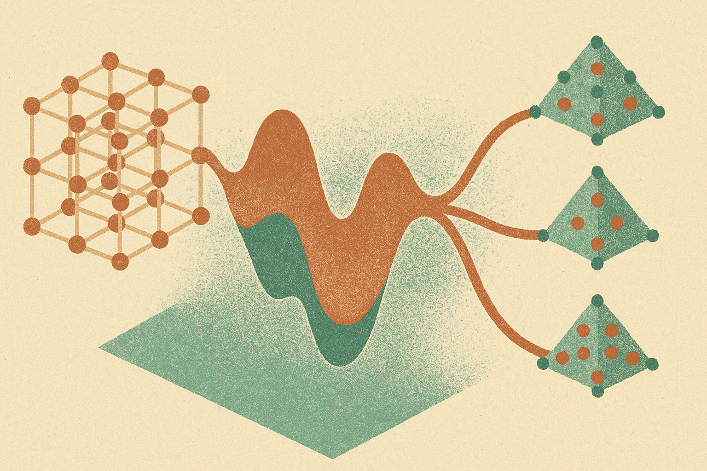

TL;DR: Thermodynamic interatomic potentials could make free-energy screening cheap enough to use early in materials discovery, but the operator question is calibration, not model magic.

## What problem is TIP actually trying to solve?

Most computational materials discovery starts with a simplification that is useful and dangerous: rank candidate crystals by ground-state energy. That is tractable. It is also not the condition most materials live under.

The arXiv paper **“Universal Thermodynamic Interatomic Potentials for Crystalline Materials”**, listed under cs.AI and cs.LG, targets that gap directly. Its core claim is that free energies govern solid-state phase stability, but free-energy calculations have stayed expensive because they require ensemble averages. In plain English: you usually need many samples of how atoms move at temperature and pressure, not just one neat static structure.

The paper introduces a thermodynamic interatomic potential, or TIP. Instead of only predicting static energy, TIP extends an interatomic potential into a thermodynamically consistent Gibbs free energy model. The responses to temperature and pressure then come through automatic differentiation.

That last part is the operator hook. If the model is well calibrated, you are not running a heavy simulation every time you ask, “What happens at this temperature and pressure?” You are querying a learned free-energy surface and getting derived quantities back.

## Why does free energy matter more than another benchmark score?

Because materials fail, transform, dissolve, or stabilize under conditions.

The paper reports an implementation called TIP[UMA], built using the universal potential UMA. TIP[UMA] is trained on free energies spanning quasi-harmonic to molecular dynamics fidelity, then calibrated to higher-resolution calculations or experiment. From a single evaluation, the paper says it can return the equation of state of a crystal and locate phase transitions among competing branches, including dynamically stabilized phases.

That is a very different promise from “we found a lower-energy candidate.” It is closer to: “we can cheaply ask whether this thing is actually stable where we intend to use it.”

This matters for several discovery workflows. Battery materials are not used at 0 K. Alloys are not just pure crystal structures. High-temperature ceramics, catalysts, semiconductors, and structural materials all care about phase stability under finite temperature, pressure, composition, and defects. A model that can expose phase transitions and miscibility gaps earlier in the funnel could save a lot of wasted synthesis and simulation time.

The alloy claim is especially practical. The paper says fine-tuning extends TIP to alloy solubility limits and miscibility gaps. That points beyond ranking single compounds toward maps of “what mixes, what separates, and where.” For product teams, that is often the real question.

## What should make builders cautious?

The claim is big, and the abstract does not give us enough detail to treat it as a solved platform shift.

The phrase “universal” always needs pressure testing in materials. Universal across which chemistries? Which crystal classes? Which temperature and pressure ranges? How much calibration is needed before predictions are useful? What happens outside the training distribution? The abstract says TIP can be calibrated to higher-resolution calculations or experiment, which is good, but also a reminder: the model is not escaping measurement. It is changing where measurement enters the loop.

There is also a workflow distinction that matters. A cheap free-energy model is valuable if it changes decisions upstream. If a team still has to run the same expensive validation on every candidate, the gain is smaller. The win comes when TIP-style screening can confidently discard bad branches, prioritize finite-temperature-stable candidates, or suggest the next expensive calculation with better aim.

I would also separate scientific elegance from production readiness. Automatic differentiation over thermodynamic responses is elegant. A single evaluation returning an equation of state is compelling. But a builder needs error bars, calibration recipes, failure modes, and integration with existing DFT, molecular dynamics, and lab feedback loops.

For a builder, the move is to test TIP-style modeling as a filter, not an oracle. Pick one narrow material family where you already have experimental phase data or trusted high-resolution calculations. Compare ground-state ranking against free-energy ranking under realistic temperature and pressure. The catch most readers miss: the value is not “AI finds magic materials.” The value is moving the expensive question, phase stability under real conditions, earlier in the pipeline.
