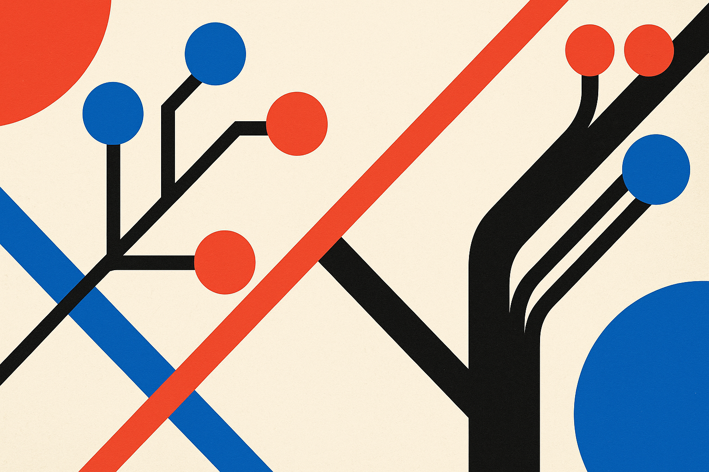

TL;DR: Video world models can make physical events look plausible, but CaliBench shows they often fail the simpler requirement: sampling the right distribution of possible outcomes.

## What is CaliBench actually testing?

The primary source here is the arXiv paper “CaliBench: Are the Stochastic Dynamics of Video World Models Physically Calibrated?” It asks a clean question: if a video model is shown a setup with known physical randomness, does it generate outcomes in the right proportions?

That sounds basic. It is not how most video benchmarks work.

A lot of model evaluation still rewards single generations, visual quality, or distributional similarity in learned feature space, like FID-style comparisons. CaliBench moves the scoring into a physically interpretable discrete space: a die face, a card suit, a Galton-board bin, a roulette color, a lottery outcome. If the reference distribution is known, the benchmark can compare generated samples against the thing we actually care about.

That distinction matters. A model can make a gorgeous die roll video and still put almost all probability mass on one face. It can make a convincing roulette spin and still leave the ball in an ambiguous place. The video looks like physics. The sampling does not behave like physics.

CaliBench splits this into two axes. Scorability is the fraction of generations that produce an outcome you can actually score. Calibration is the distance between the model’s scored outcomes and the known reference distribution, measured with total variation distance. That separation is useful because “bad” can mean two different things: the model did not finish the event clearly, or it finished the event but picked outcomes with the wrong odds.

## Where do the models fail?

The CaliBench paper applies the test to nine scenes and six image-to-video models: WAN-2.7, SeeDance-2.0, HappyHorse-1.0, Veo 3.1, Runway Gen-4.5, and Cosmos3-Super. Each scene-model combination gets 32 generations.

The reported pattern is not subtle. Models consistently concentrate probability mass on a few outcomes instead of matching the reference distribution. Most scene-model combinations are significantly miscalibrated. CaliBench reports an extreme case where Veo 3.1 collapses to one outcome on dice. On roulette, several models have low scorability because the ball is often not placed clearly enough to score.

The paper also avoids a too-neat leaderboard story. No model dominates all nine scenes. Performance varies by phenomenon, which is exactly what I would expect if these systems are learning strong visual priors without a stable internal representation of physical uncertainty.

There is one important statistical caveat. CaliBench uses a chi-squared test, but calibration is the null hypothesis, so the test can only provide evidence of miscalibration. And with 32 generations per cell, it only detects large deviations. So if a model “passes” a cell, that does not mean it is well calibrated. It may mean the sample is too small to catch the error.

That makes the negative results more meaningful, not less. If a small-N test still finds widespread failures, the failures are big enough to notice.

## Why should builders care?

If you are using video generation for mood boards, storyboards, or ads, this may not matter much. Plausibility is often enough. Nobody needs a perfume commercial to obey a closed-form distribution.

But “world model” is a heavier claim. It implies the system can represent how situations unfold, including uncertain outcomes. That is the piece agents, robotics teams, game simulation pipelines, and synthetic data builders actually want. If a model collapses randomness into a few visually likely endings, it can train downstream systems on a distorted world.

This is the gap CaliBench exposes. A model can be good at rendering the surface of chance without being calibrated about chance.

I like the benchmark because it is boring in the best way. Dice. Cards. Forks. Galton boards. Roulette. Known distributions. Scoreable outcomes. It strips away vibes and asks whether repeated samples behave correctly. That is the kind of test operators need before treating generated video as simulation rather than media.

Practitioner's Take: If you are building with video models, copy the CaliBench mindset before you copy the exact benchmark. Pick a tiny domain where you know the outcome distribution, generate repeated samples, score them in plain categories, and check both completion and calibration. The catch most teams miss: one beautiful clip tells you almost nothing about whether the model can sample the world you think it understands.
