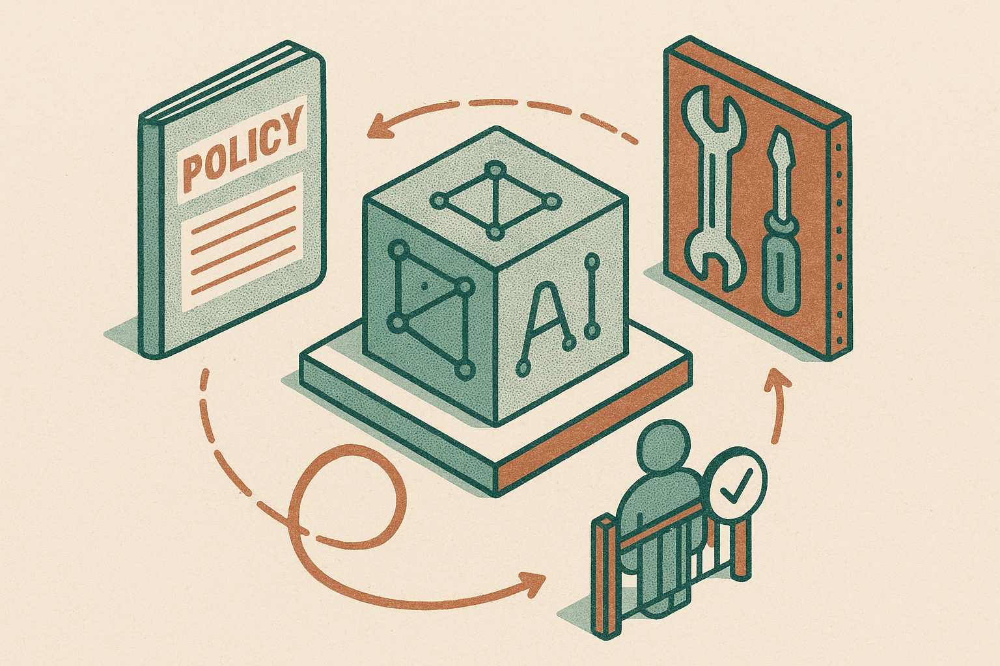

TL;DR: PIHF is useful because it treats prompts, tools, and review rules as a versioned policy layer that can improve across models without touching the model weights.

## What changed if the model weights stay fixed?

The primary source here is the arXiv paper “Policy Iteration with Human Feedback: Bringing Post-Training RL to In-context Learning.” The paper’s core move is simple and practical: stop putting all persistent learning into model weights. Keep the pretrained language model as the executor, then revise the policy around it.

That policy is written in natural language. It includes tool-use instructions and diagnostic procedure. The model runs the task, a language-model critic and a clinical expert review the full reasoning and tool-use trajectory, then candidate revisions are proposed. The expert can reinterpret the evidence, decide what gets admitted, and roll back changes.

This is post-training RL logic translated into an operator-friendly loop. Evaluate. Find repeated failures. Improve the policy. Test again. Keep the executor fixed.

That matters because most teams cannot retrain a frontier model. Many should not try. But they can maintain a versioned policy file, an eval set, tool contracts, and a review workflow. PIHF gives that pattern a cleaner research frame.

## Why does this matter for rare-disease diagnosis?

The paper tests PIHF on ultra-rare-disease benchmarks. That is a hard setting for a few reasons. The tail is long. The evidence is messy. Misses are costly. Also, raw model fluency can hide systematic diagnostic errors.

“Policy Iteration with Human Feedback” reports that a PIHF-derived policy improved Recall@1 in one proprietary executor and three open-weight executors spanning 3 to 49 billion active parameters. The headline numbers are large: 32.7 percentage points for GPT-5.4 and 31.1 points for Qwen3.6-35B, a 1.7 point difference between them.

The interesting part is not just that the numbers improved. It is that the same policy development process transferred across very different executors. If that holds up, the policy layer becomes an asset separate from any one model vendor.

That is the operator angle. A hospital system, research group, or product team could build process knowledge once, then test it against multiple models as they change. The model becomes replaceable infrastructure. The policy becomes institutional memory.

There is a caveat. The two arXiv listings in the supplied material, cs.AI and cs.CL, describe the same paper, not independent replications. The claims are promising, but they are still paper claims. I would want external reproduction, benchmark details, and a hard look at whether the expert-review loop scales beyond a specialized clinical setting.

## What should builders copy, and what should they not?

Copy the separation of concerns.

The model executes. The policy instructs. Tools provide structured capabilities. Critics inspect traces. Experts approve durable changes. Evals decide whether a proposed change survives.

That architecture is much more useful than “just write a better prompt.” A better prompt is often a one-off patch. A policy iteration loop is a system for finding recurring errors and preventing them from coming back.

Do not copy the medical framing blindly. Rare-disease diagnosis has expert reviewers, high-value cases, and clear reasons to inspect full reasoning and tool traces. A customer-support bot, coding assistant, or research agent will need different gates. Some failures can be auto-tested. Some need human review. Some should never be solved with natural-language policy alone because the right fix is a tool constraint, retrieval change, or product rule.

The bigger lesson is that in-context learning is becoming operational infrastructure. Not just “the prompt.” A living policy, with versions, evals, rollback, and ownership.

Practitioner's take: if you run an AI workflow today, start by logging complete task traces and tagging repeated failure modes. Then create a small versioned policy document that changes only through review, and test each change against a fixed eval set before shipping it. The catch most readers miss: the critic is not the authority. The paper’s strongest design choice is that expert admission and rollback stay outside the model.
