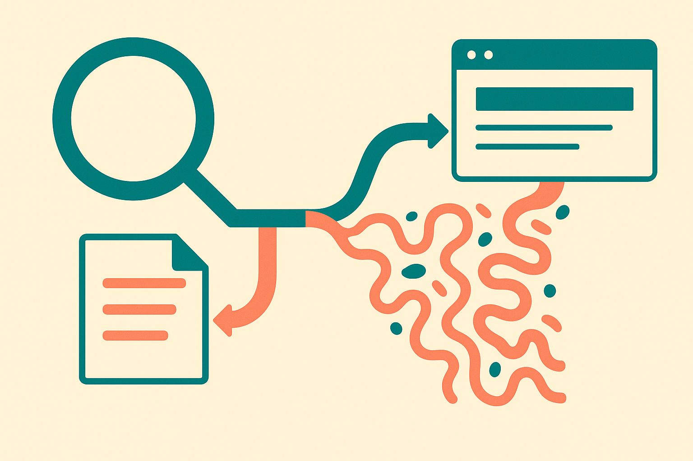

TL;DR: Treat Google AI Mode traffic as inferred search behavior, not clean channel data, until Google gives Search Console a first-class AI Mode report.

## Can you actually track Google AI Mode traffic in Search Console?

Suganthan Mohanadas at Search Engine Journal, in “How To Track Google AI Mode Traffic In Search Console,” reports that Google Search Console hides AI Mode query data by default and compares four ways to extract it, including a free ML-powered tool.

That is the useful headline. Not because the specific hacks are magical, but because it confirms the real state of AI search measurement: operators are being asked to optimize for a surface that is not yet cleanly exposed in the main reporting interface.

This is not a small analytics quirk. If AI Mode becomes a meaningful path between query and click, the old SEO loop gets blurrier. Query, impression, rank, click, landing page. That chain was already noisy. AI answers make it noisier because the user may get enough context before clicking, may reformulate less, or may click from a generated interface that does not map neatly onto the reports teams already use.

The catch: Search Engine Journal is not Google. So I would not treat every implementation detail as settled product behavior unless Google documents it directly. But Mohanadas’ reporting is still a good warning shot for search teams. The data may be there in some form, but it is not packaged for decision-making.

## Why does hidden AI Mode data matter?

Because budgets follow dashboards.

If AI Mode traffic is mixed into broader Search Console reporting, teams will either miss it, over-attribute it, or build private workarounds that only one analyst understands. None of those are great.

The risk is not just undercounting clicks. It is misreading intent. AI Mode users may behave differently from classic blue-link searchers. They may arrive with more context. They may skip comparison pages. They may ask longer, more specific questions. They may click fewer results but convert at different rates. Or not. The point is that you cannot know if the reporting layer flattens everything.

This is where SEO gets more like product analytics. You are no longer just asking, “What keyword drove this session?” You are asking, “What kind of answer environment shaped this user before they arrived?”

That matters for content strategy. A page that performs well in classic search may not be the page that gets cited, summarized, or clicked from an AI interface. A glossary page, comparison page, support article, or pricing explainer might have a different role inside AI Mode than it has inside standard search.

## What should operators do before Google makes this cleaner?

First, separate measurement from certainty.

Use Mohanadas’ Search Engine Journal piece as a pointer to possible extraction workflows, not as permission to rebuild your entire reporting model around fragile signals. If your team tests one of the four methods he describes, label the output as estimated AI Mode traffic. Do not blend it into normal organic reporting without a note.

Second, create a small AI search view instead of a giant dashboard. Track only the questions that matter: which pages appear to be getting AI Mode exposure, which queries seem different from normal search behavior, and whether those sessions act differently after landing. Keep it boring. Page, query theme, landing behavior, conversion or next action.

Third, compare patterns, not single rows. If one query spikes, ignore it until you see repetition. If one class of pages starts behaving differently, investigate. The signal will probably be lumpy for a while.

I would also keep a changelog. If you test an ML-powered extraction tool, record when you started, what it classified, what assumptions it made, and what changed in your filters. Future you will need that context when someone asks why “AI Mode traffic” doubled after a reporting tweak.

My practitioner’s take: try one extraction method on a copy of your Search Console export, then validate it manually against a small sample before anyone turns it into a KPI. The useful move is not claiming perfect AI Mode attribution. It is building an early warning system for pages and query themes that behave differently when Google inserts an AI layer between search intent and your site.
