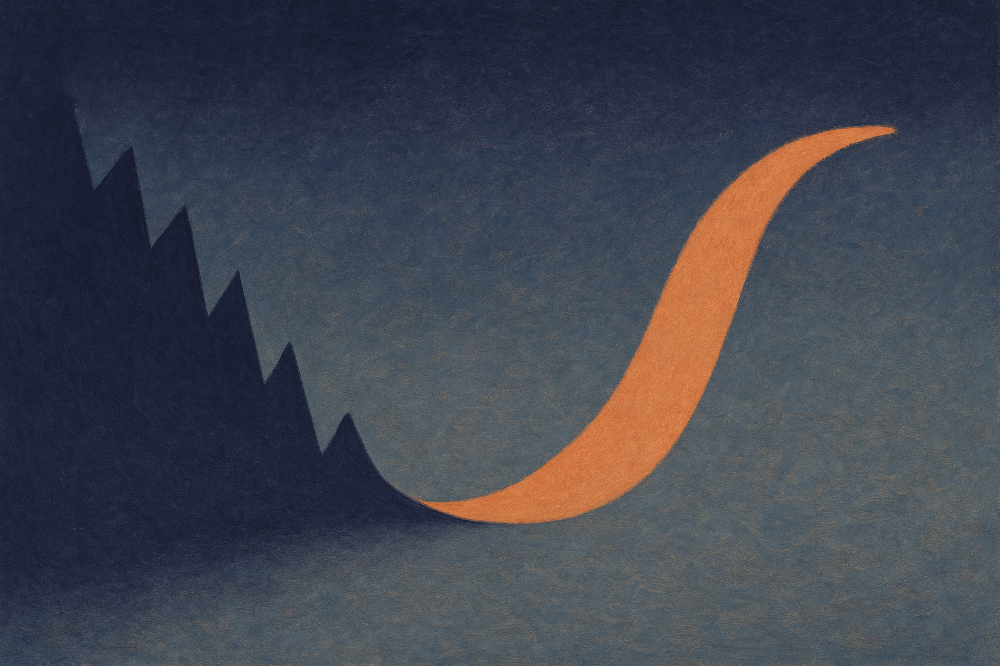

TL;DR: A team found that the "magnitude-only" part of MRI measurements, usually ignored, stays remarkably consistent across time frames in dynamic scans, and feeding it back into a physics-driven reconstruction network gives sharper images without a single extra second of scan time.

The paper is "Harnessing Magnitude-Only and Complex Measurements for Improved Dynamic MRI Reconstruction with Learned Priors," posted to arXiv under both cs.AI and cs.LG. The method it introduces is called C+Mag. I want to walk through what it actually does, because the interesting part is not the network architecture. It is the idea that useful signal was sitting in the raw data the whole time and nobody was using it.

## What problem is this actually solving?

MRI scanners do not photograph you. They collect measurements in what is called k-space, the spatial frequency domain, and an algorithm reconstructs the image from that. To go faster, scanners undersample: they skip a chunk of k-space and let the reconstruction fill in the gaps. Less data collected means shorter scans, which matters a lot for dynamic MRI like cine imaging of a beating heart or phase-contrast flow imaging of blood movement. You are trying to capture motion, so time is the whole game.

The catch with undersampling is that skipped measurements create artifacts. Modern reconstruction leans on physics-driven deep learning, usually shortened to PD-DL, which combines the known physics of the scanner with a learned prior about what real anatomy looks like. That is the baseline the paper compares against.

Here is the part that made me stop and read twice. MRI measurements are complex-valued, meaning each one carries both a magnitude and a phase. Standard reconstruction uses the full complex measurement. But there is a parallel line of research called sparse phase retrieval showing that magnitude-only measurements carry their own complementary information. The problem, as the authors put it plainly, is that using magnitude in MRI "remains largely unexplored, due to lack of practical settings where informative magnitude measurements can be obtained without additional scan time."

That last clause is the whole story. Nobody wants magnitude information badly enough to pay for a longer scan to get it. So the question becomes: is there a setting where you get it for free?

## Where does the free information come from?

Steady-state dynamic MRI. In these scans you image the same anatomy repeatedly over time. The heart beats, blood flows, but the underlying structure and the way the scanner samples it repeats frame to frame.

The authors' key empirical observation is that k-space magnitudes stay strongly consistent across time frames. Think about what that means. Even in frames where you undersampled and lost information, the magnitude pattern from neighboring frames tells you something about what you should have seen. The magnitude is an auxiliary source of truth you already collected as part of the normal scan. No extra sequence, no longer breath-hold, no additional cost to the patient.

This is the move I find worth studying regardless of whether you ever touch medical imaging. The team did not chase a bigger model or more training data. They looked hard at the data pipeline and asked what was being discarded. The answer was a signal that happens to be redundant across time in exactly the scenario where redundancy helps you.

## Why is this hard to actually use?

Because magnitude is a nasty thing to optimize against. When you strip phase and keep only magnitude, the math stops behaving. Magnitude constraints are non-differentiable and non-convex, which are the two properties that make gradient-based deep learning training miserable. You cannot just bolt a magnitude term onto your loss function and hope the optimizer sorts it out.

C+Mag handles this with an ADMM-based unrolling framework. ADMM, alternating direction method of multipliers, is a classic optimization technique for splitting a hard problem into easier subproblems. "Unrolling" means each iteration of that optimization becomes a layer in the network, so the physics and the learned prior are interleaved rather than stacked. This is a well-established recipe in the reconstruction world, so the novelty is not the skeleton.

The novelty is the magnitude-aware data-fidelity term. To deal with the non-differentiability, they use quadratically smoothed optimization, which rounds off the sharp corners of the magnitude constraint so gradients can flow. To deal with the non-convexity, which tends to trap optimizers in bad local minima, they add momentum-based updates that help the optimization push through. Neither trick is exotic on its own. Combining them to make magnitude constraints trainable inside an unrolled network is the contribution.

## Does it actually work, or is this a benchmark win?

The evidence is broader than a single dataset, which I appreciate. They tested three ways. Retrospectively undersampled cine MRI, where you take full data and artificially throw some away, the standard sanity check. Phase-contrast flow MRI, which measures velocity and depends heavily on accurate phase, a harder test. And prospectively undersampled real-time cine acquisitions, meaning actually collected with undersampling on the scanner, which is the setting that matters clinically.

Against conventional PD-DL methods, the authors report better artifact suppression, sharper anatomical recovery, and better preservation of phase information. That phase point is not a throwaway. In flow imaging, phase is the measurement, so preserving it while adding magnitude constraints is a genuine result rather than a cosmetic one.

The claim I put the most weight on is the blinded expert reader evaluation. Radiologists who did not know which image came from which method rated the reconstructions. That is the difference between winning on a pixel-similarity metric like PSNR or SSIM and producing images a clinician actually finds better. Plenty of reconstruction papers post metric gains that no human can see. Blinded readers is the harder bar, and they cleared it.

What the paper does not settle, at least from the abstract-level material I have, is generalization across scanners, field strengths, and vendors, plus how much the momentum and smoothing hyperparameters need retuning per application. Those are the questions that decide whether a method leaves the lab. The three-way evaluation is a strong signal, not a deployment guarantee.

## The Practitioner's Take

If you build applied AI, the transferable lesson has nothing to do with hearts or k-space. It is this: before you scale the model, audit what your pipeline throws away. C+Mag works because someone noticed that magnitude information, discarded by convention, is both free and redundant in exactly the regime where redundancy pays off. That is a data-side insight dressed up as a modeling paper.

So the thing to try, in your own domain, is to inventory the signals you drop on the floor. Timestamps you round off, metadata you strip, intermediate representations you compute and discard, correlated samples you treat as independent. Ask whether any of it is consistent across a dimension you can exploit, the way magnitude is consistent across time frames here. The catch most readers will miss: the free signal was only usable because the authors did the unglamorous optimization work to make a non-differentiable, non-convex constraint trainable. Finding the discarded data is the idea. Making it usable is the paper. You need both, and the second half is where the real effort lives.
