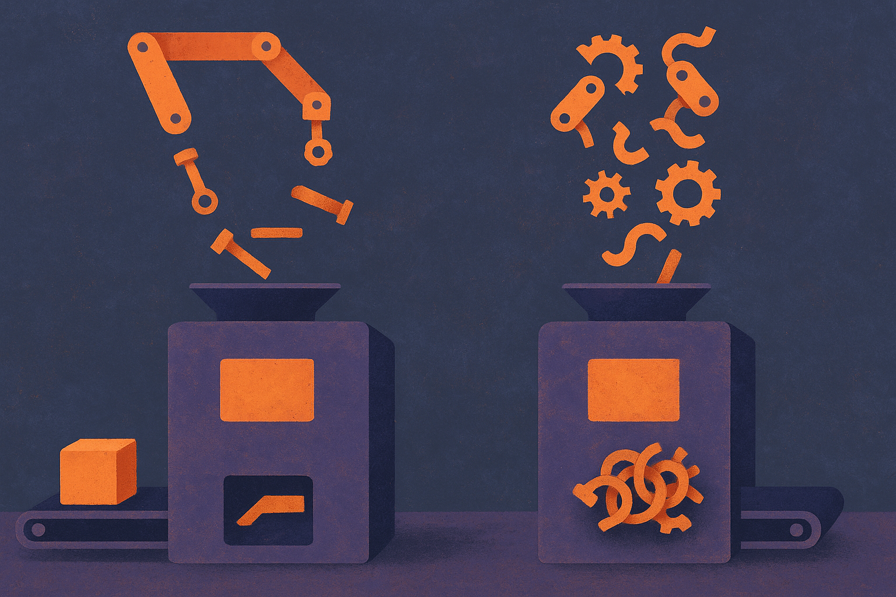

TL;DR: The paper "On the Fragility of Self-Improving Agents: Variance, Task Order, and Underspecification" shows that when you run memory-based self-improving agents multiple times and shuffle the order of their tasks, much of their reported improvement evaporates, which means most single-run demos of these systems are measuring luck and curriculum as much as learning.

Self-improving agents are one of the most seductive ideas in the current agent wave. The pitch: give an agent a textual memory bank, let it work through a stream of tasks, and it writes notes to itself about what worked. Next task, it reads its own notes and does better. Over time it climbs. No retraining, no fine-tuning, just an agent getting smarter by keeping a diary. It reads like the first step toward systems that compound on their own.

The trouble, and this is the whole point of the paper, is that almost nobody has stress-tested whether the climb is real or an artifact of how the experiment was set up. The authors did the boring, essential work: they ran the agents more than once, and they scrambled the task order. Both things you would do reflexively in any serious ML evaluation. Both things the original self-improvement papers mostly skipped.

## What exactly did the paper test?

The authors re-evaluated two existing memory-based self-improving methods. Not toy setups, the kind of agents that maintain a growing textual memory and are supposed to improve as they see more tasks. They broadened the evaluation along two axes.

First, multiple runs. Agent evaluation in complex, multi-step environments is already noisy: the same agent on the same task can pass or fail depending on small stochastic differences. When you stack a self-improvement loop on top, the paper reports that the loop amplifies that noise rather than smoothing it. A lucky early run writes confident memory, which shapes later behavior, which compounds. So a single reported number tells you very little. You need the variance across runs, and the variance is large enough to matter.

Second, task order. This is the sharper finding. The original papers used a default ordering of tasks. When the authors randomly shuffled that order, the agent's improvement dropped. Their read: the default ordering imposed an implicit curriculum. Easy tasks first, teaching the agent useful memory, then harder tasks that build on it. That curriculum was doing a lot of the work, and it was never labeled as a load-bearing assumption. It was just how the tasks happened to be listed.

If the ordering is a hidden prerequisite, then the reported gains are partly a property of the benchmark setup, not of the method. Shuffle the world and the method looks much weaker.

## Why does shuffling the tasks break things?

The authors dug into the agents' actual memory banks by hand, which is the part I respect most here. They did not just report a number went down. They looked at what the agent had written to itself and formed a hypothesis: task and environment underspecification.

Here is the intuition. When a task is underspecified, the agent has to guess what "done" and "good" mean. On an easy task early in a curriculum, that guess is usually fine, and the agent records a memory that encodes its guess as a rule. Later, on a harder or differently-shaped task, that inherited rule is now wrong, but the agent trusts its own memory. Bad specification early becomes bad memory forever. Order matters because order determines which guesses get frozen into the memory bank first.

To test the hypothesis they injected better specification into the memory construction process: detailed rubrics, environment feedback, the kind of ground truth that tells the agent what actually happened rather than what it assumed happened. This partially closed the performance gap. Partially. The authors are careful to say significant gaps remained, which means underspecification explains some of the fragility but not all of it. There are, in their words, other uncharacterized factors. I appreciate that they did not overclaim a clean fix.

## Does this mean self-improving agents do not work?

No, and it would be a misreading to say so. The paper is not a takedown of the idea. It is a demand for honest measurement of it. The methods still show real gains under favorable conditions. The problem is that the favorable conditions were doing invisible work, and the field reported the good-case number as the number.

This is a recurring pattern in agent research right now. The demo is real. The demo under a specific seed, a specific ordering, a specific prompt, is real. What is not established is that the demo generalizes. The gap between "this worked when I ran it" and "this works" is exactly the gap the paper is pointing at, and it is the gap that separates a research artifact from something you can put in production.

The constructive half of the paper is the protocol it advocates: report results across multiple runs, stress-test under shuffled and adversarial conditions, and build interfaces that let a human see and correct what the agent has written into its memory before that memory silently steers future behavior. That last point is the operational one. Underspecification is not just a benchmark quirk. It is the mechanism by which an agent can fail in ways nobody can predict, because the bad assumption is buried in a text memory nobody is reading.

## What should a builder actually do with this?

If you are shipping an agent that learns from its own memory, treat this paper as a checklist against your own optimism.

Run your evaluation more than once and look at the spread, not the best result. A single flattering run is a coin flip you got to keep. Then shuffle your task order and re-run. If performance moves a lot, you have discovered that your agent depends on a curriculum you did not know you were providing, and the real world will not hand it that curriculum in order.

Next, make your memory inspectable and editable. The paper's underspecification finding says the danger lives in what the agent wrote down about ambiguous situations. If you can read the memory bank, you can catch the frozen bad guess before it compounds. Feed in rubrics and real environment feedback where you can, because that measurably helped, even if it did not fully fix things.

The catch most readers will miss: partial closure is the actual headline, not the fragility. Even with better specification, gaps remained. That means there is no single lever that makes a self-improving agent reliable, and anyone selling you one that just works over time is selling you their best seed. Build for the variance, not for the demo.
