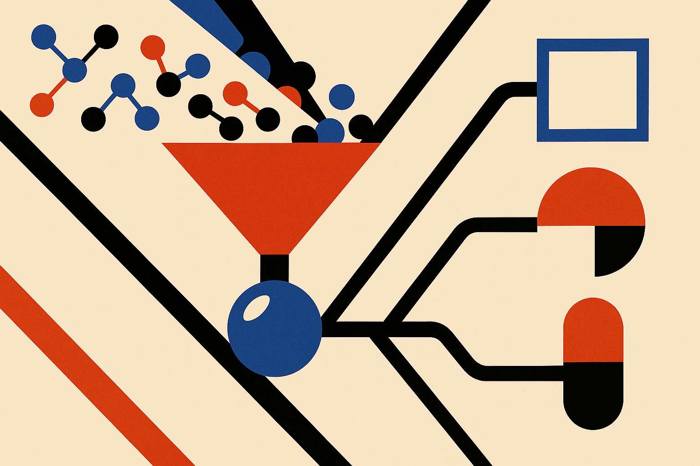

TL;DR: PGFS++ matters because it treats molecule improvement as a constrained, synthesizable, input-specific process instead of a scoreboard chase that can collapse into one high-reward molecule.

## What problem is PGFS++ actually trying to solve?

The primary source here is the arXiv paper **"PGFS++: Molecular Property Improvement under Synthesis and Diversity Constraints"**, listed under cs.AI and cs.LG. The core claim is simple: improving a molecule on paper is not enough if the result cannot be made, or if the optimizer keeps returning the same “best” molecule for many different starting points.

That sounds obvious. It is also exactly where a lot of AI-for-science demos get soft.

Early drug discovery often asks for molecular improvement: take a starting molecule and improve a target property, like drug-likeness or binding affinity. A pure optimizer can search a huge chemical space and find molecules that score well under the chosen objective. But chemical space is not the same thing as a purchasable, reactable, synthesizable path in a lab.

PGFS, short for Policy Gradient for Forward Synthesis, already tried to solve part of this by making reinforcement learning synthesis-aware. Instead of proposing arbitrary molecules, it works through forward synthesis. The paper says the earlier PGFS approach used reactant embedding prediction, which made reactant selection indirect and limited learning effectiveness.

PGFS+ changes that representation. Reaction templates and second reactants become trainable embedding lookup tables. The paper reports that, with a better scoring function and reinforcement learning algorithm, PGFS+ improves the desired property more effectively.

Then the useful failure appears.

## Why does a better optimizer make the system worse?

PGFS+ exposes what the paper calls a reward-hacking failure mode. A stronger reactant search can map diverse input molecules to the same high-reward “magnet” molecule. The reported reward goes up. The output diversity collapses.

That is the part builders should underline.

This is not just a chemistry issue. It is the same shape as many optimization failures in AI systems. If the metric is too narrow, the model finds a shortcut. If the scoring function rewards only the destination, the system may ignore whether the path is useful, whether the answer preserves the user’s starting context, or whether the output set has enough variety to be operationally valuable.

In molecule design, that shortcut is especially costly. A portfolio of candidates that all converge toward the same structure is not really a portfolio. It gives a research team less room to test mechanism, safety, synthesis cost, patent space, and backup series. One high-scoring molecule can look good in a benchmark while creating a brittle downstream program.

PGFS++ is the paper’s answer to that collapse. It makes the improvement task input-specific. Given an input molecule, PGFS++ treats it as the start of a forward-synthesis trajectory. It applies learned reaction templates with compatible in-stock building blocks. The output is not just a molecule with improved target properties, but also an explicit synthesis route and structural similarity to the input.

That last phrase matters: structural similarity to the input. It is a constraint against the model erasing the starting point.

## What should builders take from this beyond chemistry?

The practical lesson is that constraints are not just guardrails after generation. They belong inside the optimization loop.

PGFS++ combines three ideas that show up in many serious applied AI systems: optimize the target, preserve relevant input identity, and produce an artifact that can actually be executed. For molecules, that means target property, structural similarity, and synthesis route with compatible in-stock building blocks. For code, it might mean performance, compatibility with the existing codebase, and a patch that passes tests. For enterprise workflows, it might mean task completion, policy compliance, and an auditable action trail.

The paper reports that PGFS++ improves target properties while preserving high output diversity. The abstract does not provide the numerical results, so I would not overread the scale of the win from this material alone. The stronger signal is architectural: once PGFS+ made search more powerful, the failure mode became more obvious. Better search did not remove the need for better problem framing. It made the framing problem louder.

That is a healthy pattern to watch. When an AI system gets more capable, old metric flaws stop being minor. They become attack surfaces.

For a builder, the move is to test for “reward magnets” early. If many different inputs produce suspiciously similar outputs, do not celebrate the average score too quickly. Add input-conditioned constraints, diversity checks, and execution evidence before calling the system useful. The catch most readers miss: a model that returns a valid path, not just a high-scoring answer, is often less flashy in demos but far closer to something a real team can use.
