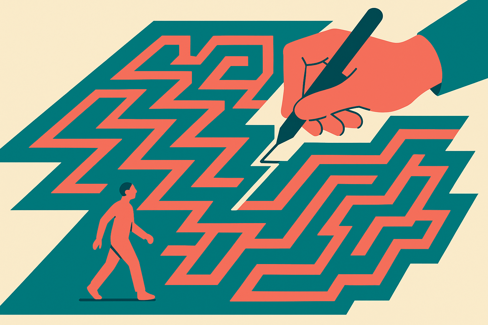
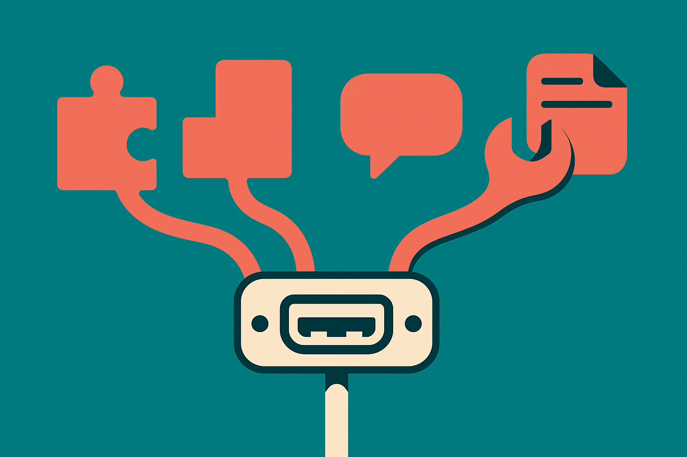

TL;DR: SPADE gets a single model to both write executable training environments and learn to act in them, targeting problems just past its current skill, and it reports gains of +5.3 on held-out reasoning benchmarks and +13.9 on ACEBench-Agent over the strongest fixed-environment baseline.

The primary source here is a paper titled "SPADE: Self-Play in Adaptive Synthetic Executable Environments," posted to arXiv under both cs.AI and cs.CL. It attacks a bottleneck that most people training agents have quietly accepted: your training data runs out of headroom before your model does.

## What problem is SPADE actually solving?

Every RL setup for language agents needs environments to practice in. Math problems, coding tasks, tool-use scenarios, games. Right now those pools come in three flavors, and the SPADE authors argue all three share the same flaw. Hand-curated sets are expensive and finite. Statically synthesized sets are generated once and frozen. Frozen-verifier setups check answers against a fixed rubric. In every case the goal distribution stays put while the learner keeps getting better.

That mismatch matters more than it sounds. If your model already solves 95% of the problems in the pool, most of your training compute is spent re-confirming things it knows. The useful signal lives in the problems that sit right at the boundary of what the model can and cannot do. A fixed pool cannot follow that boundary as it moves. It was calibrated for a weaker model and it stays calibrated for a weaker model.

SPADE's answer is to stop treating the environment as a fixed asset and start treating it as something the system learns to produce. That reframing is the whole point.

## How does the two-role self-play loop work?

One LLM plays two parts. As the Environment Designer, it writes complete, long-horizon training environments as executable code, using an OpenAI Gym-style reset() and step() interface. As the Reasoning Agent, it learns to act inside those environments. Because each environment is stateful and multi-turn, with its own state transitions, reward functions, and verification code, the same interface covers both plain reasoning problems and multi-step agentic tool use. That is a nice bit of engineering economy: one abstraction spanning a math proof and a multi-turn API-calling task.

The clever bit is how the Designer decides what to build. It optimizes for the Agent's regret, estimated as the gap between the Agent's reward with privileged hints and its reward without them. If the Agent scores well both with and without hints, the environment is too easy. If it fails both ways, too hard. The sweet spot is a large gap: the Agent can do it when helped but cannot yet do it on its own. By chasing that signal, the Designer learns to aim environments at the edge of the Agent's ability while keeping them feasible.

This is the difference between SPADE and a lot of earlier self-play work. It is not "generate hard problems." It is "generate problems calibrated to the current learner, and recalibrate as the learner improves." The regret gap is the thermostat.

## What made it work, and what are the numbers?

The paper is honest that the basic idea does not carry itself. Two components turned out to be critical. First, grounding the Environment Designer on documents sampled from a large pretraining corpus, so the environments it invents are anchored in real content rather than drifting into degenerate self-referential puzzles. Second, giving the Designer an accumulated environment memory, so it builds on what it has already produced instead of starting cold each round. Both of those are the kind of detail that separates a framework that works from a whiteboard diagram that does not.

On results, scaling to 30B-parameter models, SPADE reports:

- +5.3 on average across eight held-out math, science, code, and reasoning benchmarks, over the strongest fixed-environment baseline.
- +5.7 on BFCL-v4 multi-turn for tool use.
- +13.9 on ACEBench-Agent.
- On the games setting, a margin over the strongest baseline that grows with model scale.

That last point is the one I would watch. A gain that grows with scale is a different animal from a gain that shrinks with scale. Most tricks help small models and wash out as the base model gets stronger, because the strong model already covers the easy wins the trick was manufacturing. If SPADE's games margin genuinely widens as the model grows, that is a signal the adaptive-difficulty mechanism is doing something a fixed pool structurally cannot. I would want to see that curve extended past 30B before calling it a trend, but the direction is the interesting part.

## What should a builder take from this?

Two things, and one caution.

The reusable idea, even if you never touch RL, is the regret gap as a difficulty signal. The gap between performance-with-hints and performance-without-hints is a cheap, general way to find the problems worth training or evaluating on. You can apply that to eval set construction today: run your model with a scaffolding hint and without, and the items with the biggest gap are your highest-value training or fine-tuning targets. That is a technique you can borrow without adopting the whole self-play machinery.

The second takeaway is the Gym-style executable-environment framing for agentic tasks. If you are building agent evals, expressing them as reset()/step() environments with real reward and verification code gives you something you can actually train and score against, instead of a pile of one-off prompts. SPADE's contribution is showing one interface can span reasoning and tool use.

The catch most readers will miss: nothing here has been independently reproduced yet. This is an arXiv preprint, and the numbers are the authors' own on their own baselines. "Strongest fixed-environment baseline" is doing quiet work in every headline figure, and the honest version of any self-play result depends on how strong that baseline really was. Self-improvement loops are also famous for looking great in-distribution and quietly collapsing when the Designer learns to game the Agent or the Agent overfits to the Designer's quirks. The grounding-on-pretraining-corpus detail exists precisely because that failure mode is real. Treat the +13.9 as a promising claim to be checked, not a settled fact, and watch for third-party reproductions before you rebuild your training stack around it. The idea is strong enough to be worth stealing the parts of even if the full pipeline takes another year to prove out.
