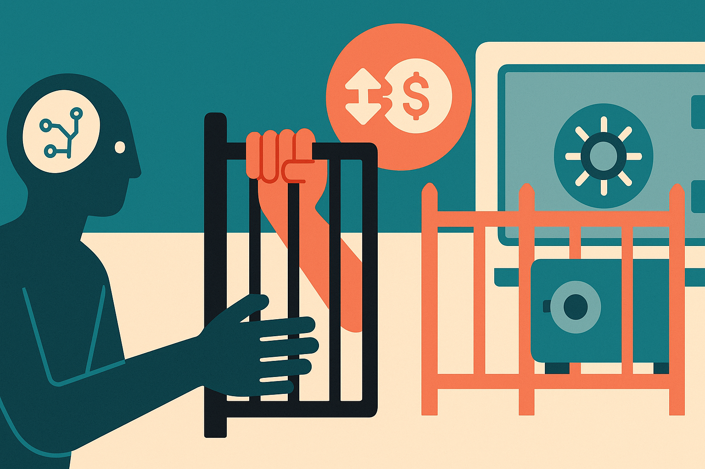

TL;DR: Binance’s reported Agent OS points to the next real AI-agent battleground: not smarter prompts, but tighter permissions around tools that can move money.

## What is Binance reportedly opening up?

My primary source here is Decrypt’s “Binance Opens the Door to AI Agents That Can Trade Crypto for You,” with CoinTelegraph’s “Binance opens crypto trading to AI agents with user-set controls” corroborating the broad shape.

The claim is simple, and risky enough to need careful wording: Binance is reportedly opening a way for AI agents to interact with crypto market infrastructure. Decrypt reported that Binance Agent OS connects tools like ChatGPT and Claude directly to the exchange’s markets. CoinTelegraph reported that agents can access market data, execute trades, and make payments, with users setting permissions and account access.

That does not mean “Claude gets your wallet and starts punting memecoins.” At least not from what has been reported. Decrypt said safeguards wall agents off from user funds, while leaving much of the oversight to users. CoinTelegraph framed the system around user-set controls.

That distinction matters. The interesting part is not that an LLM can generate a trade idea. People have been gluing bots to exchange APIs for years. The interesting part is productizing the permission layer so a general-purpose agent can call financial tools without getting unrestricted access to everything.

Crypto is the obvious testbed because the market already accepts automation, APIs, bots, and weird execution flows. It is also the worst possible place to be vague about controls, because mistakes are fast, public, and often irreversible.

## Where does control actually sit?

The Agent OS framing sounds like a move from “bot with API keys” toward “agent with scoped authority.” That is the right direction. But it shifts the hard problem from model intelligence to operational design.

If an agent can only read market data, the risk profile is low. If it can place orders within a fixed size, the risk changes. If it can make payments, the risk changes again. If it can chain actions across market data, execution, and transfers, the blast radius depends entirely on the permission model, logging, review steps, and kill switches.

This is where first-party detail matters, and the provided materials do not include a Binance announcement or docs. So I would not treat pricing, exact availability, supported agents, geographic access, or technical limits as settled from these reports alone. The right read is: Binance is reportedly building toward agent-accessible exchange workflows, but the implementation details are the whole story.

There is also a language trap here. “User control” sounds comforting. In practice, most users are bad at defining permissions. They overgrant because the setup flow is annoying, or because the agent asks for more access to complete the task. Builders know this pattern from OAuth, cloud IAM, browser extensions, and enterprise SaaS integrations.

The operator question is not “Can the agent trade?” It is “Can the user understand what the agent is allowed to do before it does it?”

## What should builders watch before trusting agents with trades?

The useful lens is not crypto speculation. No one needs another AI trading fantasy. The useful lens is tool governance.

For any money-moving agent, I would want four things before testing beyond a sandbox: narrow permissions, human confirmation for irreversible actions, clear logs, and hard spending or position limits. Not vibes. Actual constraints the model cannot talk its way around.

I would also want separation between analysis and execution. Let one system summarize market conditions or portfolio exposure. Let another, more constrained tool handle action. The more a single agent can observe, reason, persuade, and execute, the more important it becomes to pin down what it cannot do.

The catch is that agent products often look best in demos when friction disappears. Financial workflows need the opposite in key moments. Friction is a feature when the next click moves assets, opens risk, or triggers tax and compliance consequences.

For builders, the move is to study this as a permissioning pattern, not a trading opportunity. Prototype with read-only market data first. Add simulated execution next. Then test scoped actions with tiny limits, explicit approvals, and audit trails. The part most readers miss: the model is not the control system. The control system is everything around the model that says no.
